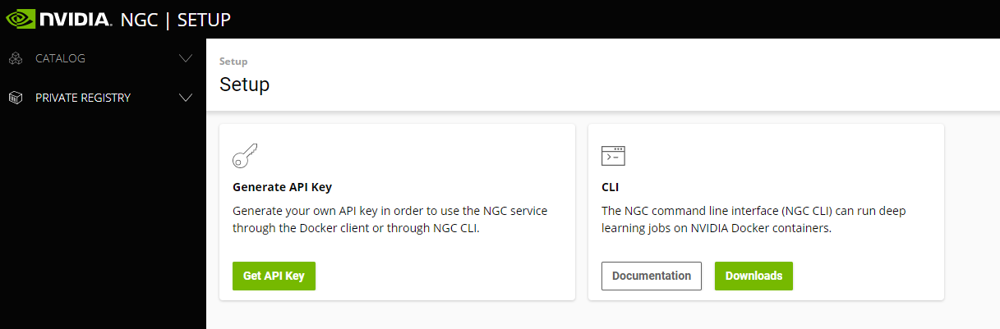

Now that we have seen how the NVIDIA DeepStream Graph Composer can help in developing IVA applications, we are now going to show how extra tooling can help to distribute these applications to datacenter and edge environments. 

Containerization also provides numerous benefits during development and testing, for example: Consistency of behavior when executing a workload on homogenous hardware, incremental updates due to file-system layering (which can greatly reduce time to deployment), and clear documentation of dependencies due to self-documenting nature.  To achieve these benefits, we will make use of the `container-builder` tool to package the previous example as a container.  

1. Before we begin, we need to setup and account with the NVIDIA NGC (NVIDIA GPU Containers) service.  This service is NVIDIA's official repository for distributing GPU accelerated containers.  Our workload will require access to this repository in order to pull in the DeepStream base container, which our containerized workload will use.  You can create an account or login with an existing account by visiting the [NVIDIA NGC login page](https://ngc.nvidia.com/signin).

    1. Login or create a new account by visiting `https://ngc.nvidia.com/signin`.  Once you are signed in to NVIDIA NGC, left-click your username in the upper-right corner and select "Setup".  Here you should see the following options:

        


    1. Select "Get API Key", and on the resulting screen in the upper-right select "Generate API Key" then select "Confirm" on the resulting prompt:

        

    1. Next, we will supply these credentials to the Docker runtime by executing the following commands in a terminal on the host machine:

        ```Bash
        sudo docker login nvcr.io
        ```

    1. When prompted for `Username`, enter `$oauthtoken` exactly as shown. When prompted for `Password`, enter the value of your generated API Key.  You should receive a message of `Login Succeeded`.

1. Now that we have access to nvcr.io, we can begin to build containers that use the base images provided through NVIDIA NGC.  The `container-builder` tool can build images by supplying it with a configuration file.  We'll use one of the examples provided in the reference graphs package.  

    1. To invoke the `container-builder` to package the deepstream-test1 application, execute the following commands on the host machine:

        ```
        cd /opt/nvidia/deepstream/deepstream-6.0/reference_graphs/deepstream-test1
        sudo container_builder -c ds_test1_container_builder_dgpu.yaml
        ```

    1. Upon successful completion, you should see output that contains the message `Successfully tagged deepstream_test1_dgpu:latest`

    >[!NOTE]
    > If you receive a `docker.errors.DockerException` error when running the above commands, it may indicate that you do not have the Docker runtime installed on the host machine.  To proceed, review the instructions in the "Install NVIDIA DeepStream Graph Composer Dependencies" section of this module on how to install Docker.


    >[!NOTE]
    > If you receive a `docker.errors.BuildError: unauthorized: authentication required`, this indicates that you may not have properly authenticated your NVIDIA NGC account for use with Docker.


1. It is important to note that before we run this containerized workload, it will require that we grant access to the X11 display environment when running from a container due to the workload using an output sink of type EGL (`type`= 2).  

    Execute the following commands from a terminal on the host machine to enable access to the X11 services:

    ```Bash
    sudo xhost +
    ```

1. Confirm that the containerized workload runs as expected by executing the following in a terminal on the host machine:

    ```
    sudo docker run -it --rm --gpus all -v /tmp/.X11-unix/:/tmp/.X11-unix/ -e DISPLAY=:0 
    deepstream_test1_dgpu
    ```

    This command will start an instance of the `deepstream_test1_dgpu` container image and supply it access to all available GPU hardware on the machine while also supplying access to the X11 socket and current `DISPLAY`.  You should see output similar to the previous run that was invoked using `execute_graph.sh`.
    
     

We are now ready to publish our working containerized workload into a secure container registry for distribution. 