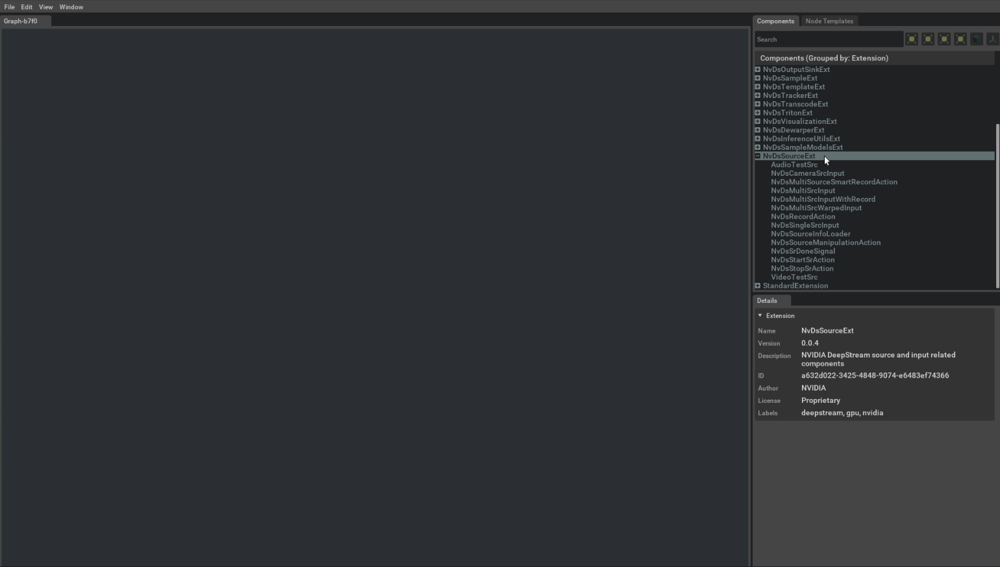

Let's take a closer look at the IVA application workflow that is enabled by the DeepStream Graph Composer.  Earlier in our introduction, we mentioned that drag and drop components used within the DeepStream Composer application can be provided by NVIDIA's Cloud Repository or another external registry. 

Using these extensions, we can add features and functionality to the Composer application and ultimately use this tool to package and distribute IVA workloads using the bundled `container-builder`.  A diagram of this process is shown below:


1. To begin, we will sync to NVIDIA's public Cloud Repository to bring in the latest available extensions.  This process can be accomplished by running the following command in a terminal on the host machine:

    ```Bash
    registry repo sync -n ngc-public
    ```

    This command will produce output similar to the following:

    ```
    2021-09-13 21:32:39,127 - Registry - INFO - Syncing repo ngc-public ...
    2021-09-13 21:32:41,022 - Registry - INFO - Syncing extension NvDsBaseExt version 0.0.1
    2021-09-13 21:32:45,833 - Registry - INFO - Syncing extension NvDsAnalyticsExt version 0.0.1
    2021-09-13 21:32:50,676 - Registry - INFO - Syncing extension NvDsCloudMsgExt version 0.0.1
    2021-09-13 21:32:55,743 - Registry - INFO - Syncing extension NvDsConverterExt version 0.0.1
    2021-09-13 21:33:00,579 - Registry - INFO - Syncing extension NvDsDewarperExt version 0.0.2
    2021-09-13 21:33:05,283 - Registry - INFO - Syncing extension NvDsDewarperExt version 0.0.1
    2021-09-13 21:33:10,300 - Registry - INFO - Syncing extension NvDsInferenceExt version 0.0.1
    2021-09-13 21:33:15,899 - Registry - INFO - Syncing extension NvDsInferenceUtilsExt version 0.0.2
    2021-09-13 21:33:20,574 - Registry - INFO - Syncing extension NvDsInferenceUtilsExt version 0.0.1
    2021-09-13 21:33:25,722 - Registry - INFO - Syncing extension NvDsInterfaceExt version 0.0.1
    2021-09-13 21:33:30,814 - Registry - INFO - Syncing extension NvDsMuxDemuxExt version 0.0.1
    Repository synced
    ```

1. After running the previous command, we can verify that the extensions are installed and available with:

    ```Bash
    registry extn list
    ```

    You may notice that many of these extensions begin with prefixes that map to the NVIDIA optimized GStreamer plugins included in the DeepStream SDK.  For example, the `NvDsMuxDemuxExt` extension provides a visual component for interacting with [`Gst-nvstreamdemux`](https://docs.nvidia.com/metropolis/deepstream/dev-guide/text/DS_plugin_gst-nvstreamdemux.html).

1. Now that we have installed and verified the latest NVIDIA provided extensions, we can launch the Composer application with:

    ```Bash
    composer
    ```

    
    
    You should notice a list of components populate on the right-side of the application user interface (grouped by extension name).  If not, you may need to resync to the `ncg-public` repo using the steps performed earlier. You can left-click on the extension name to view the components it provides as shown below:

    

    The following guidelines will help you understand how to interact with the composer application to develop custom applications:
    
    * To add a new component instance, left-click and hold on the name of the component and drag it into the graph editor space.
    * Components in the graph area are composed of a "header", which displays the name of the component and may contain "handles" for input/output ports. 
    * Components can be connected to one another by selecting a "handle" and drawing a connection between compatible input/output ports.
    * Clicking on a component can allow you to display its details, which will appear in a `Details` window on the right-side of the application.  Properties can be edited within this window to customize behavior of the component.

1. Let's examine a reference application to show what you can create by following the guidelines above.  Earlier when we installed the DeepStream reference graphs package, many examples were installed into the following path:

    ```Bash
    /opt/nvidia/deepstream/deepstream/reference_graphs/
    ```

    1. In the Composer application, select "File => Open Graph" and navigate to the `/opt/nvidia/deepstream/deepstream/reference_graphs/deepstream-test1` path and select the `deepstream-test1.yaml` file, then "Okay".
    
         

    1. Left-click on the `NvDsSingleSrcInput` component and notice the `Details` pane that opens on the right-side of the application.  Scroll down in the `Details` pane and notice the `uri` property where we set the video file that is to be used as input in this IVA pipeline.    

         


    1. Take note that you could modify the `uri` property to use an RTSP stream by setting `type` equal to '4' and providing an RTSP path `rtsp://wowzaec2demo.streamlock.net/vod/mp4:BigBuckBunny_115k.mov`.  This would have the same effect as the DeepStream [source0] configuration group entry shown below:

        ```
        [source0]
        enable=1
        #Type - 1=CameraV4L2 2=URI 3=MultiURI 4=RTSP
        type=4
        uri=rtsp://wowzaec2demo.streamlock.net/vod/mp4:BigBuckBunny_115k.mov
        num-sources=1
        #drop-frame-interval=2
        gpu-id=0
        # (0): memtype_device   - Memory type Device
        # (1): memtype_pinned   - Memory type Host Pinned
        # (2): memtype_unified  - Memory type Unified
        cudadec-memtype=0
        ```

1. Next, let's take a look at the overall flow of the IVA pipeline presented in this example.  Once we understand the overall workflow and expected behavior of the graph, we will then up this workload as a containerized workload for redistribution and execution.

     

    This application takes a video source as input using `NvDsSingleSrcInput`, which is passed into `NvDsStreamMux` (which could technically process multiple video inputs).  The output of `NvDsStreamMux` provides a frame from each video input, which is sent for processing  in `NvDsInferVideo`, which applies inference using a Resnet 4 class object detector (Bicycle, Car, Person, Road Sign).  The inference results of `NvDsInferVideo` are passed to both `NvDsPerClassObjectCounting` to display a count for each detected class and `NvsOSD`, which generates the onscreen detections with bounding boxes, which are displayed by the final connection to `NvDsVideoRenderer`.


    1. We can verify this behavior and see it in action by invoking the included `execute_graph.sh` script and passing in the necessary parameters in `parameters.yaml`.  To execute the graph for `deepstream-test1.yaml` on our x86-based host, run the following commands in a terminal:

    ```Bash
    cd /opt/nvidia/deepstream/deepstream/reference_graphs/deepstream-test1
    /opt/nvidia/graph_composer/execute_graph.sh deepstream-test1.yaml parameters.yaml
    ```

    You should see an output similar to what is shown below:

     


    >[!NOTE]
    >If you intend on using a Virtual Machine to satisfy the host machine requirements, it is possible that you may encounter issues when attempting to run a DeepStream application which utilizes an EGL sink for visualized output.  You can work around this limitation by changing the `type` of your `uri` source to '1' for "FakeSink".  However,  be aware that a "FakeSink" will not provide any visual output, it will only alow your workload to execute but without an associated on-screen display of processed results.