Now that we have published a containerized DeepStream Graph workload to our Azure Container Registry and provisioned our NVIDIA Jetson Embedded device with the IoT Edge Runtime, we are now ready to create a deployment specification in our Azure IoT Hub that will allow us to run the workload as an IoT Edge module.

1. Start by navigating to the Azure IoT Hub that was created at the start of this module.  On the left-hand side of the portal, look for the *Automatic Device Management* Section and select *IoT Edge*.  You should see the device that was registered in the previous section.  

    > [!div class="mx-imgBorder"]
    > 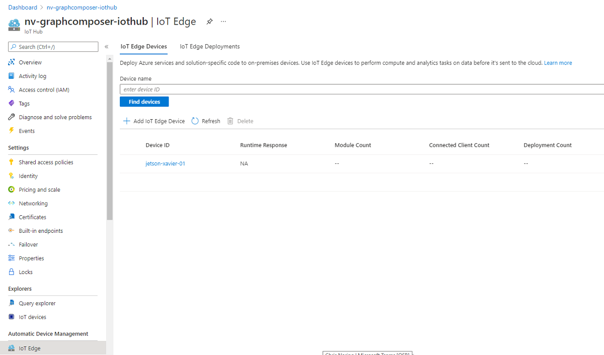

1. Click on the name of the device to see details about the current configuration:

    > [!div class="mx-imgBorder"]
    > 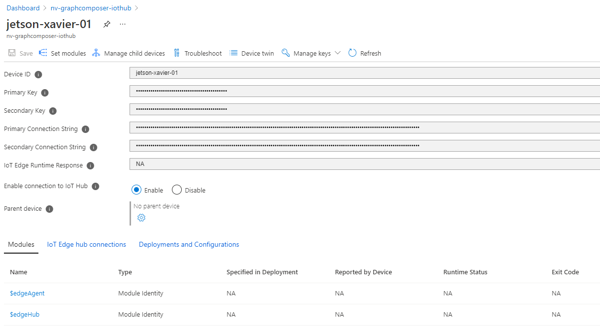

1. Select the *Set modules* section in the header area, which will open the module editor:

    > [!div class="mx-imgBorder"]
    > 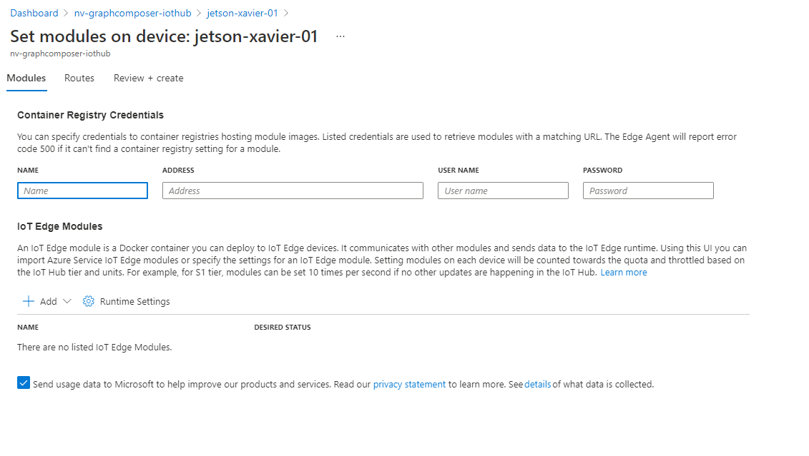

    We need to supply appropriate Container Registry Credentials so that our NVIDIA Embedded device to be able to pull container workloads from our Azure Container Registry.

1. In a separate tab, navigate to your Azure Container Registry within the Azure portal:

    > [!div class="mx-imgBorder"]
    > 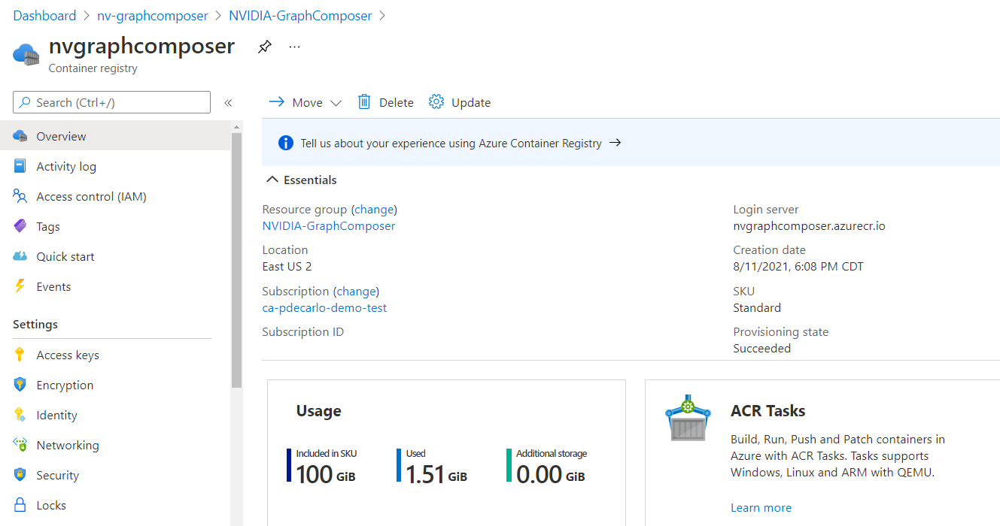

1. Next, select the `Access keys` section on the left-hand side under `Settings`  Take note of the values for `Login server`, `Username`, and `password` as they will be used in the next step.

    > [!div class="mx-imgBorder"]
    > 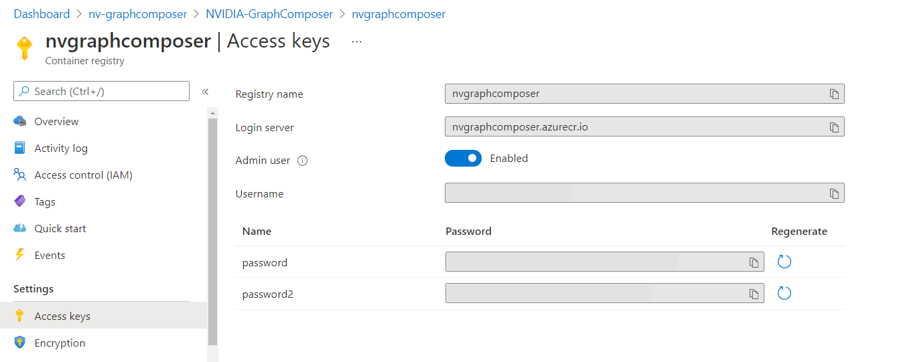

1. Navigate back to the tab where you opened *Set modules* and supply appropriate values in the *Container Registry Credentials* area.  This action will allow any device that applies this module specification to securely pull container workloads from your Azure Container Registry.

    > [!div class="mx-imgBorder"]
    > 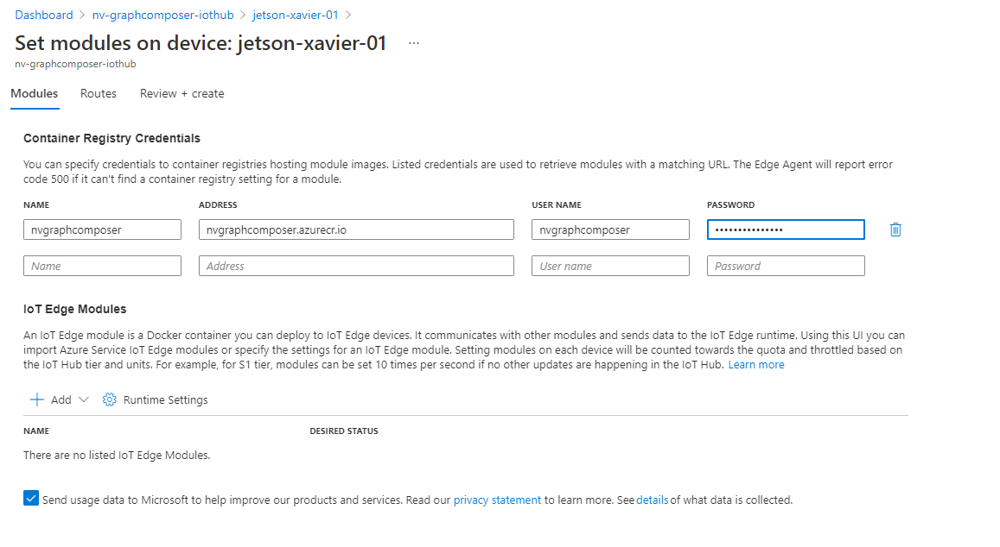

1. Next, we will configure a custom IoT Edge Module as part of our deployment specification.  To perform this step, go to the *IoT Edge Modules* section and select *Add* => *IoT Edge Module* as shown:

    > [!div class="mx-imgBorder"]
    > 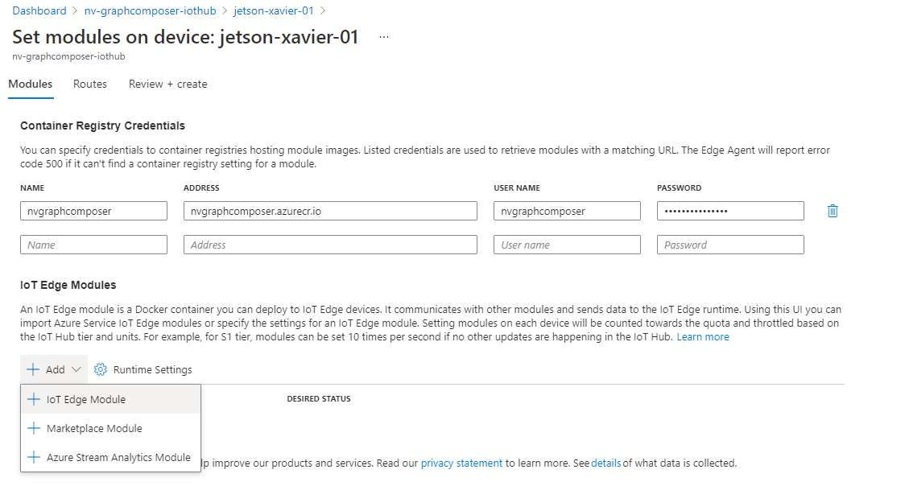

1. In the prompt that appears, in the *IoT Edge Module Name* section, provide a value of `deepstream_test4_jetson`, and in the *Image URI* section, provide a value of `<Login Server>/deepstream_test4_jetson:v1`(where `<Login Server>` is url of your Azure Container Registry):

    > [!div class="mx-imgBorder"]
    > 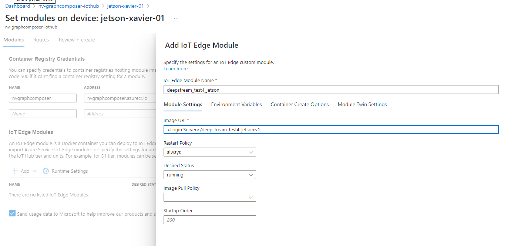

1. When you are finished, select *Review + Create* at the bottom of the screen:

    > [!div class="mx-imgBorder"]
    > 

1. You should now see a screen that displays the deployment specification that is about to be submitted to your device.  Verify that the contents look similar to the example below:

    ```
    {
        "modulesContent": {
            "$edgeAgent": {
                "properties.desired": {
                    "modules": {
                        "deepstream_test4_jetson": {
                            "settings": {
                                "image": "<Login Server>/deepstream_test4_jetson:v1",
                                "createOptions": ""
                            },
                            "type": "docker",
                            "status": "running",
                            "restartPolicy": "always",
                            "version": "1.0"
                        }
                    },
                    "runtime": {
                        "settings": {
                            "minDockerVersion": "v1.25",
                            "registryCredentials": {
                                "<Your Registry Name>": {
                                    "address": "<Login Server>.azurecr.io",
                                    "password": "<Your Password>",
                                    "username": "<Your Username>"
                                }
                            }
                        },
                        "type": "docker"
                    },
                    "schemaVersion": "1.1",
                    "systemModules": {
                        "edgeAgent": {
                            "settings": {
                                "image": "mcr.microsoft.com/azureiotedge-agent:1.1",
                                "createOptions": ""
                            },
                            "type": "docker"
                        },
                        "edgeHub": {
                            "settings": {
                                "image": "mcr.microsoft.com/azureiotedge-hub:1.1",
                                "createOptions": "{\"HostConfig\":{\"PortBindings\":{\"443/tcp\":[{\"HostPort\":\"443\"}],\"5671/tcp\":[{\"HostPort\":\"5671\"}],\"8883/tcp\":[{\"HostPort\":\"8883\"}]}}}"
                            },
                            "type": "docker",
                            "status": "running",
                            "restartPolicy": "always"
                        }
                    }
                }
            },
            "$edgeHub": {
                "properties.desired": {
                    "routes": {
                        "route": "FROM /messages/* INTO $upstream"
                    },
                    "schemaVersion": "1.1",
                    "storeAndForwardConfiguration": {
                        "timeToLiveSecs": 7200
                    }
                }
            }
        }
    }
    ```

1. When you have confirmed that deployment is ready to deploy, select *Create* to start the deployment process:

    > [!div class="mx-imgBorder"]
    > 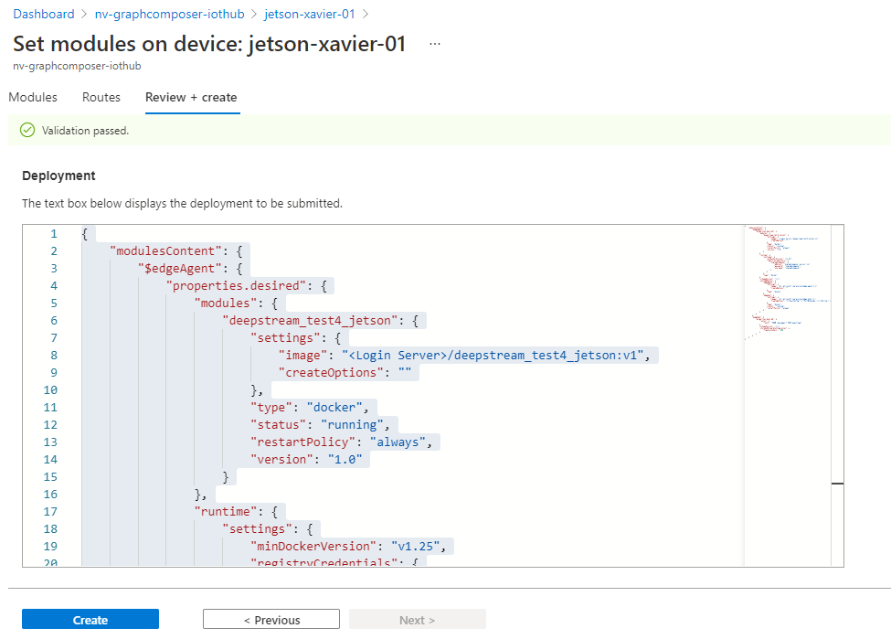

1. To verify that the deployment was successful, you can execute the  commands from a terminal on the NVIDIA Embedded device:

    ```Bash
    sudo iotedge list
    ```

1. You should see output that displays a status of *running* for the `edgeAgent`, `edgeHub`, and `deepstream_test4_jetson` modules.

    If your device is connected to a display, you should be able to see the visualized output of the DeepStream Graph application as shown below:

    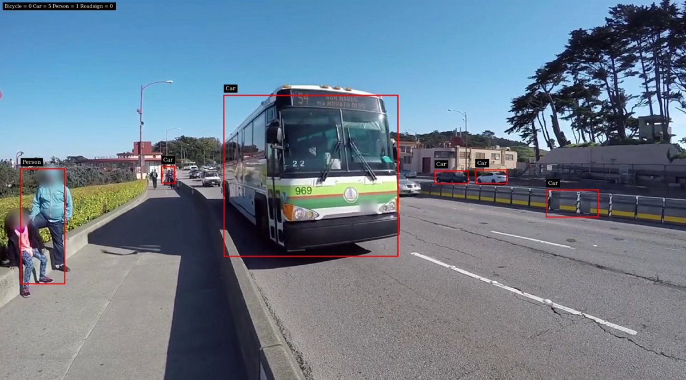

1. Monitor the output of the `deepstream_test4_jetson` module by running the following commands in a terminal on the NVIDIA Jetson Embedded device:

    ```Bash
    sudo docker logs -f deepstream_test4_jetson
    ```

1. You will notice that every few seconds your device will send telemetry to its registered Azure IoT Hub. A message that looks like the following will be produced:

    ```
    Message sent : {
      "version" : "4.0",
      "id" : 1440,
      "@timestamp" : "2021-09-21T03:08:51.161Z",
      "sensorId" : "sensor-0",
      "objects" : [
        "-1|570|478.37|609|507.717|Vehicle|#|sedan|Bugatti|M|blue|XX1234|CA|-0.1"
      ]
    }
    ```

1. You can confirm that status of the running modules in the Azure portal by navigating back to the device overview for your IoT Edge device.  You should see the following modules and associated statuses listed for your device:

    > [!div class="mx-imgBorder"]
    > 

1. You can also confirm that messages are arriving from your device into your Azure IoT Hub, by navigating to your IoT Hub overview panel where you should notice an increase in messages as shown below:

    > [!div class="mx-imgBorder"]
    > 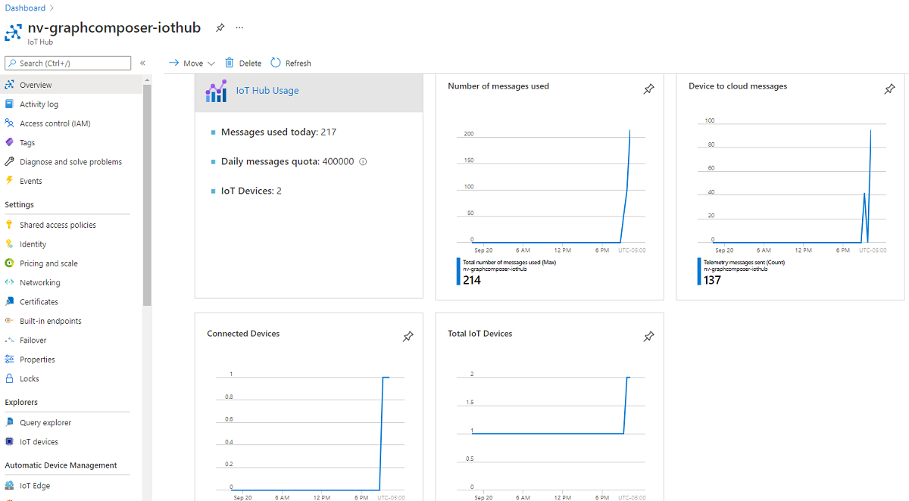

Congratulations!  You have successfully developed a production grade edge deployment of a DeepStream Graph Composer workload and deployed it to a real device using Azure IoT Edge!

### Try this

Using strategies described in this module, how might you modify an existing DeepStream reference graph to support a wildlife conservation solution that counts unique instances of endangered species using live camera feeds?  Which components would you need to modify in order to support this solution?  Would you need to make any modifications to the overall deployment strategy?
