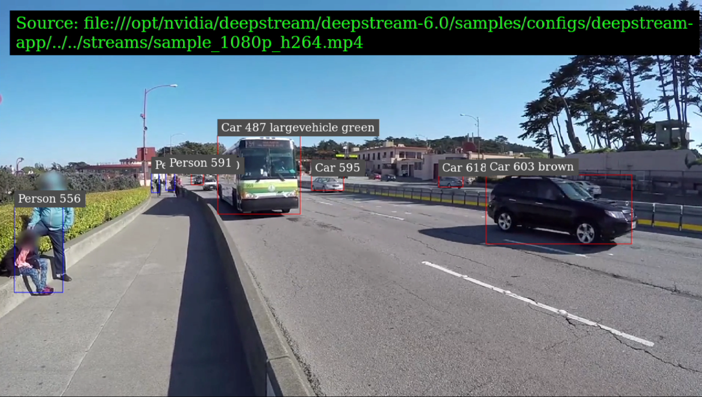

In this module, you'll learn how to set up and configure an x86-based Ubuntu 18.04 system to host an NVIDIA DeepStream development environment.

## Prerequisites

- x86-based system running Ubuntu 18.04
- RTX 2080, RTX 3080, T4, or A100 NVIDIA graphics card

## Scenario: Develop an application that counts people and vehicles in a specific area

Your boss wants to adopt AI, specifically computer vision, to aid the automation of gathering metrics about customer traffic in specific areas. The task seems like a difficult one at first, rife with complexities and areas in need of never-ending optimization. But you're aware that there might be a way to simplify this task. By using the NVIDIA DeepStream SDK together with Azure services, you can create a production-grade solution that could lend itself to other use cases with minimal modification. You decide to explore the possibilities by setting up a development environment to evaluate the NVIDIA DeepStream SDK.  

## What will you learn?

After you finish this module, you'll be able to:

- Describe the components of Intelligent Video Analytics applications
- Install the NVIDIA DeepStream SDK and dependencies onto an x86 host
- Run NVIDIA DeepStream applications
- Modify and customize NVIDIA DeepStream application configurations

## What is the main goal?

This module will demonstrate how to get started with developing Intelligent Video Analytics applications by using the NVIDIA DeepStream SDK.
