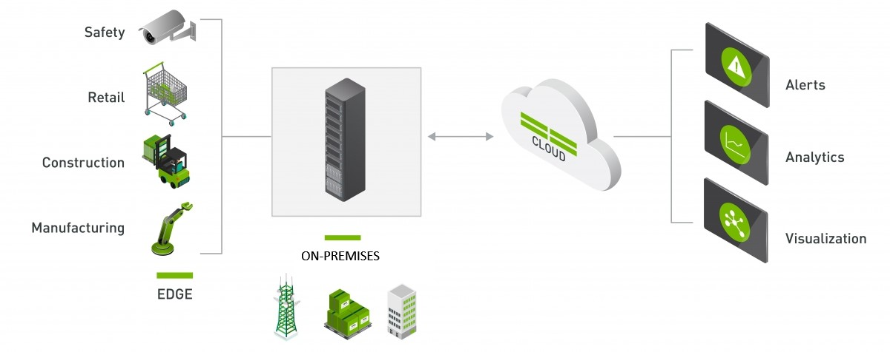

Every day, video cameras produce volumes of data in popular business domains.  These areas include hospital, manufacturing, retail, and smart city environments. Many of these deployments can be enhanced with the addition of AI that operates on the data produced by the camera sensors in real time.  

Imagine being able to monitor enforcement of health advisories or adherence to safety protocols at job sites, adapt to customer demographics, or respond to traffic events in an automated way. You can accomplish these scenarios by using video-based solutions that apply AI to Internet of Things devices deployed at the edge.

We refer to these types of solutions as *Intelligent Video Analytics (IVA)* applications. They extract actionable insights through the application of computer vision algorithms that operate on live video frames.  This table describes three types of computer vision algorithms:  

| Computer vision algorithm  | Capabilities  |
|---|---|
| Object detection  | Object detection models are trained to classify individual objects in an image and identify their location with a bounding box. For example, a traffic monitoring solution might use object detection to identify the location of various classes of vehicles.  |
| Image classification  | Image classification involves training a machine learning model to classify images based on their content. For example, consider a traffic monitoring solution. You might use an image classification model to classify images based on the type of vehicle they contain, like taxis, buses, bicycles, and so on.  |
| Object tracking   |  You can apply object tracking to an object detected via object detection. The object is assigned an identity that you can reference through successive inference passes in an IVA pipeline. For example, you could use object tracking to count unique instances of people in an area.  |

You can do powerful assessments by using these algorithms in combination to achieve functionality known as *cascading inference*. Here's an example of this technique: 
1. Identify a vehicle and its location in the frame by using object detection. 
1. Use a tracker that assigns each vehicle a unique ID to count the number of vehicles in the area. 
1. Use an image classification model to determine each vehicle's color.

After you're set up to generate insights in this way, you can employ more services to use this data by offloading to cloud services in Microsoft Azure. On Azure, data can be live-processed, trigger automation tasks, or be archived for historical analysis.  

## Enabling development of Intelligent Video Analytics applications by using NVIDIA DeepStream and Azure

NVIDIA DeepStream enables you to develop Intelligent Video Analytics applications that use a multiplatform framework that can be deployed at the edge and connect to cloud services. This framework enables you to visually define IVA pipelines by using a development tool called NVIDIA Graph Composer. The tool allows you to define video sources from file, local camera, or networked RTSP video streams that can feed directly into single or cascading inference operations. These operations produce insights that you can then forward to cloud services for further processing. By doing the computationally heavy inference tasks locally at the edge, you can reduce the amount of data needed to transmit insights and telemetry to the cloud.

## Hardware and operating system requirements

To continue with this module, you need to have access to an x86/AMD64-based machine running [Ubuntu 18.04](http://releases.ubuntu.com/18.04/). You also need to ensure that your development machine has one of the following graphics cards installed.

### GPUs compatible with DeepStream 6.0 

* [RTX 2080](https://www.nvidia.com/en-us/geforce/graphics-cards/rtx-2080/)  
* [RTX 3080](https://www.nvidia.com/en-us/geforce/graphics-cards/30-series/rtx-3080-3080ti/)
* [Tesla T4](https://www.nvidia.com/en-us/data-center/tesla-t4/)
* [Ampere A100](https://www.nvidia.com/en-us/data-center/a100/)

    >[!NOTE]
    >If you plan to use a virtual machine to satisfy these requirements, you might encounter problems later in this learning path when you try to start NVIDIA Graph Composer if you'e connecting to your VM over a remote session. You'll still be able to continue with the modules, but we want be sure you're aware of this issue.

### Try this

Consider scenarios where you could use computer vision to help you automate a task or simplify a traditionally complex process. What would your video feeds need to see? What computer vision algorithms would you need to use to implement your solution (object detection, image classification, object tracking)?
