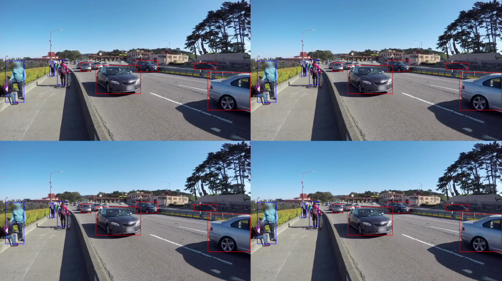

Now that you've installed the NVIDIA DeepStream dependencies and SDK, you can start working with the included DeepStream sample applications.

1. Go to */opt/nvidia/deepstream/deepstream/samples*. You'll see many sample applications and configurations. We'll go to the deepstream-app samples and start one of the sample applications.  

    The following commands will start deepstream-app by using the configuration in *source4_1080p_dec_infer-resnet_tracker_sgie_tiled_display_int8.txt*.

    ```
    cd /opt/nvidia/deepstream/deepstream/samples/configs/deepstream-app
    deepstream-app -c source4_1080p_dec_infer-resnet_tracker_sgie_tiled_display_int8.txt
    ```

    The deepstream-app should start building the execution engine. It will use the model metadata defined in the supplied configuration.  This process might take a few minutes, depending on the available hardware. It will run faster on consecutive runs because of the caching of the resulting engine output.

    The name of the configuration file tells us a bit about what to expect from the sample. The *source4_1080p_dec_infer-resnet_tracker_sgie_tiled_display_int8.txt* sample will: 
    - Decode four 1080p video sources and apply inference by using ResNet as the primary GPU inference engine (to detect people, bicycles, vehicles, and road signs). 
    - Employ object tracking and use a secondary GPU inference engine (for make/color/model of the vehicle). This engine will render results in a tiled display by using int8 precision (to speed up inference processing time).  

    The display should look like this one:

    

    You can view the labels assigned to detected objects by selecting any of the sources in the tiled display. When you do, you'll see a bit more information about the objects. To return to the tiled display, right-click anywhere in the application window.

    

Now that you've seen a DeepStream sample application, you can make some changes to customize its behavior.
