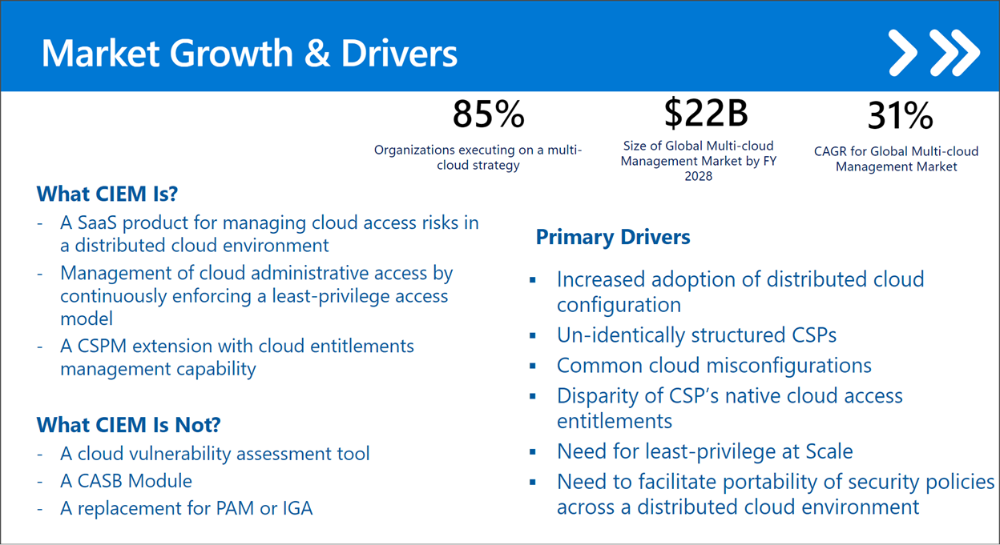
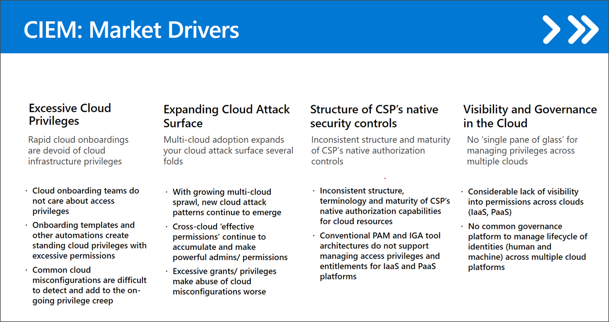

## What is CIEM? ##
Cloud infrastructure entitlement management, or CIEM (pronounced *kim*), is a SaaS approach for managing identities and permissions in cloud environments. CIEM leverages cloud infrastructure and platform services (CIPS) public APIs to obtain identity configuration, entitlements, permissions and operation details to facilitate analysis along with native capabilities to support SecOp use cases.

## How CIEM helps organizations

CIEM helps manage cloud administrative access by continuously enforcing a least-privilege access model.

- **RISK**                                       
CIEM tools manage cloud access risks through administration time controls for the governance of entitlements in hybrid and multicloud infrastructure as a service (IaaS).

- **ANALYTICS**                                                                              
CIEM tools use analytics, machine learning (ML) and other methods to detect anomalies in account entitlements, like accumulation of privileges and dormant and unnecessary permissions.

- **ENFORCEMENT**                        
CIEM ideally provides enforcement and remediation or least-privilege approaches. Some CIEM tools can extend entitlement controls to SaaS applications and identity providers (IdPs) and also provide basic threat discovery, incident response and forensics.

## CIEM market growth & viability

CIEM is an in-demand approach to managing entitlement assets in cloud environments. Eighty-five percent of organizations are executing on a multicloud strategy.  

### Why CIEM is important? ###

As company workflows and system applications continue to move to the cloud - and hybrid cloud - environments, there's an increasing need for monitoring identities and privileges in a secure environment that is dynamic, and can be accessed from various locations. CIEM allows companies to discovery, monitor, and manage entitlements in real time in cloud infrastructures, and hybrid cloud environments.

The benefits of CIEM translate into these key areas that are driving the CIEM market:

CIEM removes the gap between moving company workflows to the cloud and ensuring those workflows remain secure, remain accessibly to those who use them, and remain simple to manage. 

Now that you've had a quick overview of CIEM, let's move on to the product, Permissions Management, and see how it fits into the CIEM methodology as a cloud infrastructure security solution.