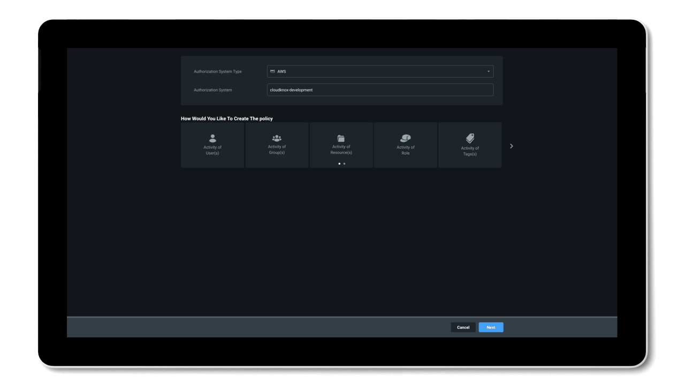
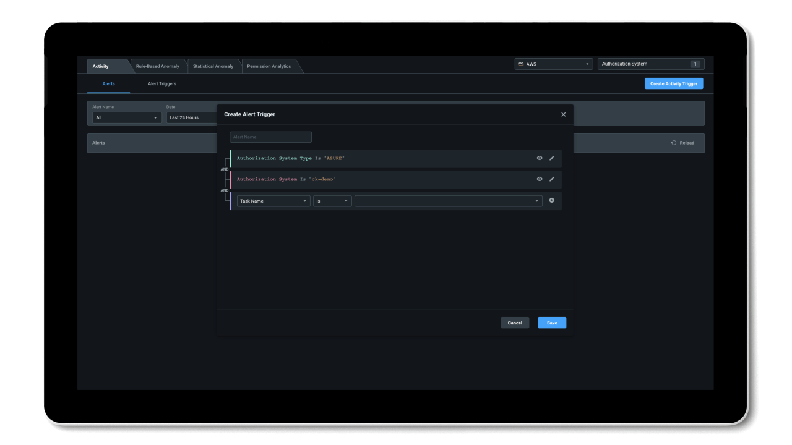

## How does Permissions Management work? ##

With Microsoft Entra Permissions Management, your organization can adopt a new, dynamic approach to managing identities and permissions in multicloud environments.

:::image type="content" source="../media/manage-permissions-dynamic-approach.png" alt-text="Image that describes the Permissions Management dynamic approach."lightbox="../media/manage-permissions-dynamic-approach.png":::

- **Grant permissions based on historical usage and activity:** Instead of relying on assumed job roles and responsibility, take the guesswork out of granting permissions with insights into usage and activity history to make data-driven decisions.
- **Allow temporary access to high-risk permissions on-demand:** Use permissions on-demand and automated just-in-time access to grant users time-bound access to high-risk permissions.
- **Continuously monitor and right-size identities to prevent privilege creep:** Use alerts and monitoring capabilities to take a proactive approach to manage privilege (or permissions) creep.

Permissions Management allows you to address three key use cases in securing and managing identity permissions in cloud environments: *discover*, *remediate*, and *monitor*.

:::image type="content" source="../media/discover-remediate-monitor.png" alt-text="Image of the Discover, Remediate, and Monitor workflow of Microsoft Entra Permissions Management."lightbox="../media/discover-remediate-monitor.png":::

### Discover & Assess ###

Permissions Management gives you visibility to discover and assess permissions risk by evaluating the gap between permissions granted versus permissions used in the Permissions Management UI.

- Permissions usage analytics provide a multi-dimensional view of permissions risk for all identities, actions, and resources across AWS, Azure and GCP.
- The Permissions Creep Index (PCI) allows you to easily assess risk by evaluating the gap between permissions granted and permissions used. PCI is an aggregated metric that regularly evaluates the level of risk associated with the number of unused or excessive permissions across identities and resources. It also measures how much damage identities might cause based on which resources they have access to.

### Remediate & Manage ###

Permissions Management evaluates and creates right-size permissions based on usage, grants new permissions on-demand, and automates just-in-time access for cloud resources.

- Simplify permissions right-sizing and least privilege role creation across any cloud platform; AWS, Azure, or GCP.
- Automated deletion provides efficiency of security with automatic removal of permissions that have been unused for the past 90 days.
- Grant identity permissions on-demand with a self-service workflow for a limited time period or an as-needed basis.

### Monitor & Alert ###

Detect anomalous activities with machine language-powered (ML-powered) alerts and generate detailed forensic reports.

- ML-powered anomaly detections provide increased efficiency in detecting unexpected shifts in activity.
- Context-rich forensic reports show information on identities, actions, and resources to support rapid investigation and remediation.
- Integration of the Defender for Cloud dashboard empowers you to manage the security of all cloud resources in one interface.

### Minimize permission risks with Permissions Management ###

Now see some of these concepts and features of Permissions Management in action.
> 

This interactive video will help you to become more familiar with what securing permissions in your multicloud environment will look like with Microsoft Entra Permissions Management. Learn how, with Permissions Management, you can get granular cross-cloud visibility, enforce principle of least privilege, and continuously monitor permissions.

### Permissions Management Architecture ###

The Permissions Management architecture is composed of data processing and analytics and data collection that create a SaaS structure.

:::image type="content" source="../media/epm-architecture.png" alt-text="Screen with Microsoft Entra Permissions Management architecture."lightbox="../media/epm-architecture.png":::

#### SaaS Service ####

- Responsible for processing the raw entitlement and activity data over a 90-day window, and making it available for the application to query.
- Receives raw files from the Collector Service containing entitlement and activity data.
- Data processing and analytics are done on these raw files to generate the usage metrics and reports that you see in the product.
- Cloud Object Storage stores the raw data files that the collector service uploaded.
- Data Lake is used to help with data analytics related to alerting. Know whether an activity triggered an alert through a data lake.
- Cloud database serves all of our pages/tabs in Microsoft Entra Permissions Management.
- Data Collector configures the collector service with the appropriate credentials to access the cloud service providers. This service collects data every hour.

#### Key Terminology ####

Here are some key terms used within the Permissions Management framework.

:::image type="content" source="../media/epm-architecture-terminology.png" alt-text="Screen with Microsoft Entra Permissions Management Architecture key terminology."lightbox="../media/epm-architecture-terminology.png":::

To familiarized yourself more with terms used in the world of Microsoft Entra Permissions Management and understand the role Permissions Management plays in cloud operations and security, see the [Microsoft Entra Permissions Management Glossary](https://query.prod.cms.rt.microsoft.com/cms/api/am/binary/RE50HaO?culture=en-us&country=UShttps://query.prod.cms.rt.microsoft.com/cms/api/am/binary/RE50HaO?culture=en-us&country=US)
