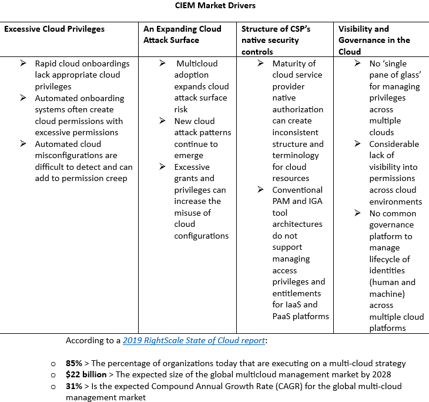

# What is CIEM? #

In order to understand Microsoft Entra Permissions Management, it's first important to understand the product category that it belongs to.

Cloud infrastructure entitlement management, or CIEM (pronounced *kim*), is a SaaS model for managing identities and permissions in cloud environments. CIEM is a newer approach that applies cloud infrastructure and platform services (CIPS) to manage human and workload identities, entitlements, permissions, and operation details across multiple cloud environments.

## Why is CIEM important?

As company workflows and system applications continue to move to the cloud, there's an increasing need for monitoring identities and privileges in a secure environment that is dynamic. CIEM allows companies to discover, manage, and monitor identities and their permissions in real time across multiple cloud infrastructures. 

Managing permissions with a CIEM approach in your organization allows you to prevent what's called the Permissions Gap problem.  

The Permissions Gap is defined as the difference between Permissions Granted and Permissions Used (Permissions Gap = Permissions Granted - Permissions Used), or, it's the number of granted permissions in your environment that go unused or unmonitored. Having a large Permissions Gap is problematic as it expands the space for cyber attacks in your organization's cloud infrastructure. This expanded space can leave you open to risk of a security breach from accidental or malicious permissions use. 

## CIEM market growth & viability

CIEM is an in-demand approach to managing entitlement assets in cloud environments. Eighty-five percent of organization are executing on a multicloud strategy.

The benefits of CIEM translate into these key areas that are driving the CIEM market:

## How CIEM helps organizations

CIEM contributes to a Zero Trust security framework by continuously enforcing a least-privilege access model. Implementing a CIEM solution into a zero-trust framework allows an organization to move beyond static, assumption-based permission processes, and into continuous permissions management that helps the organization monitor, get alerts, and remediate anomalous identity behavior.

- **GET GRANULAR CROSS-CLOUD VISIBILITY**

CIEM solutions allow users to assess permissions risks by evaluating the gap between permissions granted and permissions used through visibility of over-privileged users and groups.

- **ENFORCE THE PRINCIPLE OF LEAST PRIVILEGE**

CIEM solutions use analytics, machine learning (ML) and other methods to detect abnormal events in account entitlements, like accumulation of privileges and dormant and unnecessary permissions.

- **REDUCE PERMISSION RISK**

CIEM solutions continuously monitor access activity to identify outdated identities and right-size active permissions. Continuous monitoring also helps organizations adhere to compliance regulations and standards for user permissions.

CIEM removes the gap between moving company workflows to the cloud and ensuring those workflows remain secure, remain accessible to the resources that use them, and remain simple to manage.

Now that you've had a quick overview of CIEM, let's move on to the product, Microsoft Entra Permissions Management, Microsoft’s CIEM solution.
