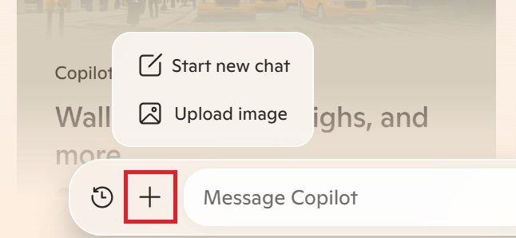

Have you ever wished you could get more out of your AI assistant than just asking questions? With Microsoft Copilot, you can do just that. Copilot isn't just about answering your text-based queries. It's a powerful tool that can analyze images and documents to give you detailed information and insights.

By using AI algorithms, Copilot can recognize elements in images, such as objects and text. It can also interpret documents like spreadsheets. You can upload an image or a document, and Copilot will break it down into identifiable features and compare them to a database to give you descriptions and insights.

In this video, you learn how to use the image and document analysis capabilities in Copilot to enhance your productivity. Whether you're a real estate agent cataloging property features or a shop owner analyzing quarterly sales data, Copilot can help you work more efficiently and make informed decisions.

> [!VIDEO https://go.microsoft.com/fwlink/?linkid=2298109]

> [!NOTE]
> Since the release of this video, the document upload functionality in Microsoft Copilot was changed to support image uploads only. Although Copilot can still analyze images that you upload, document analysis is no longer directly supported through the upload function. You can describe the content or share text from your documents, and Copilot will assist in interpreting and analyzing the information. Document analysis is still available through Microsoft 365 Copilot.

To upload an image, select the plus sign (+) and then select **Upload image**.

