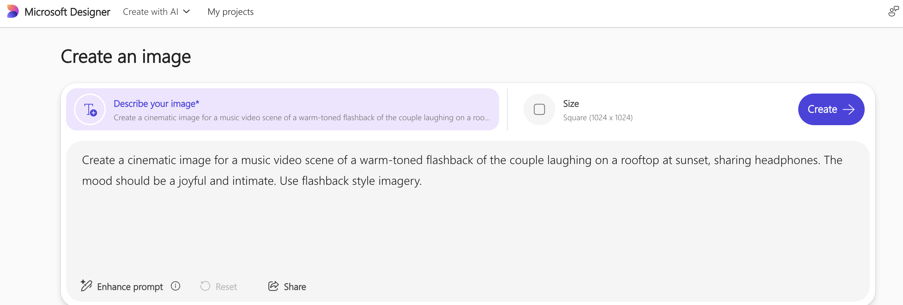
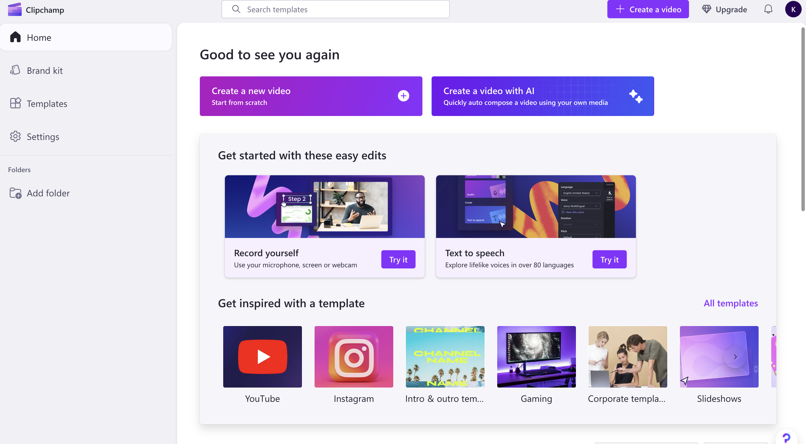
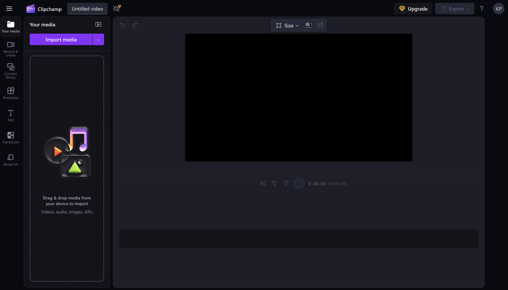

**Objective** 

Turn your music video concept and storyboard from Module 1 into a short visual teaser using **Microsoft Copilot**, **Microsoft Designer**, and **Clipchamp**.

**Materials Needed** 

- Laptop or desktop with internet access  
- Access to Microsoft Copilot, Designer, and Clipchamp  
- Your completed concept and storyboard from Module 1  
- The same song used in Module 1  
- USB drive or cloud storage to save your work  

## Step-by-Step Instructions

### **Part 1: Review and Choose Key Scenes**

- Open your storyboard and concept notes from Session 1  
- Pick **3–4 important scenes** that would look strong as visuals  
- Choose **one “signature shot"**—a key moment that defines your video  

### **Part 2: Create Scene Images in Microsoft Designer**

- Open **Microsoft Designer**  
- For each scene, use a prompt like:  
  *"Create a cinematic image for a music video scene where [describe the scene]. The mood should be [emotion]. Use [visual style or color palette]."*

- Try different angles or styles for your **signature shot**  
- Save your favorite images for later use  

### **Part 3: Generate Transitions and Effects with Copilot**

- Open **Microsoft Copilot**  
- Ask Copilot to describe creative transitions:
  *"Suggest video transitions for a scene moving from [Scene 1] to [Scene 2]. The song's mood is [mood]."*

- Get visual effects ideas for your signature shot:
  *"Describe visual effects that would enhance a scene showing [signature shot]. The effects should match a [genre] song with themes of [theme]."*

- Save Copilot's suggestions for use in your video editor  

### **Part 4: Build Your Teaser in Clipchamp**

- Open **Clipchamp** and create a new project (16:9 aspect ratio)  

- Import your saved images from Designer  

- Use Clipchamp's AI tools to:  
  - Arrange your scenes in order  
  - Add transitions suggested by Copilot  
  - Insert any text from your original concept  
  - Apply visual effects to the **signature shot**  
  - Sync everything to your selected song  

- Export a **15–30 second teaser** of your music video  

### **Part 5: Reflect on the Process**

- Watch your teaser alongside your original storyboard  
- Reflect on how AI tools helped you:
