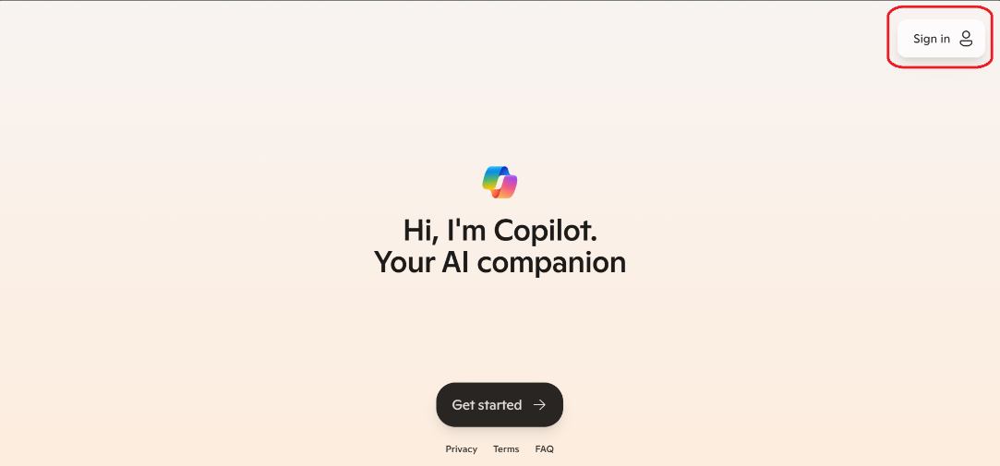
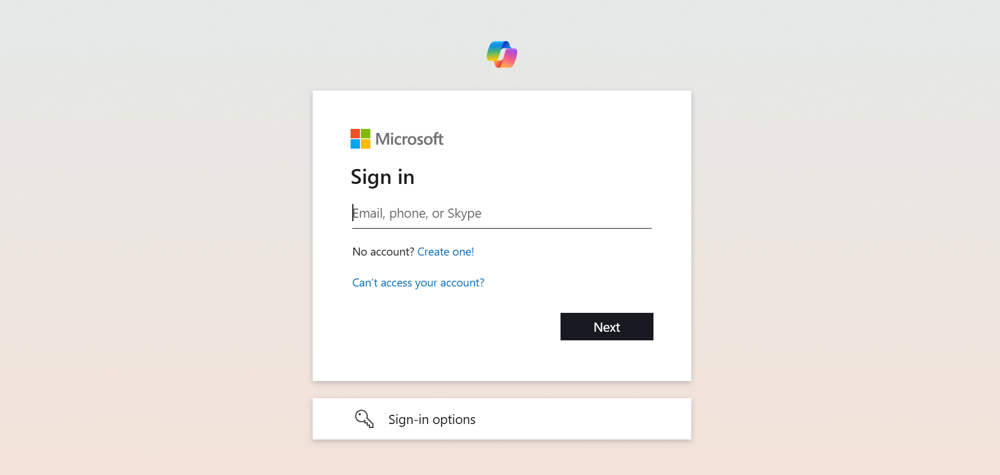
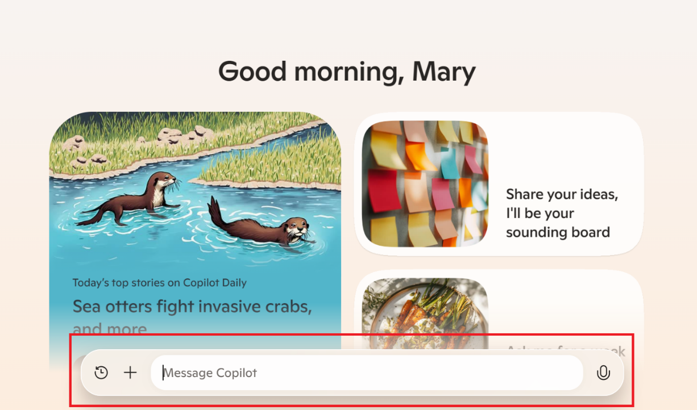

Your experience with Microsoft Copilot isn't a one-size-fits-all. Whether you're using a personal account or a work or school account, Copilot adapts to provide an experience that's right for your needs. It's compatible with various operating systems and browsers. You can also access Copilot by downloading the Microsoft Copilot app to your phone. To access Copilot from your computer, open a browser and go to copilot.microsoft.com.

You can use a limited version of Copilot without a Microsoft account. However, logging into a Microsoft account using the Microsoft Edge browser provides the best experience. Having an account allows for extended conversations with Copilot. It also allows you to save your conversation history and perform research and summaries of webpages you're viewing.

Ready to get started?

First, navigate Microsoft Copilot. To sign in, locate the "sign in" option at the top right corner by clicking on the round icon. Now, you see the option to sign-in. When signing in with a personal account, you have access to a free basic option. If you don't have a personal account, you can create one for free to access Copilot.

A work or school account is provided by your employer or school for professional use. Signing in with a work or school account ensures your organization's data is protected and Copilot will redirect you to copilot.cloud.com. If you're using Copilot for work or school-related tasks, you should sign-in with your work or school email. If your organization grants you Copilot privileges, you can also use Copilot in Microsoft 365 applications.

If you don't have an account and need to make one, select on "create one" and follow the steps provided. Once you sign in, you unlock access to extended conversations and more features. Now that you have an account, let's explore the interface.

To message Copilot, use the text box at the bottom of the page. You can add images to your conversation if you want to ask questions or need a description of an image or even want Copilot to generate content based on an image. To add an image, select on the ‘+' icon. Once you select the file, it appears on the screen and Copilot can analyze it and respond accordingly.

If logged into a work or school account, you can add a file or image with the paperclip option. When you select your file, Copilot can access its content. The ‘Recent Conversations' section shows your past interactions with Copilot. You can scroll through your recent conversations, select a specific conversation to open it, and continue where you left off.

## Step-by-Step Guide for Navigating Copilot

**Accessing Copilot**:

Open a browser and go to copilot.microsoft.com.

Alternatively, download the Microsoft Copilot app to your phone.

**Signing In**:

Locate the "sign in" option at the top right corner by clicking on the round icon.

Sign in with a personal account for a free basic option or create one if you don't have it.

For work or school accounts, sign in with your work or school email to ensure data protection and access to Microsoft 365 applications.

**Creating an Account**:

If you need to create an account, select on "create one" and follow the steps provided.

**Exploring the Interface**:

Use the text box at the bottom of the page to message Copilot.

Add images to your conversation by clicking on the ‘+' icon and selecting the file.

For work or school accounts, add files or images with the paperclip option.

**Using Recent Conversations**:                                                                                 

Scroll through the ‘Recent Conversations' section to refer to previous interactions.

Select on a specific conversation to continue where you left off.

You navigated to Copilot and set up your account. The final step is to confirm your language and accessibility settings. Continue this module to explore and utilize Copilot's features.