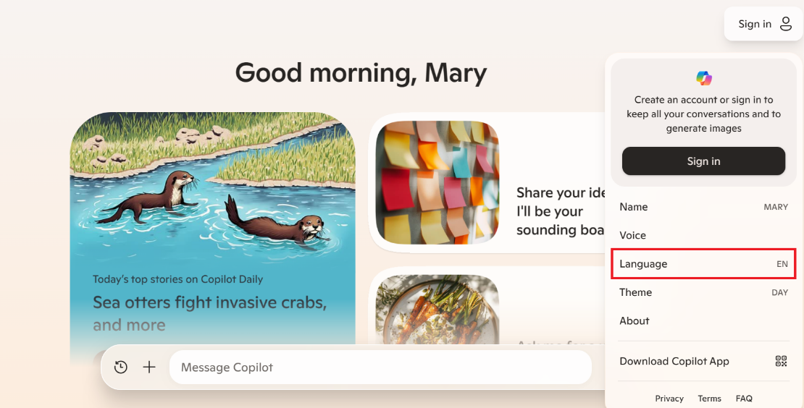
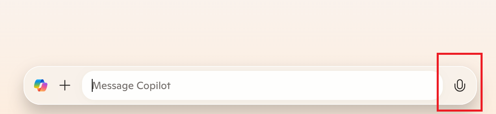

Microsoft Copilot is a multilingual AI companion designed to break down language barriers and make access to information easier across the globe. It currently supports several languages. However, language support for Copilot doesn't extend as far as Bing's language support, yet.

To adjust language settings in Microsoft Copilot, select the circle icon at the top right corner. Select on "language" and select your preferred language.

Aside from languages, Copilot was also built with accessibility in mind. Copilot voice is a feature that brings ease and efficiency to your conversations. It's perfect for those moments when typing isn't the best option, or for users who find speech more accessible than text.

Visual search is another feature that empowers you to explore and understand the world around you. Whether you're curious about a mysterious plant in your garden or the species of a bird perched outside your window, visual search is there to assist. With a simple image, Copilot becomes your guide, transforming images into knowledge.

These features help pave the way to a future where knowledge knows no bounds, and learning is within everyone's reach.

**Step-by-Step Guide for Language and Accessibility Support in Copilot**

**Adjusting Language Settings**:

Open Microsoft Copilot.

Select the circle icon at the top right corner.

Select on "language" and select your preferred language.

**Using Copilot Voice**:

Open Copilot on your device.

Select the microphone icon and speak into your device.

Copilot listens and responds in real-time.

Now that you accessed Copilot, navigated the platform, and adjusted the accessibility and language settings, you're all set to dive into engaging conversations with your AI Companion. The next lesson will help you maximize your experience, using Copilot's capabilities to their fullest. Explore how to interact seamlessly with Copilot and make the most out of this AI companion, enhancing your productivity and enjoyment.