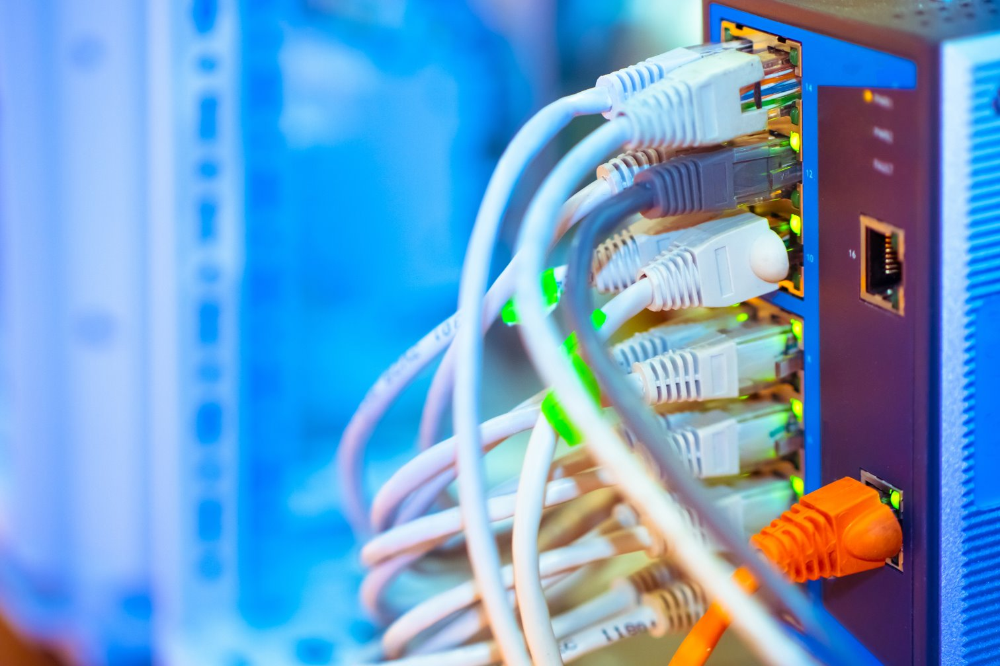

>[!div class="mx-imgBorder"]
>

The physical and logical infrastructure within a datacenter forms the foundation for hosting, powering, and managing IT operations. This includes racks and enclosures that house hardware and Application Delivery Controllers (ADCs) that optimize performance, availability, and security for applications.

| Apparatus | Recent innovations |
| --- | --- |
| **Racks and enclosures** | • High-density racks: Designed to support higher power loads and cooling requirements for modern hardware like GPUs used in AI and machine learning. • Integrated cooling solutions: Racks now feature built-in cooling mechanisms such as liquid cooling, rear-door heat exchangers, and airflow management systems to handle high-density deployments. • Intelligent rack management: Advanced racks include sensors for monitoring temperature, humidity, and power consumption, enabling better management and reduced downtime. • Physical security enhancements: Racks are equipped with biometric locks, Radio Frequency Identification (RFID) access control, and video monitoring to prevent unauthorized access. • Cable management innovations: Improved cable trays, harnesses, and labels simplify cabling in high-density racks, reducing maintenance time and risk of errors. |
| **Application delivery controllers (ADCs)** | • Multicloud and hybrid cloud Support: Modern ADCs can seamlessly manage application traffic across on-premises, cloud, and hybrid environments. Examples include F5 BIG-IP and Citrix ADC. • AI-Powered optimization: AI and ML are used to analyze traffic patterns, detect anomalies, and optimize traffic distribution dynamically. • Kubernetes and container integration: ADCs now natively support microservices and containerized applications, enabling efficient traffic management in environments like Kubernetes clusters. • TLS 1.3 and QUIC support: Support for modern protocols ensures faster, more secure application delivery, improving user experiences. • Web Application Firewall (WAF) integration: Many ADCs now include WAF capabilities to protect applications from common threats like SQL injection and cross-site scripting (XSS). • API gateway features: ADCs are evolving to include API gateway functions, facilitating secure and efficient API traffic management for modern applications. • Edge computing and CDN support: ADCs are increasingly integrated with edge computing platforms and Content Delivery Networks (CDNs) to reduce latency and enhance performance for geographically distributed users. |

## Key considerations and trends

- Efficiency and sustainability: As datacenters focus on energy efficiency, racks and ADCs are being designed with sustainability in mind, such as energy-efficient power distribution and intelligent workload balancing.
- Automation and orchestration: ADCs and rack management tools are increasingly integrated into automation frameworks, simplifying operations and enhancing responsiveness.
- Security integration: Both physical (racks) and logical (ADCs) elements now include advanced security features to address growing cybersecurity threats.
- Edge datacenters: Compact racks and lightweight ADCs are enabling the deployment of edge datacenters closer to end-users for ultra-low latency applications.
- Open standards: Open rack standards (OCP) are gaining traction, promoting interoperability and reducing costs by standardizing rack dimensions and features.
