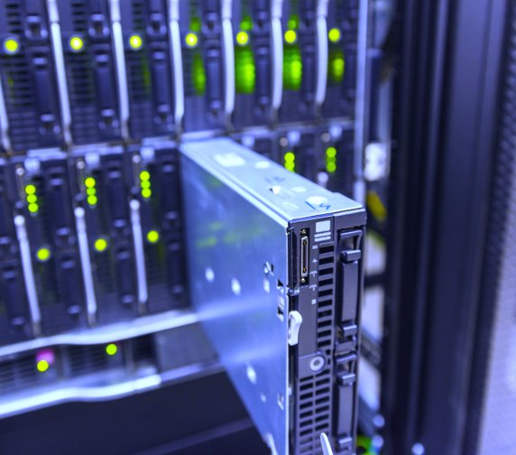

In datacenters, hardware and IT infrastructure form the foundation for hosting, managing, and delivering critical applications and services. Let us explore the essential components of a datacenter, including servers, storage systems, network infrastructure, and IT apparatus. Understanding these elements is vital to designing, implementing, and maintaining efficient, scalable, and secure datacenter environments.
>[!div class="mx-imgBorder"]
>

## Types of servers

Datacenter servers continue to evolve with innovations that enhance efficiency, scalability, and performance. New designs integrate advanced cooling solutions, high-speed connectivity, and AI accelerators to support demanding workloads. Modular and energy-efficient features also improve flexibility, making it easier to manage resources while reducing power consumption.

| Server type and component | Description | Recent innovations |
| --- | --- | --- |
| **Blade servers** | Compact and power-efficient, blade servers are used in high-density environments to maximize processing power in limited space. They're modular servers that fit into a shared chassis, which provides power, cooling, and networking resources. | <li>Integrated fabric switching: Advanced chassis systems now include integrated fabric switches, reducing external cabling and improving network performance. <li>Increased density: New blade designs enable even higher core density, such as the Cisco UCS X-Series and HPE Synergy, which can host multiple high-performance CPUs and GPUs in a single chassis. <li>Energy efficiency: Blade systems use shared cooling and power infrastructure, leading to lower energy consumption compared to standalone servers. <li>Support for AI workloads: Modern blade servers include specialized GPUs or accelerators, such as NVIDIA A100, to handle artificial intelligence (AI) and machine learning (ML) tasks. |
| **Rack servers** | Mounted in standard racks (measured in units, e.g., 1U, 2U), these servers provide scalability and flexibility for a wide range of applications. These are highly versatile and scalable, making them suitable for a wide range of applications, from small businesses to large datacenters. | <li>Advanced Cooling Solutions: New designs integrate liquid cooling and direct-to-chip cooling options to support high-power CPUs and GPUs, such as AMD EPYC or Intel Xeon Scalable processors. <li>Composable Infrastructure: Modern rack servers can be disaggregated into compute, storage, and networking modules, enabling better resource utilization and flexibility. <li>Accelerator Integration: Support for AI/ML accelerators, including Intel Habana, AMD Instinct, or NVIDIA GPUs, allows these servers to handle complex computational tasks efficiently. <li>High-Speed Connectivity: Many rack servers now include PCIe 5.0 slots and support for 400Gbps Ethernet or InfiniBand for faster data transfer. |

## Key server components

Key server components include processors (CPUs), memory (RAM), storage (HDDs/SSDs), power supplies, and cooling systems.  

| Server Component | Recent innovations |
| --- | --- |
| **Processors (CPUs) innovations** | <li>Multi-core processors: CPUs with up to 128 cores (e.g., AMD EPYC Genoa and Intel Xeon Platinum) provide extreme parallelism for data-intensive tasks. <li>AI acceleration: CPUs now include built-in AI instructions, such as Intel’s Advanced Matrix Extensions (AMX), to accelerate AI workloads.   **Example:** AI-powered customer support chatbots and fraud detection systems can now run efficiently on CPUs alone, leveraging built-in AI accelerators to enhance real-time processing without requiring dedicated GPUs. <li>Chiplet technology: AMD and Intel are using chiplet designs to increase processing power and scalability. |
| **Memory (RAM) innovations** | <li>DDR5: The latest generation of memory offers increased bandwidth and reduced power consumption, essential for high-performance servers. <li>ECC Memory: ECC (Error-Correcting Code) memory includes an additional memory chip that detects and corrects errors in real-time. While slightly more expensive than non-ECC RAM, this added protection is critical for servers and enterprise applications that rely on large-scale data processing. <li>Persistent memory: Intel Optane and other non-volatile memory solutions bridge the gap between DRAM and storage, enabling faster data access and crash recovery. |
| **Storage (HDDs/SSDs)** | <li>Non-volatile memory express (NVMe) SSDs: NVMe SSDs provide ultra-fast storage access, ideal for high-performance applications. <li>Zoned storage: Innovations like zoned namespaces (ZNS) in SSDs optimize storage capacity and performance for large-scale data. <li>HDD advancements: High-capacity drives (20TB+ using heat-assisted magnetic recording or HAMR) remain relevant for cold storage. |
| **Power supplies innovations** | <li>High-efficiency units: Power supplies with 80 PLUS Titanium certification enable higher efficiency levels, translating to less power wasted as heat for lower electricity usage and cooling requirements, resulting in operational cost savings. <li>Redundancy and failover: Modular power supplies with N+1 or N+2 configurations ensure uninterrupted power delivery. |
| **Cooling systems innovations** | <li>Liquid cooling: Direct liquid cooling (DLC) and immersion cooling are increasingly used in high-density servers to manage heat more efficiently than traditional air cooling. <li>Smart cooling: AI-driven cooling systems dynamically adjust airflow and temperatures based on real-time workload demands.   **Example:** Google’s Data Centers – Google has implemented AI-driven cooling systems in its data centers, using machine learning algorithms to analyze data from thousands of sensors. These systems adjust cooling settings in real time to optimize energy efficiency and maintain optimal temperatures, significantly reducing energy consumption. |

## Storage options

Data storage is a critical aspect of datacenter operations, supporting a wide range of applications and services. Each storage option—SAN, NAS, and object storage— serves distinct purposes in datacenters, and innovations in this field continue to enhance their performance, scalability, and efficiency. SANs lead in high-performance environments, NAS excels in shared file storage, and object storage dominates in unstructured data and cloud-native applications.  

| Storage Option | Description | Recent innovations |
| --- | --- | --- |
| **Storage area networks (SANs)** | SANs are high-speed networks connecting storage devices to servers, offering block-level access for high-performance applications like databases. They're commonly used for mission-critical applications like databases, virtualization, and large-scale transactional systems, where high performance and low latency are essential. | <li>NVMe over Fabrics (NVMe-oF): This protocol extends the speed of NVMe SSDs over a network, significantly reducing latency compared to traditional protocols like iSCSI or Fibre Channel. <li>All-flash arrays (AFAs): Modern SANs leverage AFAs with NVMe SSDs for ultra-fast read/write speeds and better reliability than traditional HDD-based SANs. <li>Automated tiering: Advanced SAN systems now support automated tiering, moving frequently accessed data to high-speed storage and less critical data to slower, more cost-effective tiers. <li>AI-powered management: Artificial intelligence optimizes storage allocation and performance, predicting failures before they occur to minimize downtime. <li>Converged and hyper-converged infrastructure: SANs are increasingly integrated into converged solutions, simplifying deployment and management. |
| **Network attached storage (NAS)** | File-level storage systems connected via standard network protocols (e.g., NFS, SMB), ideal for shared file storage.  NAS provides file-level storage over a standard network using protocols like NFS (Linux/Unix) or SMB/CIFS (Windows). It is commonly used for shared file storage, backups, and home directories in small to medium-sized environments. | <li>Scale-out NAS: Solutions like Dell EMC Isilon and NetApp ONTAP enable seamless scalability, allowing organizations to add more storage nodes without disrupting operations. <li>Hybrid NAS: Combines SSDs for caching with HDDs for capacity, offering a balance between performance and cost-effectiveness. <li>Cloud-integrated NAS: Modern NAS systems integrate directly with public cloud services, enabling seamless data tiering and offloading archival data to the cloud. Examples include QNAP Cloud NAS and Synology C2. <li>Data deduplication and compression: Advanced NAS systems incorporate these features to save storage space and reduce costs. <li>Enhanced security: Features like end-to-end encryption, multifactor authentication, and ransomware protection are now standard in NAS solutions. |
| **Object storage** | Stores data as objects with metadata and unique identifiers, optimized for unstructured data like multimedia files and backups. Examples include Amazon S3 and OpenStack Swift. Unlike SAN or NAS, object storage uses a flat structure where data is stored as objects with unique identifiers and metadata, enabling scalable and efficient management of vast datasets. | <li>Cloud-native object storage: Leading solutions like Amazon S3, Microsoft Azure Blob Storage, and Google Cloud Storage provide highly scalable and globally accessible storage for cloud-native applications. <li>On-premises object storage: Software-defined solutions like MinIO, Ceph, and Scality enable enterprises to deploy object storage within their own datacenters, providing S3-compatible APIs for hybrid cloud integration. <li>Erasure coding: Enhances data durability and storage efficiency by spreading data across multiple disks or nodes with built-in redundancy. <li>AI and ML integration: Object storage systems now embed AI/ML capabilities to analyze stored data for trends, insights, and anomaly detection. <li>Data lifecycle management: Automates data migration across tiers, ensuring cost-efficient storage of frequently accessed vs. archived data. <li>Edge compatibility: Lightweight object storage solutions are being deployed at the edge to process and store IoT data closer to the source. |
