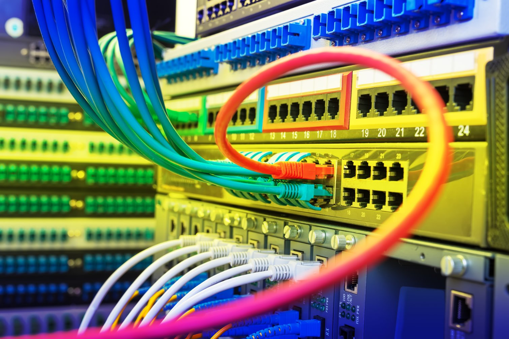

>[!div class="mx-imgBorder"]
>

Network infrastructure forms the backbone of datacenter operations, enabling communication between servers, storage devices, external systems, and users. This includes switches, routers, firewalls, and external connectivity mechanisms.

| Network Infrastructure | Description | Recent innovations |
| --- | --- | --- |
| **Switches** | Switches are critical for interconnecting devices within a datacenter. They forward data packets between servers, storage, and other switches, often organized in hierarchical architectures like leaf-spine or three-tier designs. | <li>High-speed Ethernet: Modern datacenters adopt switches supporting 100Gbps, 400Gbps, and even 800Gbps Ethernet to handle increasing data traffic. <li>Smart switching: Advanced switches now integrate programmable silicon (e.g., Broadcom Trident and Tofino) to enable custom traffic management and telemetry. <li>Zero-touch provisioning (ZTP): Automates switch deployment and configuration, reducing operational complexity. <li>Energy-efficient design: Power-efficient switches with features like adaptive power management reduce the environmental footprint. <li>Integration with software-defined networking (SDN): SDN enables centralized management of switches, simplifying configuration and enabling rapid response to changing network demands. |
| **Routers** | Routers connect datacenters to external networks, enabling communication between local and wide-area networks (LAN/WAN) and routing traffic between different subnets. | <li>High-capacity transport: Routers now support multi-terabit-per-second throughput, such as Cisco's NCS series and Juniper's PTX series, designed for hyperscale datacenters. <li>Segment routing (SR): Simplifies traffic engineering by reducing the need for complex protocols while optimizing path selection. <li>Edge routers for multicloud: Cloud-enabled routers facilitate seamless integration between datacenters and public cloud platforms. <li>AI-driven routing: Leveraging AI and ML to optimize routing decisions dynamically, improving Performance and reducing latency. <li>IPv6 support: Advanced routers fully embrace IPv6, ensuring scalability for an ever-increasing number of devices. |
| **Firewalls** | Firewalls secure datacenter networks by monitoring and controlling incoming and outgoing traffic based on predefined security rules. They're critical for protecting against unauthorized access, malware, and cyberattacks. | <li>Next-generation firewalls (NGFWs): NGFWs integrate advanced features like intrusion prevention systems (IPS), application layer filtering, and deep packet inspection (DPI). <li>Firewall as a service (FWaaS): Cloud-based firewalls offer scalable security for hybrid and multicloud environments. Examples include Zscaler and Palo Alto Prisma Access. <li>Zero Trust network access (ZTNA): Firewalls now play a role in implementing zero-trust security models, where access is continuously verified. <li>Decryption and inspection: New firewalls can decrypt and inspect encrypted traffic (e.g., TLS 1.3) to detect hidden threats. <li>Microsegmentation: Firewalls are used to segment datacenter networks into smaller zones, limiting lateral movement of attackers. |
| **External connectivity** | External connectivity connects the datacenter to external networks, including other datacenters, cloud providers, and end-users. It involves high-capacity links, redundancy, and low-latency options. | <li>Direct cloud connectivity: Services like AWS Direct Connect, Azure ExpressRoute, and Google Cloud Interconnect enable secure, high-speed links between datacenters and cloud platforms. <li>High-bandwidth optical links: Advances in dense wavelength division multiplexing (DWDM) and coherent optics enable external links with capacities of up to 800Gbps per channel. <li>5G integration: 5G connectivity at the edge allows datacenters to support augmented IoT and low-latency applications like augmented reality (AR) and virtual reality (VR). <li>Submarine cable systems: Hyperscale datacenters increasingly rely on private or consortium-built undersea cables to ensure global connectivity. Examples include Meta's 2Africa and Google's Grace Hopper cables. <li>Software-defined wide area networking (SD-WAN): SD-WAN simplifies the management of external connectivity by dynamically routing traffic over multiple links for improved performance and reliability. |

## Key trends shaping network infrastructure

- **Network automation**: Automation tools (e.g., Ansible, Terraform) enable efficient network provisioning, configuration, and management.
- **Artificial intelligence and analytics**: AI-powered tools analyze network traffic in real-time to detect anomalies, optimize paths, and predict failures.
- **Disaggregated networking**: Separating network hardware and software gives datacenters flexibility to choose best-in-class components and reduce costs.
- **Energy efficiency**: Green networking focuses on reducing power consumption through energy-efficient devices and cooling technologies.
- **Hybrid and multicloud networking**: Seamless integration of private and public clouds through advanced connectivity solutions is a major focus for modern datacenters.
