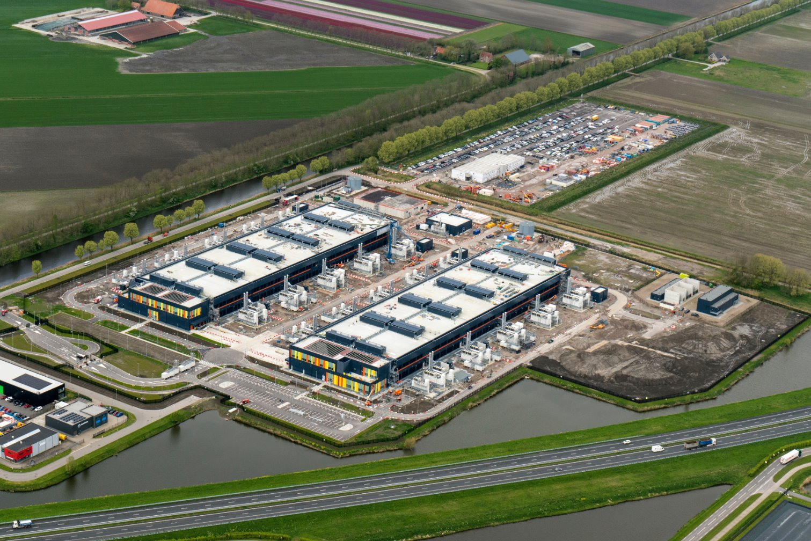

>[!div class="mx-imgBorder"]
>

Have you ever wondered why datacenters are located in specific areas and not others? For instance, why aren't there major datacenters in places like the middle of the Australian Outback or the vast, open plains of central Mongolia?

One of the primary reasons is that while these areas may offer plenty of available land, they often lack critical datacenter resources like reliable power, stable telecommunications networks, or cooling options. Additionally, harsh climates and remote locations can make it challenging to maintain and operate a datacenter effectively.

To add to this, the design of the datacenter itself plays a key role. Wherever it's located, it needs to make the best use of space, allow for future growth, and provide strong support for IT infrastructure.

By carefully selecting the right location and designing the facility thoughtfully, datacenters can deliver reliable performance, maintain uptime, and scale as needed while minimizing risks and keeping costs manageable.

## Key factors in site selection

Below are the key recommendations to consider when choosing the appropriate datacenter site location.  

- **Connectivity and proximity**: Choose locations near your primary user base or network infrastructure to reduce latency and enhance data transmission speeds. Evaluate factors such as the availability of fiber optic connections and options for network redundancy.  
- **Infrastructure availability**: Select a site with dependable access to power grids, cooling water sources, and strong telecommunication infrastructure. Assess the capacity and redundancy of these utilities to ensure they can meet the datacenter's operational demands, which can include considerations such as:
  - Availability of reliable and redundant power sources.  
  - Proximity to power grids and renewable energy options.  
  - Cost of electricity in the region.

- **Local regulations and permits**: Investigate zoning restrictions, environmental regulations, and building codes that could affect datacenter construction at the location.

- **Climate considerations**: Cooler climates may reduce cooling costs, benefiting water and/or energy efficiency, depending on the type of cooling installations. Avoid extreme temperature fluctuations or harsh weather conditions.  

- **Natural disaster risks**: Select regions with minimal geological and environmental risks. Assess risks of earthquakes, floods, hurricanes, and wildfires.  

- **Regulatory compliance and tax incentives**: Look for favorable government policies, tax breaks, or incentives for green energy adoption. Identifying industry-specific regulations or data privacy laws that could impact datacenter design is essential. For instance, healthcare organizations often have stricter data security requirements, which may necessitate enhanced physical security measures and stricter data access controls within the facility.  

- **Security**: Physical security is a top priority. Choose locations with low crime rates and consider proximity to emergency services. Additionally, site layout and landscaping can be strategically designed to strengthen physical security
