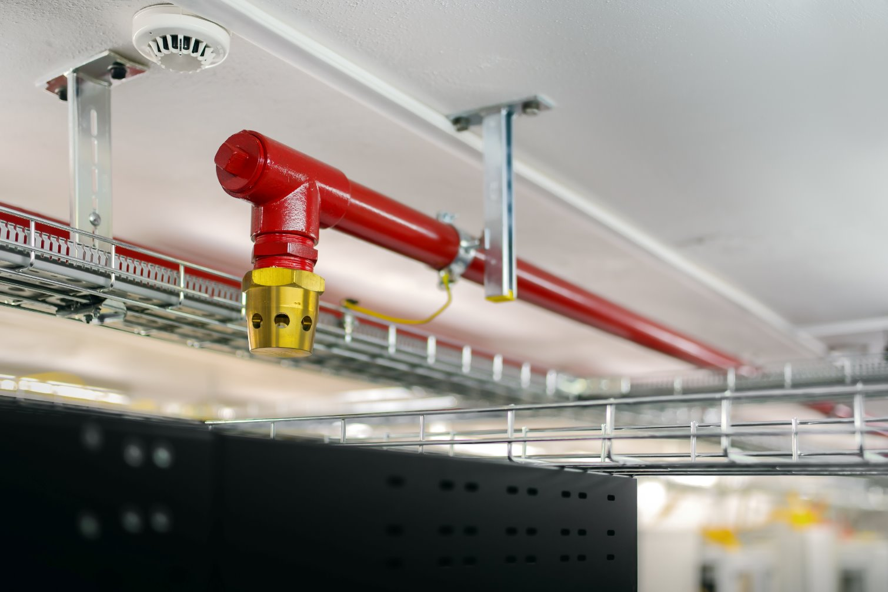

Datacenters are highly secure, controlled environments that require robust health and safety (H&S) measures to protect personnel, equipment, and data. Health and safety in datacenters require a comprehensive approach, combining fire protection systems, emergency lighting, and stringent security protocols to ensure the safety of personnel and assets. These measures not only safeguard lives and property but also contribute to the resilience and reliability of the datacenter.

## Fire protection systems

>[!div class="mx-imgBorder"]
>

Fire safety is critical in datacenters due to the high density of electrical equipment, which poses a risk of fire. Effective fire protection systems minimize damage, protect personnel, and ensure business continuity.

- **Fire detection**
  - Early Warning Systems: Datacenters employ advanced fire detection systems like VESDA (Very Early Smoke Detection Apparatus) that detect smoke at its earliest stage.  
  - Heat and Smoke Sensors: Sensors strategically placed in raised floors, ceilings, and server racks detect temperature changes and smoke.
- **Fire suppression**
  - Inert Gas Systems: Suppress fires without using water, minimizing damage to sensitive equipment. Common gases include FM-200 and Novec 1230.
  - Water Mist Systems: Use fine water droplets to cool and suppress flames with minimal risk to equipment.  
  - Fire Extinguishers: Specialized extinguishers, such as CO2 and clean agent extinguishers, are used for fires in the proximity to the electrical equipment.
- **Containment strategies**
  - Fire-Rated Walls and Doors: Ensure fires are contained within specific zones.  
  - Hot Aisle/Cold Aisle Containment: Limits the spread of heat and fire in controlled areas.

## Emergency lighting

In emergencies like power outages or fires, reliable emergency lighting ensures the safe evacuation of personnel and access to critical systems.

- Exit signage
  - Illuminated Exit Signs: Strategically placed and compliant with building codes, guiding personnel to the nearest exits.
- Backup lighting systems
  - Battery-Powered Lights: Provide lighting during power outages, ensuring visibility for evacuation.  
  - UPS Integration: Emergency lighting is often connected to the Uninterruptible Power Supply (UPS) for seamless operation during   power loss.
- Path marking
  - Floor Path Markers: Glow-in-the-dark or illuminated floor markers guide personnel to safety in low-visibility situations.

## Security protocols

Security in datacenters protects against unauthorized access, theft, and physical breaches, ensuring the safety of personnel and data.

- Access control
  - Multi-Layered Authentication: Includes key cards, biometric scanners (fingerprint, retina), and PIN codes to restrict entry to authorized personnel only.  
  - Man-Traps: Small, secure rooms requiring dual authentication to prevent tailgating (unauthorized individuals following authorized personnel).  
- Surveillance
  - CCTV Monitoring: Continuous surveillance of all areas, including entrances, exits, and server rooms, with high-resolution cameras.  
  - Monitoring Systems: Integrated with security operations centers (SOCs) for real-time threat detection.
- Physical security measures  
  - Perimeter Fencing: Prevents unauthorized entry to the facility.  
  - On-Site Security Teams: Personnel trained to respond to emergencies and security threats.  
  - Secure Racks and Cabinets: Lockable enclosures for servers and critical equipment.
- Incident response
  - Emergency Protocols: Established plans for responding to security breaches, fires, or other emergencies.  
  - Drills and Training: Regularly conducted drills to familiarize staff with evacuation and emergency response procedures.

## Additional health and safety measures

While fire protection, emergency lighting, and security protocols are key, other considerations further enhance H&S in datacenters:  

- Temperature and air quality control: Proper cooling systems to prevent overheating and maintain safe working conditions.  
- Electrical safety: Insulated wiring, grounding systems, and training on handling live operational switching activities.  
- Ergonomics: Safe handling of heavy equipment and ergonomic considerations for staff working in server rooms.  
- Emergency evacuation plans: Clearly defined procedures and maps displayed prominently across the facility.  
