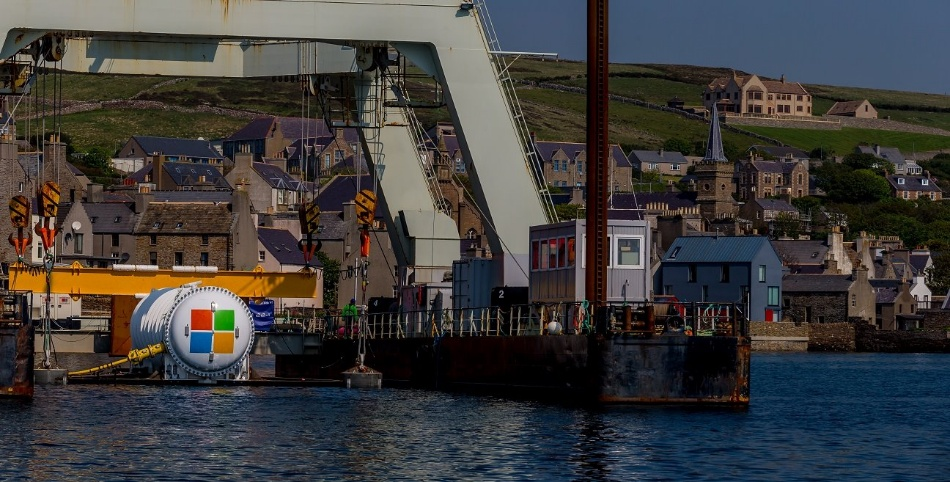

>[!div class="mx-imgBorder"]
>

Have you heard about Microsoft's Project Natick? If you have, you may be aware that it was a subsea datacenter. Subsea datacenters are an innovative concept that places computing infrastructure underwater, usually on the ocean floor. This design takes advantage of the natural cooling properties of the ocean and the availability of vast space to solve issues like energy efficiency, scalability, and land scarcity.

While subsea datacenters have exciting potential, they typically face more challenges than benefits. The advantages of natural cooling and space savings are appealing, but high installation costs, difficult maintenance, and environmental concerns make them less practical for widespread use at this stage. However, this innovative technology is still in early stages and developing, so it may become more feasible in the future with advancements in underwater infrastructure and maintenance capabilities, potentially making it a viable solution in specific situations.

| Advantages | Challenges |
|----------------|----------------|
| • **Enhanced cooling efficiency**: The cold ocean water naturally cools the equipment, significantly reducing energy consumption for traditional cooling systems. This leads to improved Power Usage Effectiveness (PUE) and lower operational costs. • **Space utilization**: Subsea datacenters take advantage of vast underwater spaces, alleviating the need for land acquisition and the constraints of urban environments. • **Eco-friendly potential**: Some designs integrate renewable energy sources, such as tidal or wave energy, to power the facility, reducing carbon emissions. • **Proximity to coastal populations**: Many datacenters aim to reduce latency by being close to major urban centers. Subsea installations near coastal areas achieve this while avoiding land-based challenges. | • **Deployment and maintenance**: Installing equipment underwater and performing repairs or upgrades is more complex and expensive compared to traditional facilities. Once submerged, any maintenance or upgrades to the facility require specialized teams and equipment. The difficulty in reaching and repairing submerged equipment makes subsea datacenters more prone to downtime and adds ongoing operational complexity. • **Infrastructure longevity**: Ensuring long-term durability against corrosion, pressure, and environmental impacts is a significant engineering challenge. The underwater environment subjects the equipment to constant saltwater exposure and immense pressure, leading to potential corrosion. This puts added stress on hardware, increasing the risk of damage and reducing the overall lifespan of the infrastructure. • **Specialized expertise**: Designing, deploying, and managing subsea datacenters requires specialized skills and technologies. • **Reliability concerns**: Higher Failure Risks: Due to the extreme environment and inaccessibility, subsea datacenters face higher risks in terms of potential failures. Any failure that requires intervention may lead to extended downtime compared to land-based datacenters where maintenance is more straightforward. • **Limited redundancy**: While traditional datacenters often have multi-site redundancy, subsea installations may face more challenges in achieving equivalent backup systems due to their isolated locations. • **Power distribution**: Subsea datacenters may have limited access to reliable power sources. Generating sufficient energy to power operations underwater could be challenging unless there is a reliable renewable energy source (e.g., tidal power), which is still not widely available in all regions. |

## Examples of subsea datacenter projects

- Microsoft Project Natick: In 2018, Microsoft deployed a subsea datacenter off the Orkney Islands in Scotland as part of its Project Natick. The sealed, cylindrical capsule housed 864 servers and operated for two years. The results showed a lower failure rate compared to land-based datacenters, owing to the controlled environment and lack of human interference. The project demonstrated the feasibility of subsea datacenters for sustainable and scalable computing.
- Nautilus Data Technologies: Nautilus develops waterborne datacenters that operate on barges rather than the ocean floor. While not fully submerged, these facilities utilize water cooling from the surrounding environment. Their first commercial facility in Stockton, California, has shown promise as a more sustainable alternative to land-based cooling.
- Baidu's Underwater AI Facility: In 2020, Baidu experimented with an underwater datacenter for artificial intelligence workloads, leveraging ocean cooling to reduce operational costs and increase efficiency.
