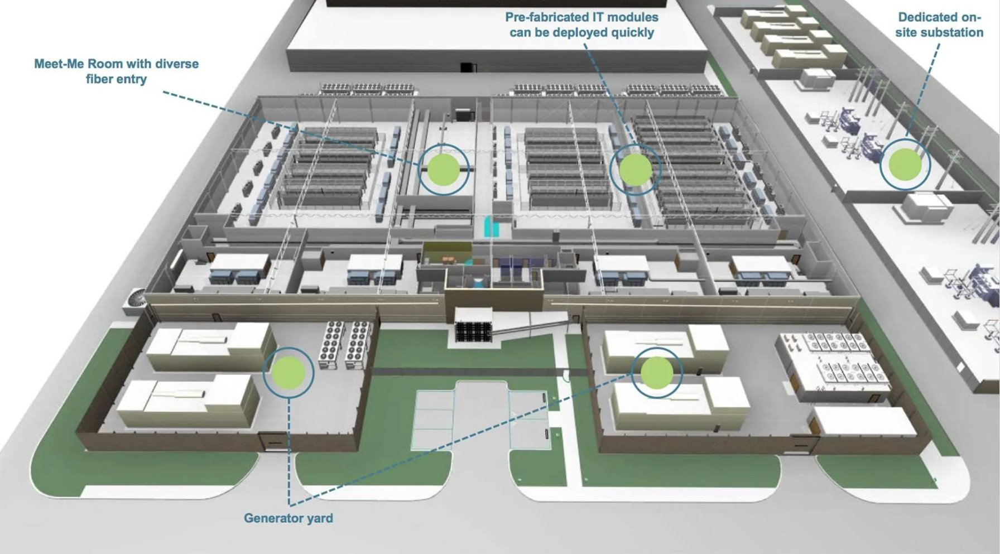

>[!div class="mx-imgBorder"]
>

Before we dive into the primary zones on the datacenter floor plan, it's important we define two commonly used terms in datacenter design and space allocation: grey space and white space.

- White space: Refers to the areas in a datacenter that are dedicated to IT equipment, such as servers, racks, storage devices, and networking equipment. This is the space where customers (or the datacenter operator) can install their hardware.
- Grey space: Refers to areas within a datacenter that are non-IT space but still play a crucial role in supporting the IT infrastructure. These spaces are generally used for supporting systems like power distribution, cooling, backup systems, and other operational equipment.

When thinking about these zones, it's also important to keep in mind topologies within a datacenter. Datacenter topologies refer to how the IT systems and infrastructure are organized to ensure smooth, reliable, and scalable operations. Think of it as the blueprint for how everything works together in a datacenter.  

## Here are some common datacenter topologies

- **Centralized Topology**: This model is suitable for smaller data centers (under 5,000 square feet). It involves separate LAN and SAN environments, with each server cabled back to core switches centralized in the main distribution area. This setup is efficient for port utilization and management but doesn't scale well for larger data centers  
- **Zoned Topology**: In this design, switches are distributed among end-of-row (EoR) or middle-of-row (MoR) locations. This topology is scalable, repeatable, and predictable, making it cost-effective and efficient for larger data centers. It minimizes cabling costs and provides high switch and port utilization  
- **Top-of-Rack (ToR) Topology**: This topology places a switch at the top of each server rack, connecting all servers within the rack to the switch. The ToR switches then connect to aggregation switches. This design reduces cabling complexity and improves manageability and scalability  
- **Multi-Tier Topology**: This is a common model in enterprise data centers, consisting of core, aggregation, and access layers. The core layer provides high-speed packet switching, the aggregation layer connects multiple access switches, and the access layer connects servers and end devices. This design supports scalability and high performance
