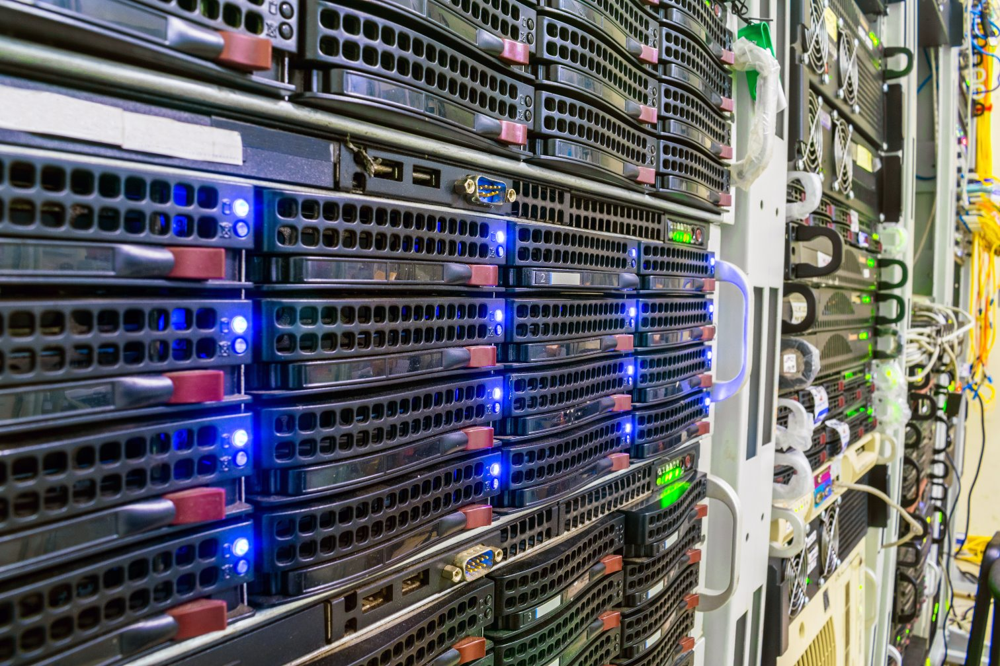

>[!div class="mx-imgBorder"]
>

Understanding critical infrastructure is essential in the design and architecture of datacenters as it forms the backbone of a datacenter's ability to deliver reliable, secure, and continuous services. As datacenters are responsible for hosting critical applications, storing vast amounts of data, and supporting cloud-based services, their operational integrity hinges on the effective design and management of their critical infrastructure. This includes power systems, cooling mechanisms, security protocols, and networking components that must be meticulously planned and maintained to ensure uptime, safety, and scalability. Critical infrastructure in a datacenter is designed with redundancy, resilience, and fault tolerance to maintain uptime, even in the event of failures or disasters.

## Key components of critical infrastructure in a datacenter

- **Power Supply Systems**  
  - **Electrical Substations**: These systems serve as the connection point to the electrical grid and entry point for the power to the downstream systems. They're essential for converting and distributing power to various systems within the facility.  
  - **Uninterruptible Power Supply (UPS)**: A critical component that provides temporary power during outages by drawing it from the connected battery system. The UPS ensures that critical equipment, such as servers, network devices, and storage, remains operational while the backup power system (e.g., generators) is brought online.  
  - **Backup Generators**: Diesel or gas-powered generators provide long-term power during extended outages. Diesel generators start once the utility outage is detected, as opposed to UPS, which provides the power to the load during the generator starting cycle. UPS battery system should have enough capacity to be able to hold the load during the transfer time.  
  - **Power Distribution Units (PDU)**: These units distribute the power to the downstream busbar systems and circuit breakers that feed rows of server racks.  
  - **Power Cabling and Circuitry**: Includes all the wiring and distribution panels that supply the power from the UPS, generators, and substations to the equipment in the datacenter.

- **Cooling Systems**

  - **HVAC (Heating, Ventilation, and Air Conditioning) Systems**: These are responsible for maintaining the temperature and humidity of the datacenter, based on the established cooling strategy.  
  - **Chillers and Cooling Towers**: These systems cool the air or liquid in the HVAC loop, ensuring that temperatures remain within acceptable limits.  
  - **Computer Room Air Conditioning (CRAC) Units**: These air conditioning units are specifically designed to cool the server rooms by circulating chilled air directly into the cold aisles and exhausting hot air from the hot aisles.
  - **Chilled Water Systems**: Used in some datacenters, these systems circulate chilled water through pipes or cooling coils to regulate temperatures.  
  - **Cooling Distribution Units (CDU)**: These units distribute and monitor the chilled water systems and ensure that the cooling performance is maintained.

- **Networking and Communication Systems**

  - **Data Network Infrastructure**: The network backbone that includes routers, switches, firewalls, and load balancers, ensuring the transfer of data within and outside the datacenter.  
  - **Fiber Optic Cables**: High-speed cables used for transferring large volumes of data to and from the datacenter, often extending to other datacenters and external locations.  
  - **Redundant Network Paths**: Multiple network connections ensure the datacenter can stay operational even if one network link fails. These redundancies may include diverse fiber paths or satellite connections. For instance, a physical optic cable is installed in both a West and East path. If the West path was cut due to an incident, the East path is expected to pick up the workload.  
  - **Network Security Devices**: Firewalls, intrusion detection/prevention systems (IDS/IPS), and security appliances that protect the data and infrastructure from external threats.

- **Security Systems**

  - **Physical Security**: Security measures that protect the facility from unauthorized access, including perimeter fences, security guards, surveillance cameras, and biometric or card-based access control systems at entry points.
  - **Access Control Systems**: Systems that regulate who can enter specific areas of the datacenter, ensuring that only authorized personnel can access sensitive equipment, especially areas like server rooms, power rooms, and network operation centers.  
  - **Video Surveillance**: CCTV systems monitor the facility continuously, recording and providing real-time visual information of the datacenter's interior and exterior.  
  - **Alarm Systems**: These systems detect unauthorized access or physical breaches, triggering alerts to security personnel and local authorities.

- **Data Storage and Backup Systems**

  - **Data Storage Arrays**: Storage systems such as SAN (Storage Area Networks) and NAS (Network-Attached Storage) house critical data, providing redundancy and high availability. However, JBOD (Just a Bunch of Disk) and JBOF (Just a Bunch of Flash) is more widely used in datacenters. These come in the form of server racks and are critical for datacenter operation.  
  - **Backup Solutions**: Critical data needs to be backed up regularly. Backup systems may involve cloud storage, tape backups, or additional on premises storage arrays that can recover data in the event of hardware failure.  
  - **Replication Systems**: These systems copy data between multiple locations or datacenters in real-time or near-real-time, ensuring data availability in case of site-specific disasters.  

- **Fire Suppression and Environmental Monitoring**

  - **Fire Suppression Systems**: These are essential for the protection of the datacenter in case of a fire. Typically, sprinkler systems are used in server areas to suppress fires without damaging equipment.
  - **Smoke Detectors**: Early-warning systems that can detect the presence of smoke or fire in the datacenter.

- **Facility and Building Infrastructure**

  - Building Structural Integrity: The physical structure of the datacenter must be able to withstand natural disasters (e.g., earthquakes, floods, etc.) and provide a stable environment for the IT equipment.  
  - Raised Flooring: Used to allow easy management of cables and facilitate airflow, which is crucial for efficient cooling in the server rooms.  
  - Ceiling Systems: Provide space for the distribution of cooling and power infrastructure, as well as other mechanical and electrical components.

- **Redundancy and Resilience Systems**

  - N+1, 2N, and 2(N+1) Redundancy: Critical systems (e.g., cooling, power, networking) are designed with redundancy, typically using configurations like N+1 (one spare unit), 2N (two fully redundant systems), or 2(N+1) to ensure that failures in any single component don't disrupt operations.  
  - Tier Classification: Datacenters are often classified according to their level of redundancy and uptime capability (Tier 1 to Tier 4). Critical infrastructure is designed to meet the standards of the applicable Tier classification, ensuring maximum reliability.

- **Monitoring and Management Systems**

  - Building Management Systems (BMS): These systems are used to monitor and control various aspects of the facility's infrastructure, including HVAC, power distribution, fire suppression, and lighting.  
  - Data Center Infrastructure Management (DCIM): Software tools that provide a holistic view of the datacenter's performance, tracking and managing power usage, cooling, space utilization, and equipment health. These systems are essential for managing critical infrastructure proactively.

- **Disaster Recovery Systems**

  - Disaster Recovery (DR) Solutions: These systems ensure that critical operations can continue even in the event of a catastrophe. This includes backup sites, replication of data to other locations, and failover mechanisms for IT workloads to ensure business continuity.  
  - Contingency Planning: Procedures and strategies to handle emergencies, including power outages, fire, or natural disasters, ensuring that operations can be restored quickly and securely.
