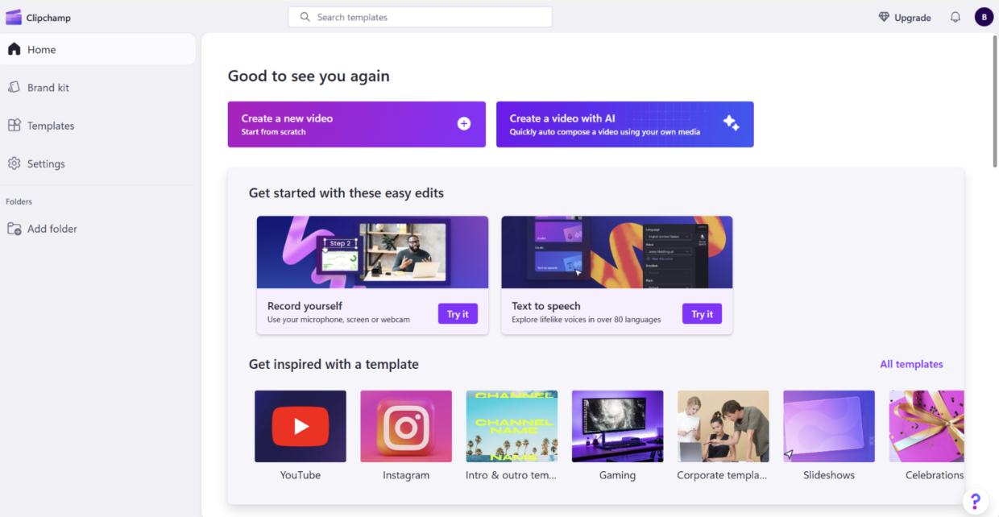
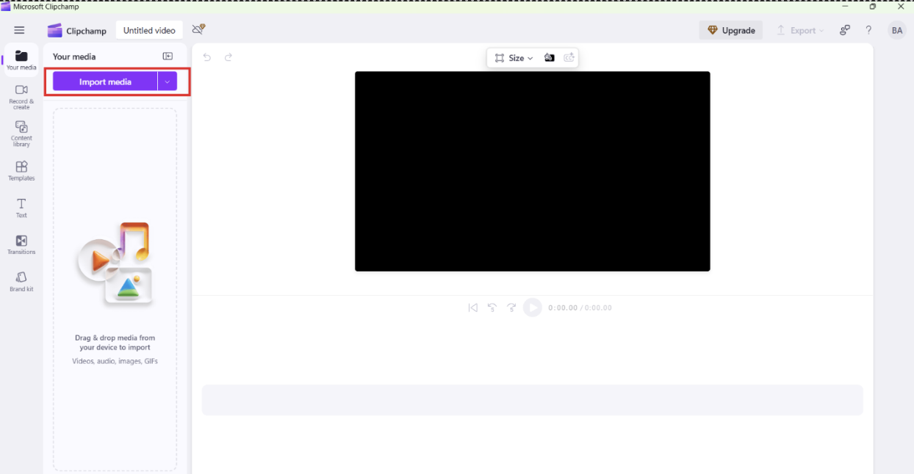
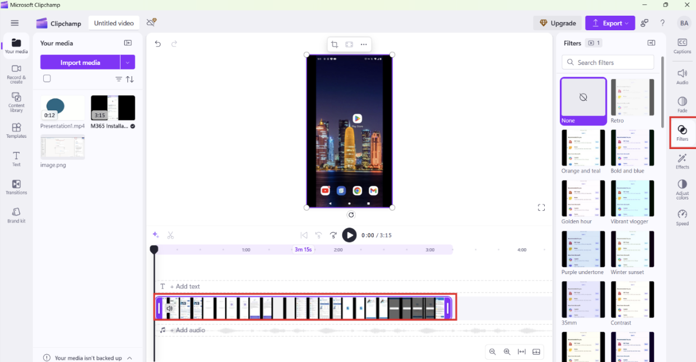
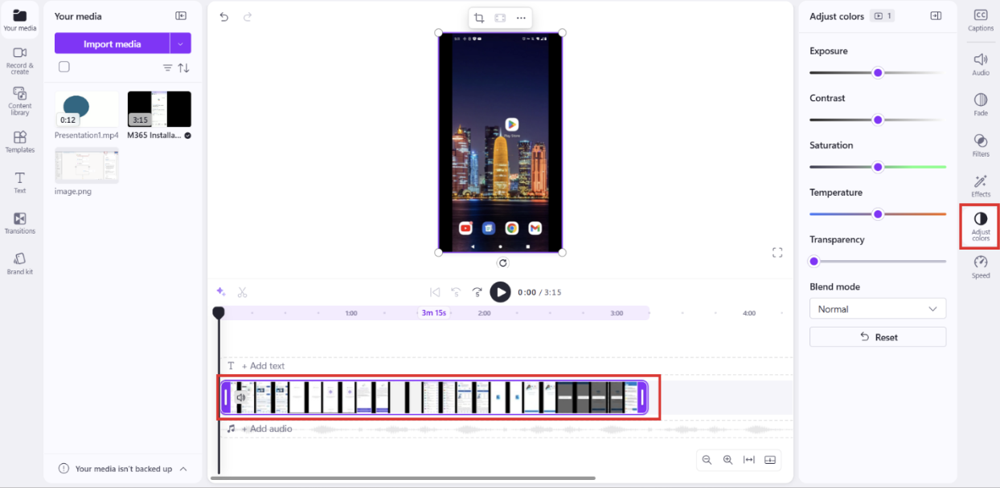
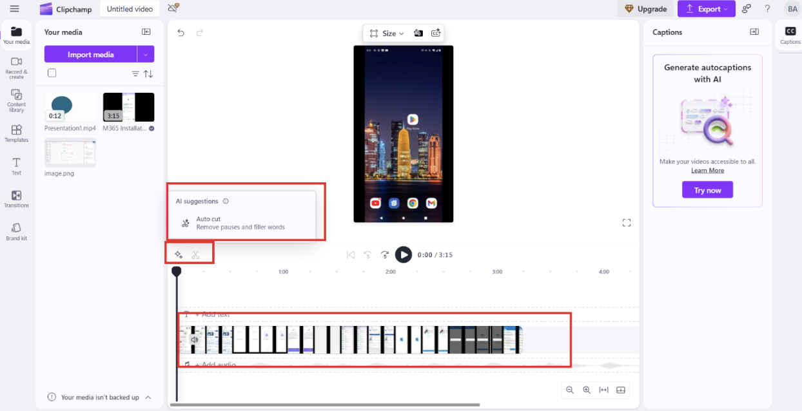
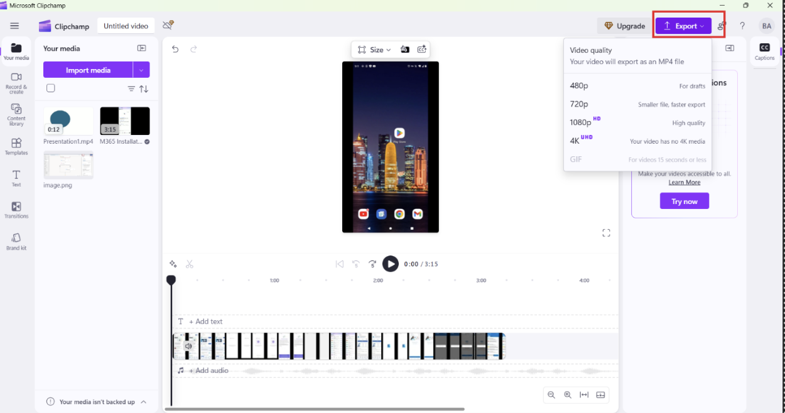

**Objective:**

Use Microsoft Clipchamp to enhance the visual style of an animation clip by applying manual adjustments and aesthetic effects.

**Materials needed:**

- Laptop or desktop computer with internet access  
- Microsoft Clipchamp access  
- An animation clip created in a previous module or session  

## Step-by-step instructions

### 1. Import your animation clip

- Open Clipchamp and start a new video project.  
    
- Upload the animation clip you created in a previous activity, such as a storyboarded or smoothed sequence.  
  

### 2. Apply vintage or stylistic effects

- Explore Clipchamp's effects panel for retro, cinematic, or custom looks.  
- Apply filters such as **grain**, **sepia**, **glitch**, or **VHS overlays** to stylize your animation.  
- Adjust the intensity and layering of effects to match the tone and emotion of the scene.  
  

### 3. Fine-tune and sync elements

- Make manual adjustments to **brightness**, **contrast**, and **saturation** for a consistent visual style.  
    
- Align all **text overlays** and **transitions** on the timeline to ensure clean, intentional pacing.  
- Use **snapping tools** to sync visuals with key audio or scene changes.  
  

### 4. Export in high resolution

- Choose an export resolution based on your intended audience or platform:  
  - **1080p** for general sharing  
  - **4K** for professional presentations  
- Export your video and preview the final output to check quality.  
  

### 5. Review and reflect

- Watch the final video and compare it with the original animation.  
- Share your clip with a peer or small group and ask for feedback.  
- Reflect on how the enhancements affect tone, mood, and storytelling impact.

## Expected outcome

Learners apply stylized enhancements to a previously created animation clip, showing how post-production effects add polish, character, and narrative depth to animated projects.
