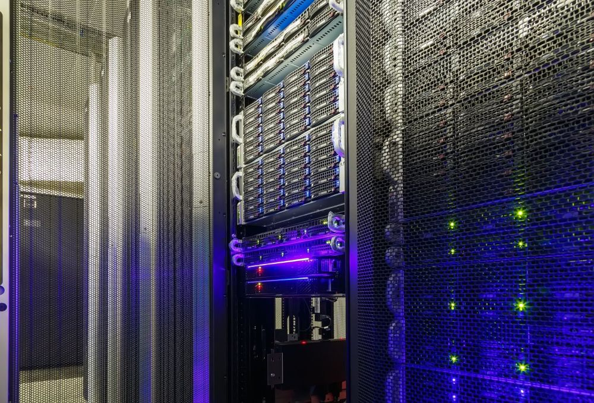

Now that we've seen the incredible range of possibilities enabled by datacenters, let's dive into the different types of datacenters that make all this possible. Datacenters come in various forms, each designed to meet specific needs and requirements. From hyperscale datacenters that support massive cloud services to edge datacenters that bring computing power closer to users, we'll explore the unique characteristics and functions of each type. Understanding these distinctions will give you a clearer picture of how datacenters operate and the critical roles they play in our interconnected world.
>[!div class="mx-imgBorder"]
>

### Enterprise datacenter

These are privately owned and operated by a single organization to support its business operations. Designed for internal use, offering high customization and control over infrastructure and security.

- **Example**: A corporate datacenter that supports a bank's online transactions: JPMorgan Chase Data Center:

- **Location**: JPMorgan Chase has multiple datacenters worldwide, with key locations in the United States, Europe, and Asia.

- **Size and Features**: JPMorgan Chase operates high-security, large-scale datacenters to support its vast array of banking services. These datacenters are designed to host mission-critical systems, including online banking, mobile applications, and financial services infrastructure. They also store sensitive financial data and support the bank's transaction processing systems.

- **Purpose**: The datacenters are primarily used for running internal banking systems, including systems for customer accounts, loan processing, trading platforms, and real-time financial transactions. They also support security protocols and compliance standards required by the banking industry.

- **Why is it an enterprise datacenter?** Owned by JPMorgan Chase: These datacenters are privately owned and managed by JPMorgan Chase, making them enterprise-level facilities dedicated solely to the bank's infrastructure and data processing needs.

- **Security and Compliance**: Given the sensitive nature of the data (e.g., customer financial data), these datacenters follow strict security measures, including physical security, data encryption, redundancy, and compliance with financial regulations (e.g., PCI-DSS for payment card information).

### Colocation datacenter

These facilities lease (rent out) space, power, cooling, and networking to multiple organizations. Ideal for businesses that want to avoid building and maintaining their own datacenters but still need reliable infrastructure.

- **Example**: Companies renting server racks in a third-party facility such as Equinix, Digital Realty, NTT Global Data Centers.

    In a colocation datacenter, clients rent space (rack space, cabinets, or even entire rooms) within the datacenter facility but own and manage their own servers, storage, and networking equipment.

    The responsibility for hardware management, configuration, updates, and maintenance lies with the client.

    The datacenter provider is responsible for physical infrastructure (such as power, cooling, security, and connectivity), but not the client's IT systems.

### Cloud datacenter

These are operated by cloud service providers and deliver services like computing, storage, and applications over the internet. Designed for scalability and flexibility, enabling organizations to pay only for the resources they use.

- **Example**: Amazon Web Services (AWS), Microsoft Azure, Google Cloud Platform

### Edge datacenter

Smaller, distributed datacenters located close to users or devices to reduce latency and improve performance. They support real-time applications like IoT, autonomous vehicles, and streaming.

- **Example**: Amazon Web Services (AWS) Wavelength.

- **Location**: AWS Wavelength extends AWS infrastructure to 5G networks and is deployed in various global locations, including U.S. cities and AsiaPacific regions, in partnership with mobile carriers such as Verizon in the U.S. and SK Telecom in South Korea.

- **Size and Features**: AWS Wavelength brings AWS services to the edge of the 5G network, with the edge datacenters located near 5G towers or base stations. The purpose of Wavelength is to allow developers to build applications that require single-digit millisecond latencies to end users, such as autonomous vehicles, industrial IoT, and augmented reality (AR) or virtual reality (VR) applications.

- **Purpose**: The primary goal of AWS Wavelength is to provide ultra-low latency, high-bandwidth applications at the edge of the network, closer to the user, while integrating seamlessly with the AWS Cloud. It brings the power of the cloud to local 5G networks, enabling applications to process data in real-time with minimal delay.

- **Why is it an edge datacenter?** Edge of the Network: AWS Wavelength is designed to place computing resources directly in the telecom network, right next to 5G towers, allowing for real-time data processing closer to where data is generated.

- **Low Latency and High Throughput**: It enables applications to deliver ultra-low latency by reducing the distance data travels, which is crucial for applications such as real-time gaming, streaming, IoT, and smart city solutions.

### Hyperscale datacenter

Massive facilities operated by tech giants to handle extremely high levels of data and compute capacity. They're optimized for cloud computing and big data analytics with thousands of servers working together. A hyperscale datacenter is much larger in terms of both physical size and computing capacity than a usual datacenter.

- **Example**: Datacenters owned by Meta, Google, Microsoft or Amazon.

    These datacenters are built to scale rapidly and accommodate thousands or even millions of servers to handle massive computing workloads. They're often associated with cloud service providers like Amazon Web Services (AWS), Google Cloud, or Microsoft Azure, and are designed to support highly scalable, global services. The infrastructure is massive, typically spanning hundreds of thousands of square feet or more.

### Managed services datacenter

These datacenters are managed by a third-party provider, handling operations like maintenance, backups, and updates for clients. Outsourcing datacenter management to reduce operational burden.

- **Example**: IT service companies managing datacenters for small businesses. Rackspace Technology, IBM Cloud Managed Services, CenturyLink (Lumen Technologies), Tata Communications etc.

    In a managed service data center, the client outsources both their infrastructure and management to the service provider.

    The service provider owns, manages, and maintains the hardware, software, network configurations, and other IT services, providing comprehensive IT management for the client.

    The client simply rents fully managed servers or IT systems, which can include cloud hosting, storage, and backup services.

### Software-defined datacenter (SDDC)

A datacenter where all key infrastructure components—compute, storage, networking, and security—are virtualized and managed through software. Physical hardware still exists but is abstracted and controlled programmatically. SDDCs provide greater flexibility, scalability, and automation, enabling organizations to quickly adapt to changing workloads and reduce operational complexity.

- **Example**: A cloud-based datacenter where virtual machines (VMs), software-defined storage (SDS), and software-defined networking (SDN) are centrally managed through tools like VMware vSphere or Microsoft System Center.
