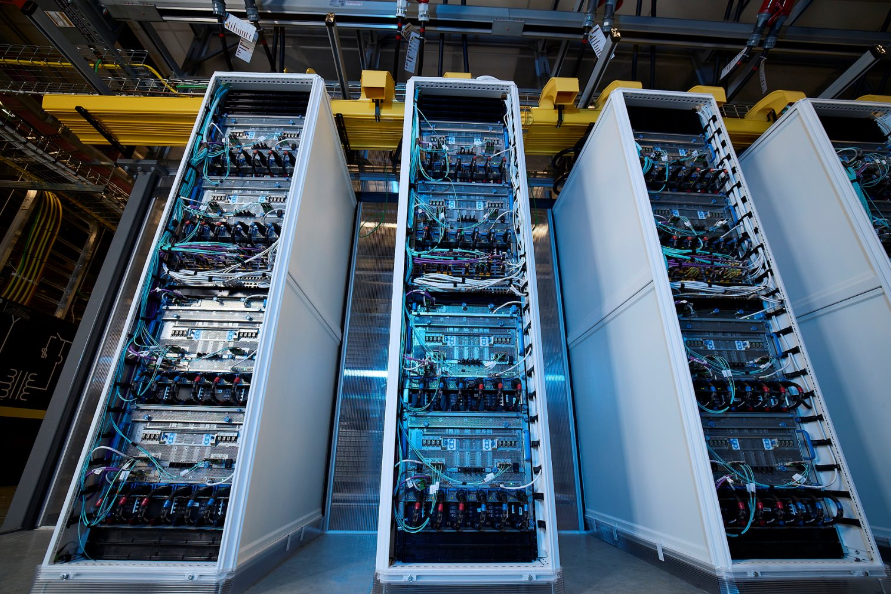
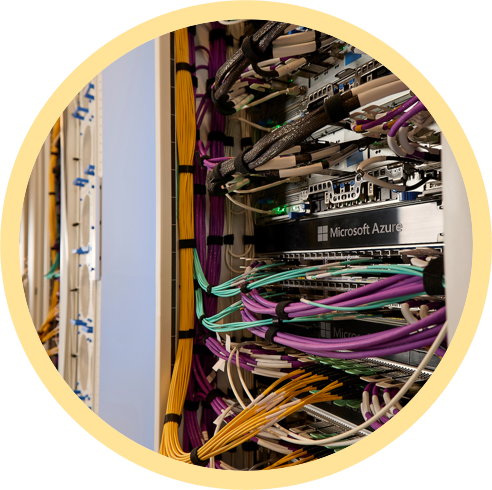
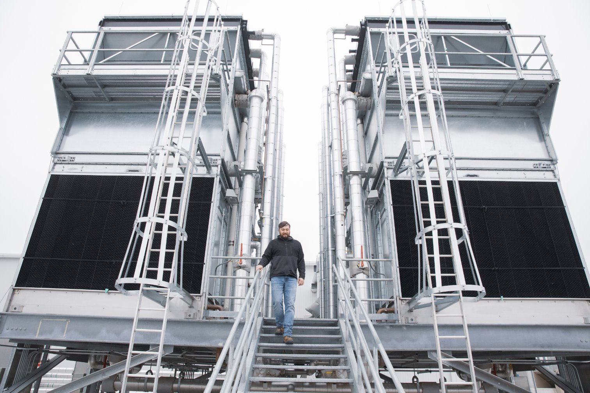
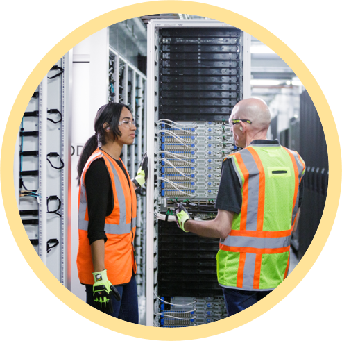
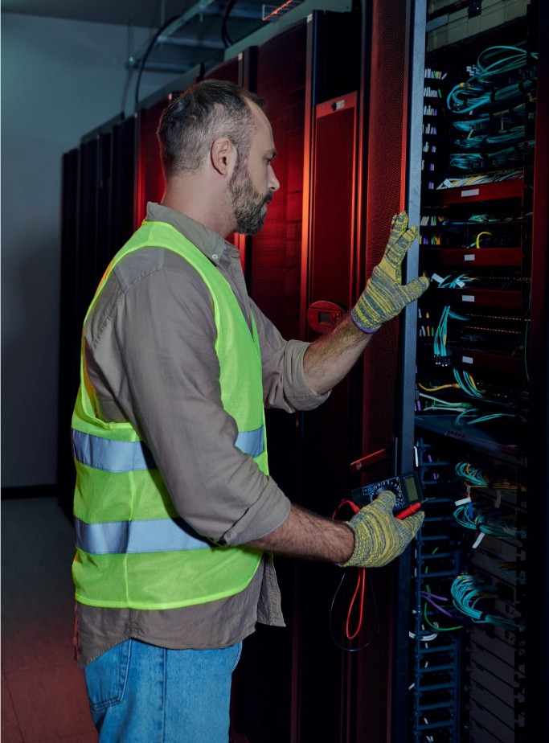
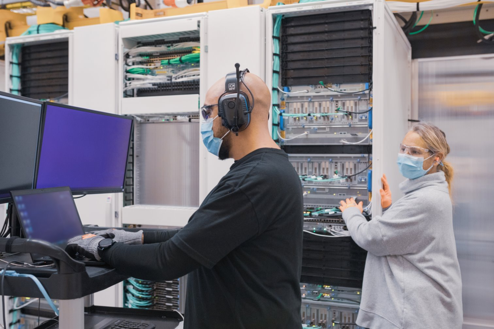

A datacenter is a complex facility composed of multiple components that work together to ensure reliable storage, processing, and transmission of data. These components can be categorized into the following main groups:

- **Computing Resources**

    | Computing Resources |  |
    | --- | --- |
    |  | • **Servers**: The backbone of a datacenter, handling computations, data processing, and application hosting. • **Virtual Machines (VMs) and Containers**: Software-defined computing units that optimize resource utilization. • **High-Performance Computing (HPC) Systems**: Advanced servers for handling demanding tasks like AI, simulations, and analytics. |

- **Storage Systems**

    | Storage Systems |  |
    | --- | --- |
    |  | • **Hard Disk Drives (HDDs) and Solid-State Drives (SSDs)**: Used for storing data in various formats. • **Storage Area Networks (SANs)**: High-speed networks that connect storage devices to servers. • **Network-Attached Storage (NAS)**: Dedicated file storage connected to the datacenter network. • **Cloud-Based Storage**: Integrated cloud solutions for scalability and flexibility. |

- **Networking Infrastructure**

    | Networking Infrastructure |  |
    | --- | --- |
    |  | • **Switches and Routers**: Facilitate communication between devices within and outside the datacenter. • **Firewalls**: Protect the datacenter from unauthorized access and cyber threats. • **Load Balancers**: Distribute network traffic across servers to optimize performance and reliability. • **Cabling**: High-speed fiber optics and Ethernet cables to connect components. |

- **Power and Cooling Systems**

    | Power and Cooling Systems |  |
    | --- | --- |
    |  | • **Uninterruptible Power Supplies (UPS)**: Provide backup power during outages. • **Power Distribution Units (PDUs)**: Manage and distribute electrical power to datacenter equipment. • **Cooling Systems**: Include air conditioning, liquid cooling, and airflow management to maintain optimal operating temperatures. • **Generators**: Ensure power continuity during extended outages. |

- **Physical Infrastructure**

    | Physical Infrastructure |  |
    | --- | --- |
    |  | • **Racks and Enclosures**: Physical frameworks to house servers and storage devices. • **Raised Floors**: Allow cabling and cooling systems to run beneath equipment. • **Buildings and Facilities**: Purpose-built structures designed for security, scalability, and environmental control. |

- **Security Systems**

    | Security Systems |  |
    | --- | --- |
    |  | • **Physical Security**: Includes surveillance cameras, biometric access controls, and security personnel. • **Cybersecurity Tools**: Firewalls, intrusion detection systems, encryption, and endpoint security. |

- **Management and Monitoring Tools**

    | Management and Monitoring Tools |  |
    | --- | --- |
    |  | • **Datacenter Infrastructure Management (DCIM) Software**: Provides visibility into physical and IT resources. • **Monitoring Systems**: Track performance, power usage, and environmental conditions. • **Automation Tools**: Enable efficient resource management and predictive maintenance. |

- **Software**

    | Software |  |
    | --- | --- |
    |  | • Software is a critical component of a datacenter, but its role differs from that of physical infrastructure. Software provides the intelligence and control needed to manage and optimize datacenter operations. • Unlike physical hardware (servers, racks, power systems), software is intangible and often modular, meaning it can be updated, replaced, or reconfigured without affecting the datacenter's physical layout. • While hardware provides the foundation, software is what makes the datacenter functional, flexible, and efficient. Software orchestrates and manages the hardware components (servers, storage, and networking). Without software, the hardware in a datacenter would be static and non-functional. |

## Types of software critical to datacenters

- **Operating Systems (OS)**: Enable servers and devices to run applications and manage resources.
- **Virtualization Software**: Allows multiple virtual machines (VMs) to run on a single physical server, optimizing resource usage.
- **Datacenter Infrastructure Management (DCIM) Software**: Monitors and manages physical and virtual resources, including power, cooling, and server workloads.
- **Networking Software**: Manages traffic routing, load balancing, and network security.
- **Storage Management Software**: Oversees how data is stored, accessed, and backed up.
- **Automation and Orchestration Tools**: Facilitate routine tasks, resource provisioning, and scaling.
