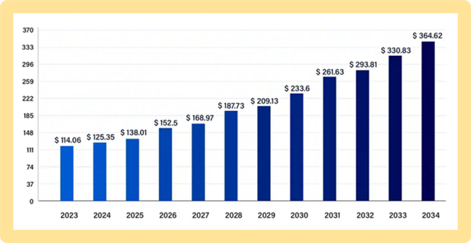
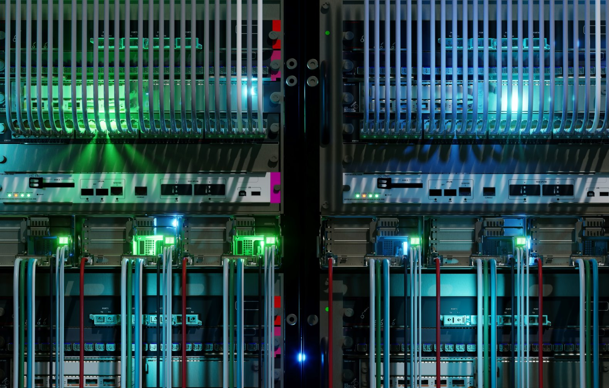

The datacenter industry is growing faster than ever. Datacenters are massive buildings where companies store huge amounts of data, run websites, and support all kinds of internet services (like social media, gaming, or shopping platforms).
>[!div class="mx-imgBorder"]
>

**Graph Source: Data Center Market Size To Hit Around USD 364.62 Bn by 2034**

## How big is the datacenter market?

- In 2023, the global datacenter market was worth about $123.6 billion. To put that into perspective, that's more than the entire economy of some countries!
- By 2030, experts predict the datacenter market will more than double in size to $354 billion. This is happening because more people are using the internet, and more companies need to store and process tons of data.

## What's driving the growth of datacenters?

Several key things are making datacenters even more important in 2025:

- **AI and heavy computing:** Artificial Intelligence (AI) is becoming a large part of our daily lives (think smart assistants, video games, or even self-driving cars). All of this requires numerous computing power. As AI grows, datacenters are getting bigger and need more energy to support it. It's like the amount of electricity needed to run a huge gaming server or an online game that millions of people play at once.

- **Green and renewable energy:** Datacenters use numerous power, which is why many companies are trying to switch to renewable energy sources (like solar or wind power) to run their operations. For example, Amazon plans to be carbon neutral (no net carbon emissions) by 2040. This means they'll use green energy to power their datacenters to reduce their environmental impact.

- **Cooler, smarter datacenters:** Modern datacenters must be very efficient. One way they're improving is by using new cooling technologies to keep servers from overheating. These technologies work much like how air conditioning works in a home, but on a much larger scale. More liquid cooling and other systems are being used to manage the heat from all the computing.

- **More investment in datacenters:** Datacenters are expensive to build and run, which is why companies are getting investment from private funds and credit agencies. It's like how startups get funding to help them grow; datacenter companies need this money to build new facilities and keep up with demand.

- **New locations for datacenters:** As more people around the world use the internet, new datacenters are popping up in places where there's growing demand, like in Asia and Africa. These places are becoming hubs for global internet services and tech innovation.

## Why does this matter?

The growth of the datacenter industry is closely tied to almost every digital service you use. Whether you're streaming movies, playing games online, or working on a school project, datacenters help store and process that data. The bigger the industry gets, the more advanced and reliable these services will become.

**Sustainability** is also a big part of the future. As more companies look to reduce their environmental impact, you might see tech companies and cloud services focusing even more on using green energy. We'll discuss sustainability and datacenters in greater detail in Module 5 of this course, including how datacenters measure their power usage effectiveness (PUE) and water usage effectiveness (WUE).
