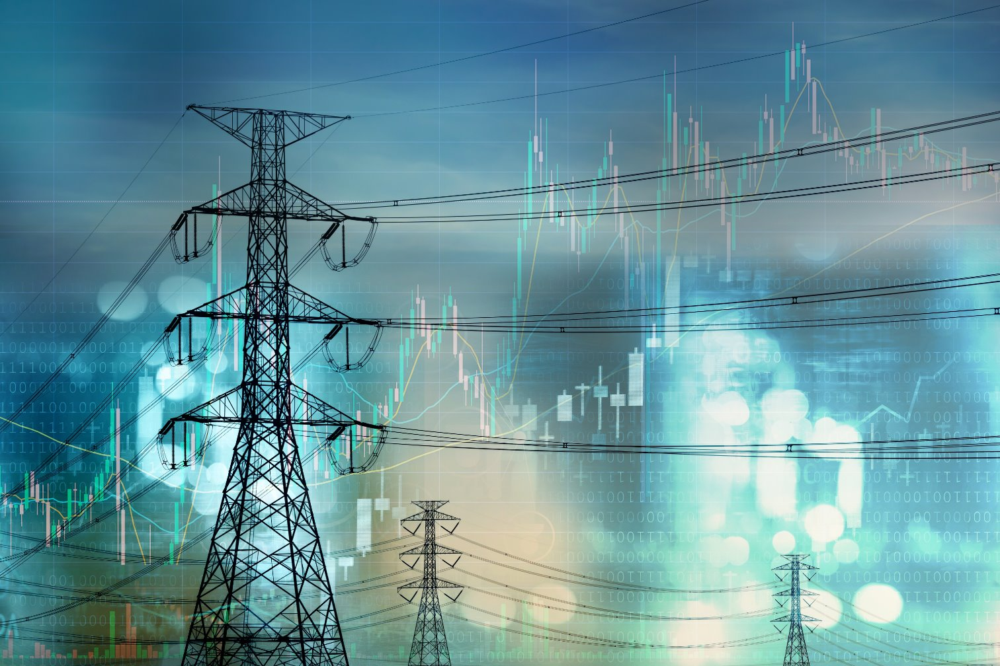

>[!div class="mx-imgBorder"]
>

**Did you notice** that when news articles or industry reports talk about the size of datacenters, they usually mention megawatts (MW) instead of square feet? This is for a very important reason: megawatts measure the power capacity of the datacenter, while square feet measure its physical space.

An average household uses around 10,000 kilowatt-hours (kWh) per year, which translates to roughly 10 megawatt-hours (MWh), while a typical datacenter can consume hundreds of megawatts per year, with large hyperscale facilities using between 20-50MW annually, meaning a single datacenter can use significantly more energy than thousands of average households combined.

## Here's why megawatts (MW) is the more relevant unit for discussing datacenter size

- Power consumption is key for datacenters
  - Datacenters consume numerous electricity to run the thousands of servers and keep the equipment cool. The power usage is a key factor in determining how large a datacenter is in terms of its ability to handle heavy workloads.
  - Megawatts (MW) represent the electrical power a datacenter needs to operate. For example, a large datacenter may need 100 MW of power to run all its equipment. This tells you how much electricity it consumes and how much computing capacity it can handle.

- Square feet alone don't tell the full story
  - Square feet measure the physical size of the building. While this can be useful to understand the physical footprint of the building, it doesn't tell you much about how powerful or how many servers the datacenter can support.
  - The number of servers, cooling systems, and other equipment inside the datacenter determines its power requirements, not just its physical size.

- Efficiency and power density
  - Modern datacenters are becoming much more efficient in using space. They can fit more servers and computing power into smaller spaces, which means the same amount of physical space (measured in square feet) can house a datacenter with a high MW capacity.
  - For instance, new hyperscale datacenters (super-large datacenters built by companies like Amazon, Microsoft, and Google) can be very powerful but might not necessarily take up significantly more space than older, smaller facilities. They use technology to pack numerous computing power into a smaller area, so the MW rating gives a clearer idea of their capability.

- Industry standard for power consumption
  - In the data center industry, the MW rating is the standard way to discuss a facility's size because it directly relates to the energy consumption and operational capacity of the datacenter.
  - For example, when a datacenter operator says their facility has 100 MW of capacity, it indicates how much power is available to support servers, storage, cooling, and other systems.
