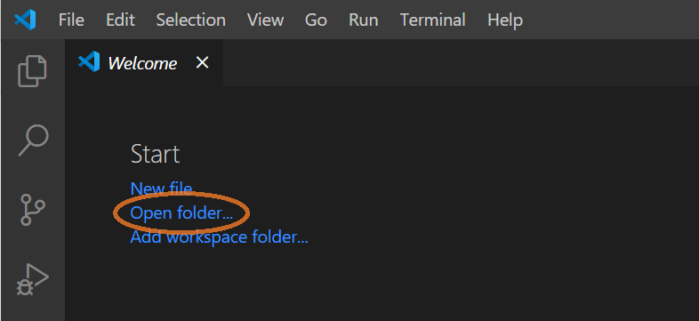
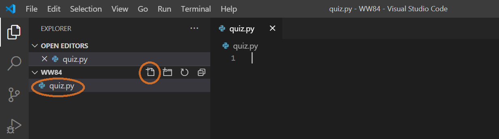
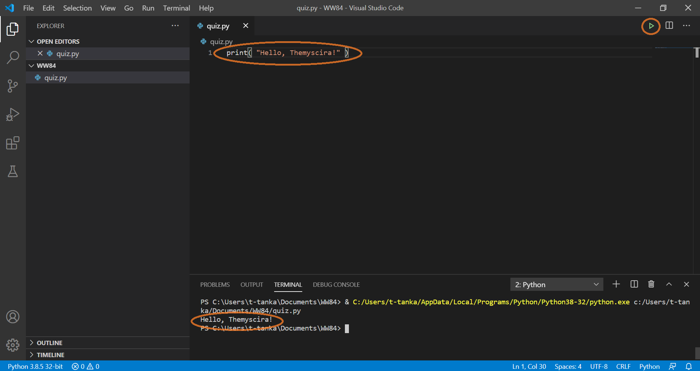

Before you jump in to writing a program to decode messages, you should make sure your local environment is set up properly.

Let's start by creating a folder on your computer where you can easily find it. Call it **WW84**. For example, you might create it in your **Documents** folder.

> [!NOTE]
> If you already followed the previous module in this learning path where you [decoded a secret message](https://docs.microsoft.com/learn/modules/secret-message/?azure-portal=true), you can use the same folder as before.

> [!div class="mx-imgBorder"]
> 

Then open Visual Studio Code and select **Open folder**. Open your **WW84** folder.

> [!div class="mx-imgBorder"]
> 

Next, create a file called **quiz.py**.

> [!div class="mx-imgBorder"]
> 

Feel free to close the **Welcome** tab now.

> [!NOTE]
> As you're coding in Python, Visual Studio Code will suggest other powers to add to Visual Studio Code, such as "Linters." You don't need these for this project, so feel free to ignore them.

The first thing we'll do is make sure our command center (code editor) works. We'll give a simple command that tells Python to print us a message. Copy the following command into your file:

```python
print( "Hello, Themyscira!" )
```

Your editor should resemble this:

> [!div class="mx-imgBorder"]
> 

To have Python follow your commands, press the green **Play** button in the upper-right corner. You should see a message from Python appear.

Now you're ready to learn some of the Python basics needed to build your quiz.

*WONDER WOMAN 1984 TM & © DC and WBEI. RATED PG-13*
