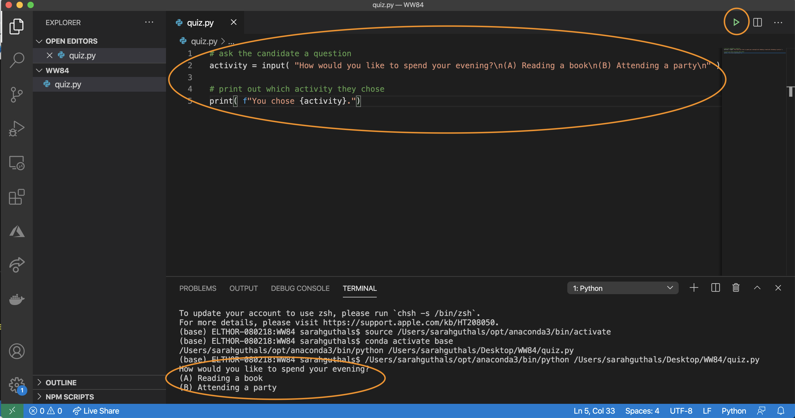
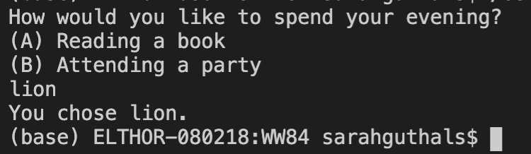

Now it's time to create the outline of your quiz code!


To start, you'll ask five questions and have only two options for each:

1. How would you prefer to spend your evening?
   1. Reading a book
   1. Attending a party

1. What's your dream job?
   1. Curator at the Smithsonian
   1. Running a business

1. What's more important?
   1. Money
   1. Love

1. What's your favorite decade?
   1. 1910s
   1. 1980s

1. What's your favorite way to travel?
   1. Driving
   1. Flying

We'll use these questions to determine which of the following four characters you're most like:

- Diana Prince / Wonder Woman
- Barbara Minerva
- Steve Trevor
- Max Lord

## Ask the quiz taker for input

You probably already know how to print text to the console from the last unit in this module on Python basics, but now you have to write code to enable a human write text *back* to the program.

Python's `input` command is for this exact scenario. It gives back (returns) the user's answer, which you can then store in a variable.

If you have code from the Python basics unit, you can delete it if you want this file to be only the code for the quiz.

> [!NOTE]
> The `\n` in the following text is putting in a new line so that the question and answer choices are each on their own line. Think of it like hitting the Enter key.

```python
# ask the candidate a question
activity = input( "How would you like to spend your evening?\n(A) Reading a book\n(B) Attending a party\n" )

# print out which activity they chose
print( f"You chose {activity}.")
```

Press the **Play** button, and you should see the question print out, along with the options. In the **TERMINAL** area, try typing **A** and then selecting the Enter key to see what happens.

> [!div class="mx-imgBorder"]
> 

Notice that the activity variable simply stores whatever you entered. Try entering **lion** instead and see what happens.

> [!div class="mx-imgBorder"]
> 

For now, let's assume the user understands that they should enter either **A** or **B**, whichever corresponds with their choice. Let's also assume that they should capitalize it correctly.

Now, you can use a conditional statement to run commands depending on which option they chose. Add this `if` statement to your program:

```python
# if they chose reading a book
if activity == "A":
    print( "Nice choice!" )
```

Press the **Play** button and try entering **A** as your choice. Make sure it's capitalized.

> [!div class="mx-imgBorder"]
> 

What do you think will happen if you choose **B** instead? Try writing some code to see if you can account for that, and then go to the next unit to see different ways of doing it!

*WONDER WOMAN 1984 TM & © DC and WBEI. RATED PG-13*
