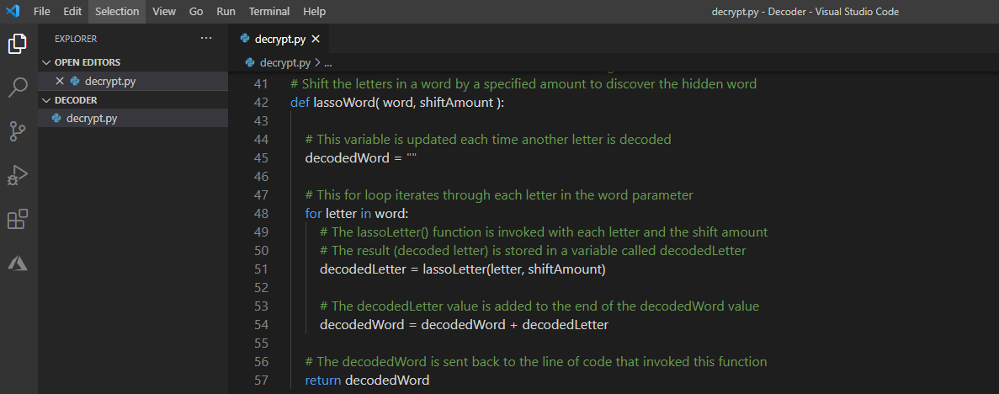

As a novice sleuth and solver of mysteries, you are unexpectedly handed a piece of paper that contains a secret, encoded message. The mysterious person who hands you the message says, "A treasure is hidden at a location that I cannot reveal right now. Meet me at that location on a specific, special day, and I will reveal to you the hidden treasure." Besides being a person who enjoys solving mysteries, you have always wanted to find a hidden treasure. You are eager to discover the secrets that are hidden in the secret message. You decide that you'll use Python to decode the secret message and find the location and date that can lead to hidden treasure! 

You can crack the code of the secret message by using the Python programming language and find the hidden treasure in this beginner's lesson. For the best experience, make sure your local developer environment is ready with [Visual Studio Code](https://code.visualstudio.com/?azure-portal=true). Follow the steps in the [Set up your Python beginner development environment with Visual Studio Code](https://docs.microsoft.com/learn/modules/python-install-vscode/?azure-portal=true) Learn module.

## Learning objectives

In this module, you will:

- Write your first lines of Python code
- Create a function to decode a character by using a cipher
- Create a function to decode a word by using a cipher
- Discover the secret location to reveal the hidden treasure in this module

## Prerequisites

- [Python installed](https://docs.microsoft.com/learn/modules/python-install-vscode/3-exercise-install-python3?azure-portal=true)
- [Visual Studio Code with Python Extension](https://docs.microsoft.com/learn/modules/python-install-vscode/6-exercise-write-execute-first-script?pivots=windows?azure-portal=true)

> [!Note]
> No coding experience is required to complete these lessons!
