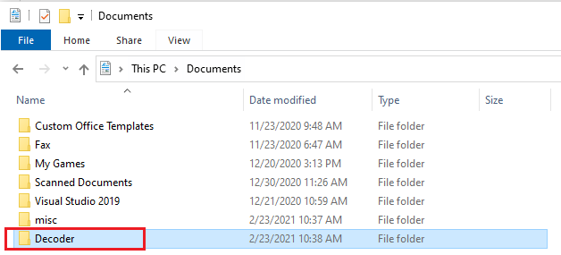
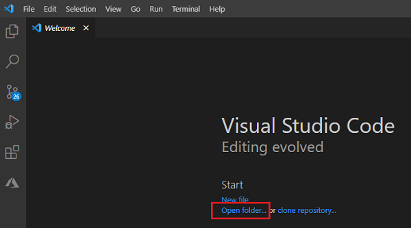

Start by creating a folder for your code on your computer where you can easily find it. Name the folder **Decoder**. In our example, we created our folder in the **Documents** folder.



Next, open Visual Studio Code. From the **Start** screen, select **Open folder** and choose your **Decoder** folder.



Now create a file called *decrypt.py*.


Feel free to close the Visual Studio Code **Welcome** tab now.

> [!Note]
> As you write Python code, Visual Studio Code suggests other capabilities to add to the development environment, such as "Linters." You don't need these extras for this project. Feel free to ignore them.

The first thing we'll do is make sure our command center (also called a _code editor_) works. We'll give a simple command to Python and tell it to print a message. Copy the following command into your **decrypt.py** file to say hello to the fictional town Contosoville.

```python
print( "Hello, Contosoville!" )
```

Your editor should resemble this:


To have Python follow your commands, press the **Run** button at the upper right. You should see a message from Python:


Now you're ready to learn some of the Python basics that you need to build your decoder.

