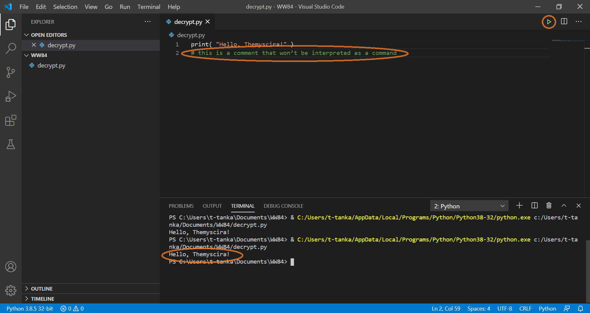
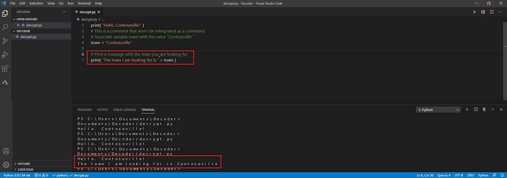
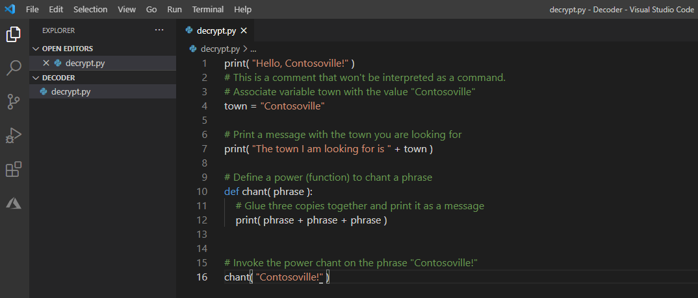

Before you can uncover the true meaning of the secret message, let's walk through the basics for commanding the Python language. If you already know how to use comments, variables, functions, and conditionals, you can skip to the [next unit](../3-ceasar-cipher-part-1.yml) in this module.

## Comments

We can write comments to ourselves that Python will ignore. On any line where we use the number (or *hash*) symbol (`#`), Python ignores everything after the symbol.

Try adding the following code to your **decrypt.py** file:

```python
# This is a comment that won't be interpreted as a command.
```

Press the **Play** button, and you should see the same behavior as before.


 
## Variables

Coding is essentially the movement and manipulation of data. Imagine writing a message decoder on a calculator where the only data you have access to is the last result of an equation. Though that's not impossible, it does seem unnecessarily difficult! 

In Python, we have *variables*, which are like containers that have a name and store data. You can think of variables as code names for information that we want our program to remember and have access to later.

The following command tells Python to associate the code name or variable `town` with the name of a town called "Contosoville." (This is also a clue to the mystery of the secret, encoded message.)

To do this, you use the assignment equal sign (`=`) operator. Anytime after this command, when Python sees the variable `town`, it will substitute the value "Contsoville"! Contosoville just might be the mystery location you are looking for.

```python
# Associate variable town with the value "Contosoville"
town = "Contosoville"
```

Try it out! Replace the following commands in your **decrypt.py** file. (If you're wondering what the plus sign (`+`) is for: it "glues together" phrases into a longer phrase.)

```python
# Associate the variable town with the value "Contosoville"
town = "Contosoville"

# Print a message with the mystery location
print( "The town I am looking for is " + town )
```

Press the green **Run** button, and you should see the town revealed.


 
## Functions

Similar to how variables are containers for single bits of information, functions are like containers for lines of code. Typically, programs run from top to bottom, and each line of code is run in order. However, if you write a function, you can invoke it by calling the function name whenever and however many times you want. Invoking a function means to tell the program to run the code within that function, even if it's in a different part of the file. 

You can also add data to a function as parameters. Parameters are variables that contain data that you want to use to specify the behavior of the function.

Here's how we can give Python the power to chant. In this example, given a phrase, Python can chant the phrase three times.

```python
# Define a power (function) to chant a phrase
def chant( phrase ):
    # Glue three copies together and print it as a message
    print( phrase + phrase + phrase )
```

In this code, the function is called `chant`. The parameter is a variable called `phrase`. The code within the function invokes another function that you didn't write, but which is available to you as part of the Python language `print()` capability. If you invoke this function, the value you pass in as the parameter is printed to the console three times.

Try it out! Update the commands in your **decrypt.py** file to call the power chant.

```python
# Define a power (function) to chant a phrase
def chant( phrase ):
    # Glue three copies together and print it as a message
    print( phrase + phrase + phrase )


# Invoke the power chant on the phrase "Contosoville!"
chant( "Contosoville!" )
```

Press the green **Run** button. 



You should see the chant printed in the console at the bottom of the Visual Studio Code window.


Great! Now that you know the basics, let's go decrypt the note.
