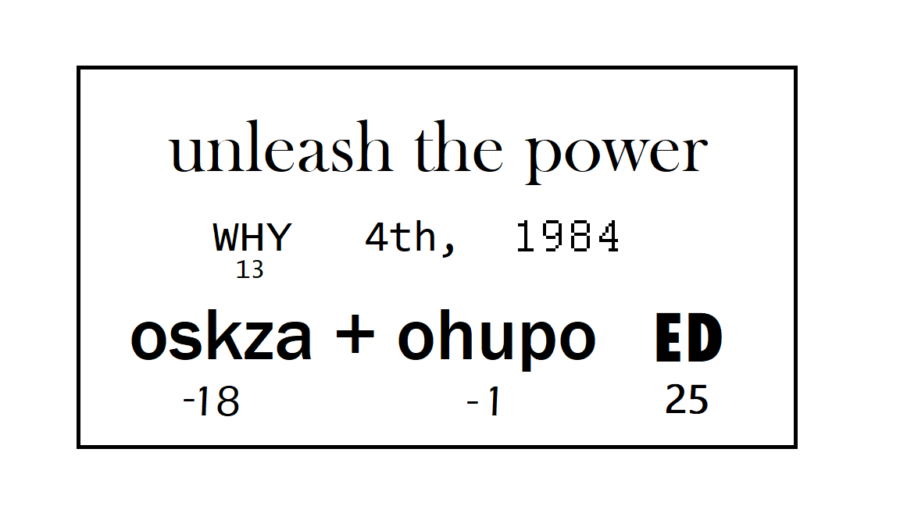

Remember the secret message you're trying to decode:



It looks like the message might be encrypted with something called a *Caesar cipher,* where all the letters are shifted in the alphabet by some amount. Similar to Wonder Woman's golden lasso, we'll need to give Python the power to find the true meaning of the words "WHY," "oskza," "ohupo," and "ED."

If you're not familiar with Caesar ciphers, you can explore more on [Smithsonian Learning Labs](https://learninglab.si.edu/collections/decode-a-secret-message/Y4F5099N4wjRAEmz#r/?azure-portal=true).


To decipher this message, we need to start by giving our code the power to shift a single letter. First, we create a function called `lassoLetter()` that takes in two parameters. The first parameter is `letter`, and it holds the letter to decode. The second parameter is `shiftAmount`, and it says how far to shift the letter.

```python
def lassoLetter( letter, shiftAmount ):
```

Before you write this function, it's a good idea to know what you expect to happen. If you invoke this function and pass in `a` as the first parameter and `2` as the second parameter, what do you expect will be the output?

> [!Important]
> Don't actually do this yet in your code! We haven't written the function yet.

```python
lassoLetter('a', 2)
```

You would expect the function to return the letter `c`. 

## Convert a character to a number

Next, you need to convert your letter (also called a _character_ or _char_) into a number. Letters and numbers in code have a numerical representation because computers, ultimately, compute numbers. ASCII character codes are the numerical codes that represent letters and numbers (and other punctuation, but that's beyond the scope of this lesson). Here's a chart that matches the letter and number that humans understand to the decimal number that computers understand:

| Char | ASCII | Char | ASCII | Char | ASCII |&nbsp;&nbsp;&nbsp;&nbsp;&nbsp;&nbsp;&nbsp;&nbsp;&nbsp;&nbsp;|
|---|----|---|----|---|----:|-----|
| 0 | 48 | A | 65 | a |  97 | |
| 1 | 49 | B | 66 | b |  98 | |
| 2 | 50 | C | 67 | c |  99 | |
| 3 | 51 | D | 68 | d | 100 | |
| 4 | 52 | E | 69 | e | 101 | |
| 5 | 53 | F | 70 | f | 102 | |
| 6 | 54 | G | 71 | g | 103 | |
| 7 | 55 | H | 72 | h | 104 | |
| 8 | 56 | I | 73 | i | 105 | |
| 9 | 57 | J | 74 | j | 106 | |
|   |    | K | 75 | k | 107 | |
|   |    | L | 76 | l | 108 | |
|   |    | M | 77 | m | 109 | |
|   |    | N | 78 | n | 110 | |
|   |    | O | 79 | o | 111 | |
|   |    | P | 80 | p | 112 | |
|   |    | Q | 81 | q | 113 | |
|   |    | R | 82 | r | 114 | |
|   |    | S | 83 | s | 115 | |	
|   |    | T | 84 | t | 116 | |
|   |    | U | 85 | u | 117 | |
|   |    | V | 86 | v | 118 | |
|   |    | W | 87 | w | 119 | |
|   |    | X | 88 | x | 120 | |
|   |    | Y | 89 | y | 121 | |
|   |    | Z | 90 | z | 122 | |	

> [!NOTE]
> This table shows only numbers and letters, but every key on the keyboard has an ASCII character code. 

Suppose you pass in the letter `a` and a `shiftAmount` value of `2` to the `lassoLetter()` function, and you expect it to return the letter `c`. How would you update your code to return that output? 

If you try to add `a + 2`, it doesn't make sense. How do you add a number and a letter together?

Python to the rescue! Python has a function called `ord` that converts a character to its corresponding ASCII character code.

If we call the `ord()` function and pass in the lowercase letter `a`:

```python
ord('a')
```

The output is `97`. The number `97` is the ASCII character code for the character `a`.


If we call the `ord()` function and pass in the uppercase letter `W`:

```python
ord('W')
```

The output is `87`. The number `87` is the ASCII character code for the character `W`.


If we call the `ord()` function and pass in the number `6`:

```python
ord('6')
```

The output is `54`. The number `54` is the ASCII character code for the number `6`.


We couldn't add a letter and number together (`a + 2`), but we can add two numbers together. If we add `97` for the letter `a` with the number `2`, we get `99`. The number `99` is the ASCII representation for the character `c`. The output makes sense!

Here's the next bit of code to add to your function:

1. Convert a letter to lowercase, for consistency.
1. Convert a letter to its corresponding ASCII character code by using the `ord()` function. 

```python
def lassoLetter( letter, shiftAmount ):
    letterCode = ord(letter.lower())
```

> [!Important]
> When you add the new code to your file, be sure to use the same indentation as in this example. Indent the new code from the left margin as shown. If the indentation isn't correct, Python won't read the new code as part of the function.

To decode this message, we need to shift the letter `W` by `13`. To do this shift, here are the values for our parameters:
- `letter` = 'W'
- `shiftAmount` = 13
- `letterCode` = `ord('w')` = 119

## Calculate a decoded character: The simple way

Now it's time to calculate the new character. First, review the original example. If you start with the letter `a` and want to get the letter `c`, then you do the following steps:

1. Confirm that the value passed in the `letter` parameter is lowercase. In this case, it's `a`.
1. Use the `ord()` function to convert the letter `a` to its ASCII code, `97`. Save the code value `97` in the `letterCode` variable.
1. Add a `shiftAmount` value of `2` to the `letterCode` value of `97` to get the new number value: `99`. Store the value `99` in the `decodedLetterCode` variable.
1. Use the `chr()` function to _decode_ the number value `99` into a character to get `c`. (The `chr()` function simply does the opposite of the `ord()` function.) Store the decoded value `c` in the `decodedLetter` variable.
1. Return the `decodedLetter` value: `c`.

So, your code might look like this:

```python
letterCode = ord(letter.lower())

decodedLetterCode = letterCode + shiftAmount

decodedLetter = chr(decodedLetterCode)

return decodedLetter
```

Let's see what would happen if you ran this code with the first letter of the actual secret message, `W`, and the shift amount, `13`.

| Variable | Value |&nbsp;&nbsp;&nbsp;&nbsp;&nbsp;&nbsp;&nbsp;&nbsp;&nbsp;&nbsp; |
|:---------|:------|-------|
| `letter` | W | |
| `shiftAmount` | 13 | |
| `letterCode` | `ord('W')` = 119 | |
| `decodedLetterCode` | 119 + 13 = 132 | |
| `decodedLetter` | chr(132) = `error` | |

The code won't return the expected result because a Caesar cipher loops back to lowercase `a` when it reaches lowercase `z`.

To take into account the loop behavior, you have to change the formula for getting the `decodedLetterCode` value. Instead of simply adding the `shiftAmount` value to `letterCode`, you have to figure out what the *true* letter code is for the decoded letter.

We'll take a look at that formula in the next unit.

*WONDER WOMAN 1984 TM & © DC and WBEI. RATED PG-13*
