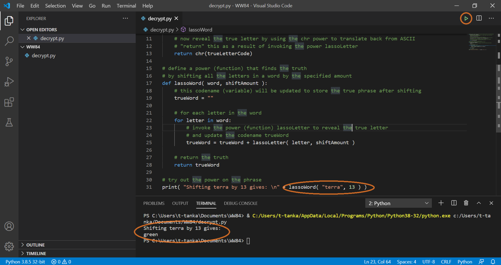

Now that you know how to decode one letter given a certain shift amount, you can decode entire words and phrases!

To decipher a complete word, you need to invoke the `lassoLetter()` function for each letter in the word. Then you put all of the decoded letters together into a decoded word. 

This time, you'll write a function called `lassoWord()` that has two parameters: `word` and `shiftAmount`. 

```python
def lassoWord( word, shiftAmount ):
```

## Words as collections of letters

One way to think about words is that they're really just collections of letters. For example, you can think of the word "Hello" as:

> 'H' - 'e' - 'l' - 'l' - 'o'

A variable can be a name for one piece of data: one word, one letter, one formula, one function, and so on. Python has many ways to represent collections of data. One way is with a *list*.

A list is exactly what it sounds like. A word can be considered a list of letters. Even better: Python has a way to loop through each item in a list one at a time. 

## List iteration with a for loop

Because you want to invoke the `lassoLetter()` function on each letter, you need to loop through each letter in the word that you're trying to decode. 

Here's the syntax for a `for` loop:

```python
for item in list:
    do something
```

The word that's passed in as a parameter can be considered a list of letters. So, you can write:

```python
def lassoWord( word, shiftAmount ):

    for letter in word:
```

Now that you understand this Python functionality, you can do something to _each letter_ in a word, like invoking the `lassoLetter()` function.

## Invoke the lassoLetter() function

It's fairly straightforward to invoke the `lassoLetter()` function on each letter in a word:

```python
def lassoWord( word, shiftAmount ):

    for letter in word:
        lassoLetter( letter, shiftAmount )
```

Remember that when you wrote the `lassoLetter()` function, the last line of code in the function was the following:

```python
# Send the decoded letter back
return decodedLetter
```

This is called a *return statement*. This statement sends back the value to the line that invoked the function. To capture that return value, all you have to do is use a variable:

```python
def lassoWord( word, shiftAmount ):

    for letter in word:
        decodedLetter = lassoLetter(letter, shiftAmount)
```

Now you're invoking a function that you wrote, `lassoLetter()`, from a new function that you're writing now: `lassoWord()`.

## String letters together

With the code that you just wrote, you'll have one value in the `decodedLetter` variable. When the loop runs again, the variable gets updated. 

You can trace the code to see how this works:

- `word` = "hello"  
- `shiftAmount` = 1

| Loop<br>iteration | Value of <br>`letter` | Value of <br>`decodedLetter` |&nbsp;&nbsp;&nbsp;&nbsp;&nbsp;&nbsp;&nbsp;&nbsp;&nbsp;&nbsp; |
|---------------|--------|---------------|-------------|
| 1 | 'h' | 'i' | |
| 2 | 'e' | 'f' | |
| 3 | 'l' | 'm' | |
| 4 | 'l' | 'm' | |
| 5 | 'o' | 'p' | |

You're left with a variable named `decodedLetter` that has a value of just the letter 'p'. But, what you wanted was a variable named `decodedWord` to have the value `ifmmp`. Recall from the Python basics that we reviewed earlier in this module, you can use the plus sign (`+`) between two words or letters to combine them.

```python
def lassoWord( word, shiftAmount ):

    decodedWord = ""
    
    for letter in word:
        decodedLetter = lassoLetter(letter, shiftAmount)
        decodedWord = decodedWord + decodedLetter

    return decodedWord
```

With this code, the entire word is now stored in the variable `decodedWord`. You can send back this value to the line where this function was invoked. You can trace the code like before:

| Loop<br>iteration | Value of <br>`letter` | Value of <br>`decodedLetter` | Value of <br>`decodedWord` |&nbsp;&nbsp;&nbsp;&nbsp;&nbsp; |
|----------------|----------|-----------------|---------------|---------------|
| 1 | 'h' | 'i' | "i" | |
| 2 | 'e' | 'f' | "if" | |
| 3 | 'l' | 'm' | "ifm" | |
| 4 | 'l' | 'm' | "ifmm" | |
| 5 | 'o' | 'p' | "ifmmp" | |

### Comment your code

Don't forget to add comments to your code, so you know exactly what's happening! (If you return to this exercise later on, you don't want to have to decipher your own code.)

```python
# Define a function to find the truth in a secret message
# Shift the letters in a word by a specified amount to discover the hidden word
def lassoWord( word, shiftAmount ):

    # This variable is updated each time another letter is decoded
    decodedWord = ""

    # This for loop iterates through each letter in the word parameter
    for letter in word:
        # The lassoLetter() function is invoked with each letter and the shift amount
        # The result (decoded letter) is stored in a variable called decodedLetter
        decodedLetter = lassoLetter(letter, shiftAmount)

        # The decodedLetter value is added to the end of the decodedWord value
        decodedWord = decodedWord + decodedLetter

    # The decodedWord is sent back to the line of code that invoked this function
    return decodedWord
```

> [!Important]
> Be sure to use the same indentation as in this example. Indent the new code from the left margin as shown.

## Test your functions

Press the green **Run** button, and . . . nothing should happen. You've written your two functions, and the `lassoWord()` function does invoke the `lassoLetter()` function. But nothing invokes the `lassoWord()` function yet! 

Test your new code by invoking the `lassoWord()` function with `terra` as the value for the `word` parameter and `13` as the value for the `shiftAmount` parameter. 

```python
# Try to decode the word "terra"
print( "Shifting terra by 13 gives: \n" + lassoWord( "terra", 13 ) )
```

Now when you press the **Run** button, you should see the word **green** printed on the console:



## Review the complete decrypt.py file

Now that you've written two lasso functions, your complete **decrypt.py** file should look like this:

```python
# Define a function to find the truth by shifting the letter by a specified amount
def lassoLetter( letter, shiftAmount ):
    # Invoke the ord function to translate the letter to its ASCII code 
    # Save the code value to the variable called letterCode
    letterCode = ord(letter.lower())
    
    # The ASCII number representation of lowercase letter a
    aAscii = ord('a')

    # The number of letters in the alphabet
    alphabetSize = 26

    # The formula to calculate the ASCII number for the decoded letter
    # Take into account looping around the alphabet
    trueLetterCode = aAscii + (((letterCode - aAscii) + shiftAmount) % alphabetSize)

    # Convert the ASCII number to the character or letter
    decodedLetter = chr(trueLetterCode)

    # Send the decoded letter back
    return decodedLetter

# Define a function to find the truth in a secret message
# Shift the letters in a word by a specified amount to discover the hidden word
def lassoWord( word, shiftAmount ):

    # This variable is updated each time another letter is decoded
    decodedWord = ""

    # This for loop iterates through each letter in the word parameter
    for letter in word:
        # The lassoLetter() function is invoked with each letter and the shift amount
        # The result (decoded letter) is stored in a variable called decodedLetter
        decodedLetter = lassoLetter(letter, shiftAmount)

        # The decodedLetter value is added to the end of the decodedWord value
        decodedWord = decodedWord + decodedLetter

    # The decodedWord is sent back to the line of code that invoked this function
    return decodedWord

# Try to decode the word "terra"
print( "Shifting terra by 13 gives: \n" + lassoWord( "terra", 13 ) )
```

Now you're ready to decode the secret message!
