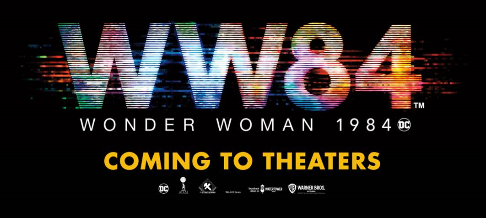

With your **decrypt.py** file, you can now decode any secret message that uses the English alphabet. Your decoded messages will be in all lowercase, but that shouldn't take away from the meaning behind them.

Special thanks to [Audrey St. John from Mount Holyoke College](https://www.mtholyoke.edu/people/audrey-stjohn?azure-portal=true) for the inspiration for this lesson! 

## Additional challenges for your decrypt code

As an added challenge, you can explore how to:
- Maintain casing for each letter throughout the decoding process.
- Create a function to read in an entire message without having to print each word individually.
- Modify your decoder to include numbers.

## Discover the next coding challenge

Having decoded secret messages from the WONDER WOMAN 1984 film world, it's time to figure out which character you're most like! In the next module in this learning path, you'll create a test to determine your superpower with Python and Visual Studio Code.

## Dive deeper into Python

If Python has piqued your interest, check out the rest of the [Take your first steps with Python](https://docs.microsoft.com/learn/paths/python-first-steps/?azure-portal=true) learning path.

After you complete this learning path, look for other Learn modules to continue your learning journey on our [Student page](https://docs.microsoft.com/learn/roles/student?azure-portal=true). From [tracking global air quality with Azure Maps](https://docs.microsoft.com/learn/modules/azure-maps-track-air-pollution/?azure-portal=true) to [helping remote farmers protect their crops with text message weather alerts by using Azure Functions](https://docs.microsoft.com/learn/modules/send-crop-weather-alerts/?azure-portal=true), we're here to guide you as you explore new technology, develop new coding skills, and solve challenging problems!

*WONDER WOMAN 1984 TM & © DC and WBEI. RATED PG-13*
