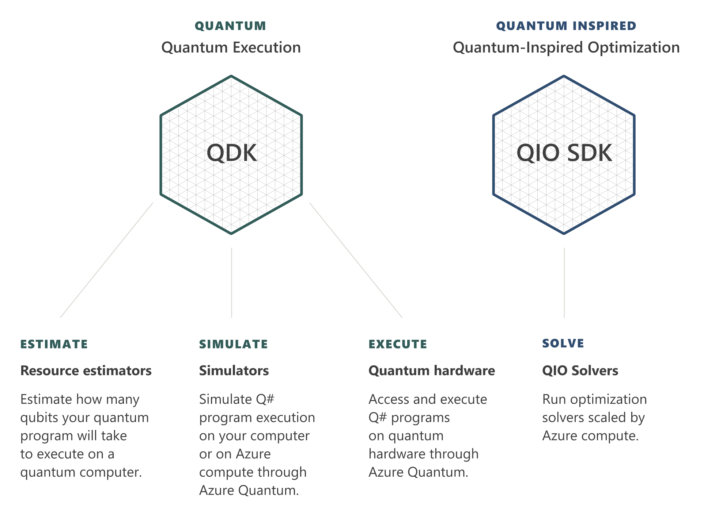

# Azure Quantum

In this unit, you'll get an introduction to the Azure Quantum service and the types of problems Azure Quantum can help you solve. 
You'll also learn about the hardware and software offerings from our third party providers which you can access through Azure Quantum. 

> [!VIDEO https://www.microsoft.com/...]

## Overview
Azure Quantum is a single Azure service to enable quantum impact today.
Like other Azure services, you'll need to deploy an Azure Quantum resource into your Azure subscription in order to use the service. 
This resource is called an **Azure Quantum Workspace** - or **Workspace** for short. 
Through this resource you can access the services of a number of **Providers**, whether that's Microsoft or a third-party provider.
These providers will have on offer different **Targets** - software or hardware - that you can use to solve the problems you're interested in.
The Azure Quantum service manages the scheduling and jobs from start to finish.
So whether you're running a quantum-inspired solver, or executing a quantum program, you can easily submit jobs and see the results. 

## Quantum Solutions
If you want the ability to solve large, complex optimization problems at scale, then you can explore quantum-inspired solvers from Microsoft and partners such as 1QBit.
In this module you'll get an understanding of what optimization problems are, and what techniques you can use through Azure Quantum to solve them.

## Quantum Software
If you are interested in developing quantum software, then Azure Quantum offers a suite of tools for helping you express your algorithms using the Quantum Development Kit and Q#. 
There are tools for simulating your programs, so that you can test the behaviour and performance of your code. 
In addition, there are tools such as resource estimation, which will help you understand the resources that your code would require.
In terms of a quantum program, this tells you the types of quantum gates you use, and how many.

Using these tools together helps you understand the features of a quantum computer that you'd need in order to run your program, such as the number of qubits. 
From a software engineering perspective, it also helps you iterate and improve your code, so that you can reduce the requirements necessary to run it. 
For more detail on how this is done in practice, check out Dave Wecker's talk on [Achieving Practical Quantum Computing](https://cloudblogs.microsoft.com/quantum/2018/06/01/achieving-practical-quantum-computing/).

## Quantum Hardware
If you have developed quantum software that you would like to run on quantum hardware, then through Azure Quantum you can access a range of different hardware types. 
For example, there's IonQ's quantum computer built from trapped ions. There's also superconducting devices from Honeywell and QCI.
Currently, Microsoft is also developing its own quantum hardware based on topological qubits.

In the next unit, you will learn more about what quantum-inspired optimization is and when it is a useful solution. If you are interested to learn how to develop quantum software, there is a separate MS Learn module, [Write your first quantum program with the Quantum Development Kit](https://docs.microsoft.com/learn/modules/get-started-qdk). Both the quantum-inspired optimization solvers and the Quantum Development Kit are available on Azure Quantum.  