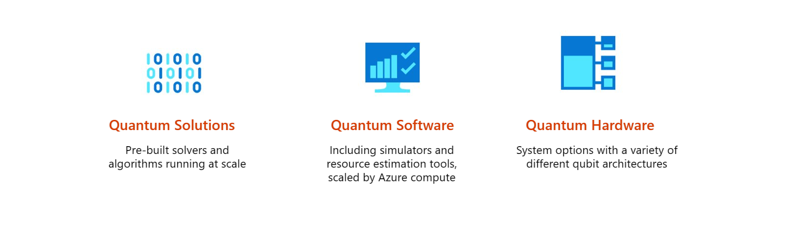

# Azure Quantum
In this unit, you'll get an introduction to the Azure Quantum service and the types of problems Azure Quantum can help you solve. 
You'll also learn about the hardware and software offerings from our third party providers which you can access through Azure Quantum. 

> [!VIDEO https://www.microsoft.com/...]
## Workspaces
Azure Quantum is a service provided by Azure. 
Like other Azure services, you'll need to deploy an Azure Quantum resource into your Azure subscription in order to use the service. 
This resource is called an **Azure Quantum Workspace** - or **Workspace** for short. 

With an Azure Quantum workspace in your subscription, you'll be able to explore quantum solutions, use quantum software tools and access quantum hardware. 

## Targets
The kind of program you wish to run will determine the type of hardware or software that you use, in Azure Quantum we refer to this as the **Target**.
You'll also be able to select from a range of **Providers**, whether that's Microsoft or a third party, and begin using those services in your Workspace.

- **Quantum Solutions**: If you want the ability to solve large, complex optimization problems at scale, then you can explore quantum-inspired solvers from Microsoft and partners such as 1QBit.
In this module you'll get an understanding of what optimization problems are, and what techniques you can use through Azure Quantum to solve them.
- **Quantum Software**: If you are interested in developing quantum software, then Azure Quantum offers a suite of tools for helping you express your algorithms using the Quantum Development Kit and Q#.
There are tools for simulating your programs, so that you can test the behaviour and performance of your code. 
In addition, there are tools such as resource estimation, which will help you understand the resources that your code would require.
In terms of a quantum program, this tells you the types of quantum gates you use, and how many.
Using these tools together helps you understand the features of a quantum computer that you'd need in order to run your program, such as the number of qubits. 
From a software engineering perspective, it also helps you iterate and improve your code, so that you can reduce the requirements necessary to run it. 
For more detail on how this is done in practice, check out Dave Wecker's talk on [Achieving Practical Quantum Computing](https://cloudblogs.microsoft.com/quantum/2018/06/01/achieving-practical-quantum-computing/).
- **Quantum Hardware**: If you have developed quantum software that you would like to run on quantum hardware, then through Azure Quantum you can access a range of different hardware types. 
For example, there's IonQ's quantum computer built from trapped ions. There's also superconducting devices from Honeywell and QCI.
Currently, Microsoft is also developing its own quantum hardware based on topological qubits.

## Jobs
Whether you're running a quantum inspired solver, or executing a quantum program, your request is sent to the Azure Quantum service.
The service considers these requests as **Jobs** and schedules them.
Once a job has been submitted, you can access information about the status of the job, and the results once it has completed.