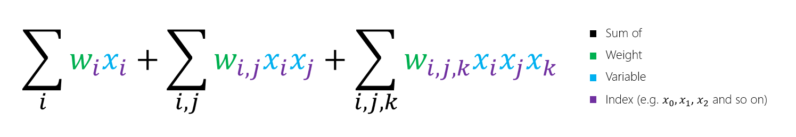
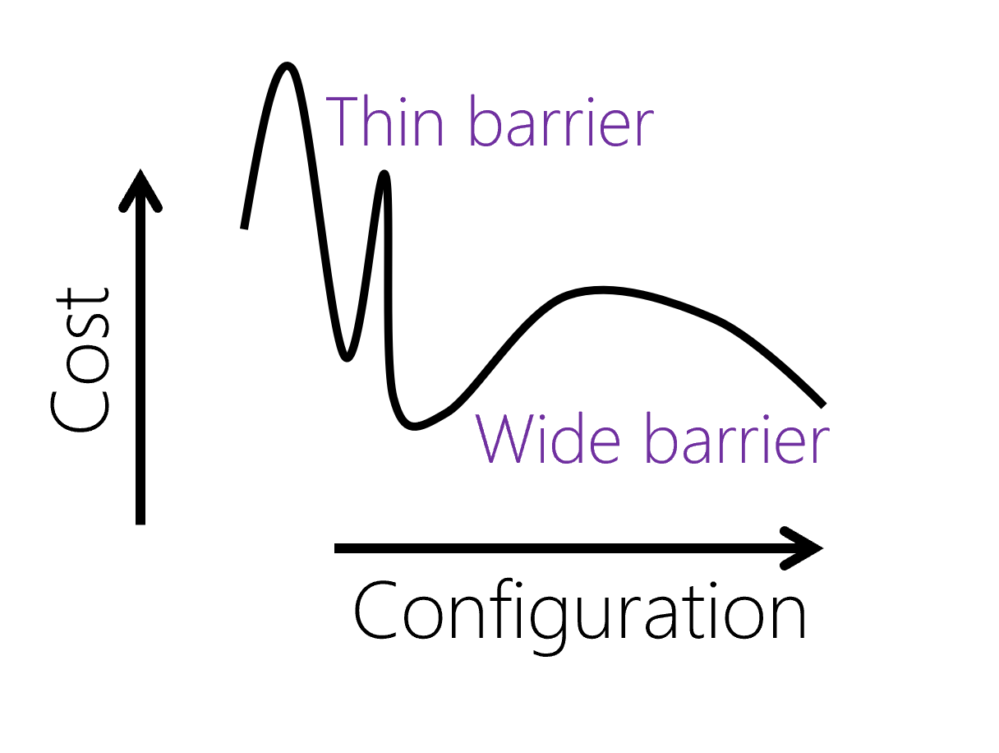
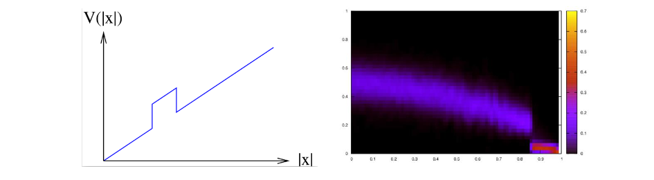

In this unit, you will learn about quantum-inspired optimization methods, that will be available on Azure Quantum. Quantum-inspired optimization is a subset of quantum annealing methods. We will give an introduction to these methods and the types of optimization problems they can be used for.

# Introduction to Quantum Inspired Optimization (QIO)

## What is QIO?

There are many models of quantum computing. If you have viewed the *Get Started SDK* module (is this referring to the QDK module?), you'll have gained familiarity with the Gate Model, in which we define quantum programs by writing operations that make use of quantum gates. 

Quantum Inspired Optimization (QIO) is based on a different computational model, namely adiabatic quantum computing. This approach uses a concept from quantum physics known as the adiabatic theorem which works as follows:
- Begin by preparing a system and initializing it to its lowest energy state. For a simple system, one which we understand everything about, this is easy to construct.
- Next, slowly transform that system into a more complex one, one which describes the problem we are trying to solve.
The adiabatic theorem states that, as long as this transformation moves slowly enough, the system will stay in that lowest energy configuration. So at the end, we've solved our problem.

[Adiabatic quantum computation](https://en.wikipedia.org/wiki/Adiabatic_quantum_computation) has been well-studied, and as a result, a number of techniques have been developed to simulate this type of physics.
These classical algorithms, which we can run on classical computers today, are also known as quantum inspired approaches.

## Why is QIO useful?

Optimization problems are commonplace in industry, from manufacturing, to finance, to transportation and much more. 
These problems involve searching over all the feasible solutions to find the best, often lowest cost, solution. 
Adiabatic quantum algorithms are naturally suited to solving optimization problems of this kind.

In the long term, adiabatic quantum algorithms can be run on quantum computers, once we have devices of a large enough scale and quality. (Can we give an estimate of scale, e.g. 200 fault-free qubits? Because this statement probably will provoke people to ask "how many qubits?") 
You can learn more about building a scalable quantum computer in [this blog post](https://cloudblogs.microsoft.com/quantum/2018/05/16/achieving-scalability-in-quantum-computing/). 

In the meantime, we can emulate these algorithms using quantum inspired techniques today on classical hardware, and often see improvements in performance over other state-of-the-art classical optimization techniques. 
Theory suggests we'll see further speedups once quantum hardware is available.

Applying QIO to real-world problems might offer businesses' new insights, or help lower costs by making their processes more efficient. QIO is a advantageous method in these scenarios:
1. For a fixed use case and fixed quality of solution, finding the solution faster.
2. For a fixed problem and fixed amount of time, finding a higher quality solution.
3. By extending the problem to consider more variables, finding a solution to a more realistic model.

## Understanding optimization problems

Before we dive into QIO, we should overview what optimization problems are in general. 

Let's begin with some common terminology:
- **Search space**: This is the space of all the feasible solutions to the optimization problem. Each point in this search space is a valid solution to the problem, however typically we are looking for the lowest point, or lowest cost solution.
- **Objective function**: This is a mathematical description, which, when evaluated, tells you the cost of that solution. (Can we also define "cost" or "cost function"?)

(And the relationship between opbjective function and cost function - "In most optimization problems the dominant computational cost is the cost of the evaluations of the objective function. The cost is usually negligible for the processing that is used to determine what assignment of the variables to try next. Thus the total CPU-time typically used by an optimization algorithm is approximately the number of evaluations of the objective function that it makes multiplied by the processing time for one evaluation." Still a little abstract. Is the CPU-time the cost?) 

Together, these are often referred to as an optimization landscape. 
In the case of a problem involving two continuous variables, the analogy to a landscape is quite direct. 
For example, here is a plot of an objective function that looks like a single smooth valley:

This kind of problem can be easily solved with techniques such as [gradient descent](https://en.wikipedia.org/wiki/Gradient_descent), where you begin from an initial starting point and greedily move to any solution with a lower cost. After a few moves this will converge to the global minimum.

- **Global minimum**: The lowest point in the optimization landscape.
- **Local minimum**: A rugged landscape may consist of multiple valleys. Each of these valleys will have a lowest point, which are called the local minima. One of these points will be the lowest overall, and is the global minimum.

Advanced methods such as QIO offer no advantage on these easy problems. Instead, they should be applied to problems where the landscape is rugged, featuring many hills and valleys for example:

In these scenarios, one of the greatest challenges is avoiding getting "stuck" at any of the sub-optimal local minima. 
It is these cases where QIO can outperform other techniques, due to the behaviour of the algorithms which we will detail in the following section.

So far we have discussed smooth and rugged objective functions, but what if there is no structure at all? In these cases, where the solutions are completely random, then no algorithm can improve upon brute force search.

To summarize the general conditions where QIO performs well:
- Optimization landscapes should be rugged but structured. Such landscapes arise frequently in practice, for example in traffic optimization or solving satisfiability problems.
- If the number of variables is too small, then simplistic algorithms are already sufficient. For problems with over 100 variables, QIO has achieved orders of magnitude improvement over previously used methods. (Examples of previously used methods? Some research papers to link to?)

## Simulated and quantum annealing 

We will explain the general idea of simulated annealing and quantum annealing, as the solvers in Azure Quantum use variations of these techniques. 

### Simulated annealing
For optimization problems in search spaces that are too large to solve by exhaustive search and objective functions that are rugged but structured, one of the most successful and commonly used heuristics is simulated annealing.

- **Heuristic**: A technique for finding an approximate solution, when finding the exact solution may take too long.
- **Walker**: We can imagine a person or a particle in our solution space, and each step taken creates a path, or walk, through the optimization landscape.

Simulated annealing is like gradient descent in that the algorithm simulates a walker that preferentially moves downhill. 
But unlike in gradient descent, the walker can take uphill moves with some non-zero probability. 
This creates the possibility for the walker to escape from local minima and then descend into deeper neighboring minima, as illustrated below.

You'll notice this uphill move is described as a "thermal jump" in the illustration. 
That's because simulated annealing is an algorithm from physics that mimics the behaviour of materials as they are slowly cooled.
The walker is like an atom in a metal, for instance, that are driven by thermal motion to reconfigure themselves. 
These changes are random, however moves to lower-energy configurations are more likely than moves to higher-energy configurations.
Hence, we say it follows a biased random walk. 

Let's take a look at how we define the cost function of our simulated annealing problem. 
Firstly, we have a number of variables. We can name these variables *x*, and if we have *i* variables, then we can index them individually as follows:

These variables can take specific values, and in the case of a binary optimization problem they can only take two. 
In particular, if your problem is considering these variables as spins, as in the Ising model, then the values of the variables can be either +1 or -1. 
In other cases, these can simply be 1 or 0, as in the QUBO or PUBO model which we will explain shortly.

Let us consider some variables. Each of these variables has an associated weight, which determines their influence on the overall cost function.
We can write these weights as *w*, and again, if we have *i* variables, then the associated weight for those individual variables can be indexed like so:

And so, we can write our cost function as the sum of these weights and variables.

Currently our cost function only considers individual variables. 
You can think of these as independent contributions to the cost function. 
But often, in real-life scenarios, variables may depend on one another.
So how do we describe this?
Mathematically, we write this as the product of two variables.
Their contribution can be written as their weight, multiplied by each of the variables with indices *i* and *j*:

We can combine this with the previous cost function to describe a problem where variables can contribute individually, and based on another variable:

However, we don't have to stop there. We can extend this to considering how three variables might depend on one another, using a third index *k*:

Combining this again, we have a problem of the form:

- **k-local**: In mathematics, the expressions we have just defined are called "polynomials". 
In the first case, with independent variables, we would say that this polynomial had degree 1.
For a polynomial with degree $k$, we would describe this as a $k$-local problem.
- **QUBO**: In the second case, we introduced the idea of having two variables depend on one another. 
Mathematically, this amounts to introducing quadratic terms. 
Alternatively, we might say it was a 2-local problem.
In Azure Quantum, you might see these problems described as "quadratic unconstrained binary optimization problems", or QUBOs.
- **PUBO**: In the final case, we described a polynomial with maximum degree 3. 
However, we could continue to extend this cost function so that it considered problems of a greater degree. 
In Azure Quantum, we use the term "polynomial unconstrained binary optimization", or PUBO, to describe problems with a maximum degree $k$. 

Now that we have defined the structure of our problems, let's look into more detail at how we describe the acceptance of moves.
This translates to considering, "with what probability should I accept a new assignment to these variables"?
Since the moves are driven by thermal motion, it depends on the temperature.
It also depends on the cost (or energy) of the current and proposed configurations, and finally, a constant called the Boltzmann constant.

Mathematically, the probability can be written as follows:

Simulated annealing algorithms mimic this thermal process not only conceptually but in quantitative detail. 
Over the course of the algorithm the temperature is gradually lowered, which means that moves to higher-energy configurations become less and less likely.
This ensures that the search space is explored widely at the beginning, and at the end only small changes are made that fine-tune the solution.

### Quantum annealing
[Quantum annealing](https://en.wikipedia.org/wiki/Quantum_annealing) is a quantum algorithm which is similar in spirit to simulated annealing but differs in a few details. 
For instance, in simulated annealing we explored the solution space by making thermal jumps, from one solution to the next.
In quantum annealing, we instead make use of a quantum effect called "quantum tunnelling", which allows us to travel through these energy barriers. 
We frame our problem by giving assigments to qubits, which are our variables, and the energy of a given assignment to the qubits is the value of the objective function.
Initially we begin with the quantum state in a broad [superposition](https://en.wikipedia.org/wiki/Quantum_superposition) over many possible assignments to the qubits.
Instead of varying the temperature, as we did in simulated annealing, we vary a parameter called the "quantum field strength".
What this parameter defines is the radius of neighboring states that we could move to, as time goes on, this radius becomes smaller and smaller, as we hone in on a solution.
By the end of the anneal, the system has settled into one particular configuration of low energy which can then be measured, thus yielding a (not necessarily optimal) solution to the desired optimization problem.
The most mathematically clean formulation of quantum annealing is called adiabatic quantum optimization, and is what quantum inspired methods attempt to emulate.

### From Quantum to Quantum Inspired Optimization
One essential feature determining the difficulty of optimization problems is the shape of the barriers that separate local minima from deeper neighboring minima. 
It can be shown in some examples that the runtime of adiabatic quantum optimization algorithms depends sensitively on the width of these barriers but is relatively insensitive to their height. 
Example problems can be constructed containing tall narrow barriers that are solved efficiently by adiabatic quantum optimization but which require exponential time to solve by simulated annealing due to the exponentially small Boltzmann factors.
The capacity to cross tall narrow barriers (a process called quantum tunneling) is the mostly commonly cited argument in favor of quantum annealing.

[Monte Carlo methods](https://en.wikipedia.org/wiki/Monte_Carlo_method) are a broach class of algorithms which use random sampling to estimate a result, and are used in a wide variety of areas, including the simulation of quantum systems. 
Any Monte Carlo method applied to solve a quantum annealing problem can be considered "simulated quantum annealing", and it is these methods that we refer to as quantum-inspired optimization. 
There are a variety of techniques that we have developed, and over time the suite of solvers available through Azure Quantum will grow. 
As with all heuristic algorithms, knowing which solvers perform well is often a combination of intuition about when tunneling-like phenomena can be expected to help with solving optimization problems.
However it is also through experimentation; testing these algorithms on different varieties of optimization instances and observing their performance.

#### Diffusion Monte Carlo 

Diffusion Monte Carlo is a type of population method, and on a technical level these are derived by writing an imaginary-time analogue of Schrödinger’s equation, which governs the dynamics of the quantum wavefunction:

and this yields a continuous-time random walk. What does that mean? In terms of our walkers on our solution space, it means that the number of walkers is not preserved. 
For example, the walkers at locations where the objective function is high can die off, and walkers where the objective function is low can reproduce. 
Through a combination of hopping to neighboring sites, death, and reproduction, the walkers explore the search space, preferentially accumulating in the regions where the objective function is lowest. 
As in quantum annealing, the parameters are varied with time so that the hopping is favored at the beginning of the anneal, thereby causing the walkers to explore the search space widely, and birth/death processes are favored at the end of the anneal, thereby strongly driving the walkers into the areas of lowest objective function. 
Depending on the precise details of the algorithm, the population methods are variously called Diffusion Monte Carlo, Green’s Function Monte Carlo, or Population Annealing.

Green’s function Monte Carlo can mimic tunneling effects. 
On the left, an objective function V is shown which depends only on the Hamming weight |x| of the given bit string x. 
On the right the distribution of walkers (with color indicating concentration of walkers) is plotted as a function of Hamming weight (vertical axis) and anneal time (horizonal axis). 
Walkers at Hamming weight above the barrier eventually die off as walkers below the barrier reproduce, thereby mimicking quantum tunneling.

#### Path integral Monte Carlo (PIMC)
Path-integral methods work by applying a random walk not to a population of independent walkers but rather to a path through a sequence of possible locations in the search space. 
As in population methods, the precise random walk taken by these paths is derived by adherence to an imaginary-time version of Schrödinger’s equation. 
Intuitively, one can regard such a path as a collection of walkers which each preferentially hop into areas of lower objective function, but which are loosely tied to each other by a chain of elastic bands. 
When a walker stumbles into an area of lower objective function than was previously found, they tug on neighboring walkers can pull more of them into the new basin.
Path Integral Monte Carlo is a method that uses an idea of a "replica", which is simply a copy of the system which is being simulated.

It is in this way that Path Integral Monte Carlo mimics quantum tunnelling. 
Paths spend most of their time in the low "energy" regions, where the objective function is small.
There are occasional hops between wells, which are called *instantons* and can be treated like particles and analysed using the methods of quantum field theory.
Results show that time requiired for Path Integral Monte Carlo to escape from a local minimum to a neighbouring llower minimum scales identically to quantum annealing.
- **Replica**: A copy of the system which is being simulated.
- **Parallel tempering**: A method used to improve the dynamic properties of Monte Carlo simulations

# Explain general ideas of optimization
In this unit, you will learn about the quantum-inspired solutions enabled by Azure Quantum.
objective function, cost function, gradient descent
finding global minimum 

Shall we explain what NP-hard is?

This is the relationship between objective and cost functions: In most optimization problems the dominant computational cost is the cost of the evaluations of the objective function. The cost is usually negligible for the processing that is used to determine, based on the evaluations performed so far, what assignment of the variables to try next. Thus the total CPU-time typically used by an optimization algorithm is approximately the number of evaluations of the objective function that it makes multiplied by the processing time for one evaluation. 

# Explain QIO

explain mathematically the similarities and differences: Thermal jump, quantum tunnel, simulated annealing, quantum annealing, quantum-inspired = simulated quantum annealing

Is Ising model the only quantum model? How do we use it?

Is there a workflow to show the commonality of establishing a QIO solutions:
e.g. construct cost function -> describe with Hamiltonian -> minimum energy

# Mapping an everyday problem to QIO e.g. Ship-loading example

(Imagine that you are the owner of a freight shipping company. You've just received your first order to deliver some cargo, and it's going to require two of your ships. The cargo consists of containers that are of varying weights - how do you load the ships so that their respective weights are as similar as possible? 

In number theory and computer science, this is known as the partition problem. lt can be thought of as an optimization problem if you consider a set of elements S, that must be partitioned into subsets S1 and S2. The sum of the elements in these subsets must be minimized in order to solve the problem. (Note: This version is NP-­hard, but can be efficiently solved.) )

Why is this example QIO (minimizing Hamiltonian)? How does it relate to the concepts above (why is Hamiltonian a cost function)? How would people do this optimization classically? 

How is our example connected to the terms introduced earlier?

# What kind of problems are good for QIO

[landscape plots]()
