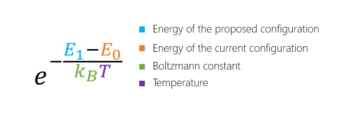

# Introduction to Quantum Inspired Optimization (QIO)

## What is QIO?

There are many models of quantum computing. If you have viewed the *Get Started SDK* module, you'll have gained familiarity with the Gate Model, in which we define quantum programs by writing operations that make use of quantum gates. 

Quantum Inspired Optimization (QIO) is based on a different computational model, namely adiabatic quantum computing. This approach uses a concept from quantum physics known as the adiabatic theorem which works as follows:
- Begin by preparing a system and initializing it to its lowest energy state. For a simple system, one which we understand everything about, this is easy to construct.
- Next, slowly transform that system into a more complex one, one which describes the problem we are trying to solve.
The adiabatic theorem states that, as long as this transformation moves slowly enough, the system will stay in that lowest energy configuration. So at the end, we've solved our problem.

Adiabatic quantum computation has been well-studied, and as a result, a number of techniques have been developed to simulate this type of physics.
These classical algorithms, which we can run on computers today, are also known as quantum inspired approaches.

## Why is QIO useful?

Optimization problems are commonplace in industry, from manufacturing, to finance, to transportation and much more. 
These problems involve searching over all the feasible solutions to find the best, often lowest cost, solution. 
Adiabatic quantum algorithms are naturally suited to solving optimization problems of this kind.

In the long term, adiabatic quantum algorithms can be run on quantum computers, once we have devices of a large enough scale and quality. 
You can learn more about building a scalable quantum computer in [this blog post](https://cloudblogs.microsoft.com/quantum/2018/05/16/achieving-scalability-in-quantum-computing/). 

In the meantime, we can emulate these algorithms using quantum inspired techniques today, and often see improvements in performance over other state-of-the-art classical optimization techniques. 
Theory suggests we'll see further speedups once quantum hardware is available.

Applying QIO to real-world problems might offer businesses new insights, or help lower costs by making their processes more efficient. This can be done by:
1. For a fixed use case and fixed quality of solution, finding the solution faster.
2. For a fixed problem and fixed amount of time, finding a higher quality solution.
3. By extending the problem to consider more variables, finding a solution to a more realistic model.

## Understanding optimization problems

Let's begin with some common terminology:
- **Search space**: This is the space of all the feasible solutions to the optimization problem. Each point in this search space is a valid solution to the problem, however typically we are looking for the lowest point, or lowest cost solution.
- **Objective function**: This is a mathematical description, which, when evaluated, tells you the cost of that solution. 

Together, these are often referred to as an optimization landscape. 
In the case of a problem involving two continuous variables, the analogy to a landscape is quite direct. 
For example, here is a plot of an objective function that looks like a single smooth valley:

This kind of problem can be easily solved with techniques such as gradient descent, where you begin from an initial starting point and greedily move to any solution with a lower cost. After a few moves this will converge to the global minimum.

- **Global minimum**: The lowest point in the optimization landscape.
- **Local minimum**: A rugged landscape may consist of multiple valleys. Each of these valleys will have a lowest point, which are called the local minima. One of these points will be the lowest overall, and is the global minimum.

Advanced methods such as QIO offer no advantage on these easy problems. Instead, they should be applied to problems where the landscape is rugged, featuring many hills and valleys for example:

In these scenarios, one of the greatest challenges is avoiding getting "stuck" at any of the sub-optimal local minima. 
It is these cases where QIO can outperform other techniques, due to the behaviour of the algorithms which we will detail in the following section.

So far we have discussed smooth and rugged objective functions, but what if there is no structure at all? In these cases, where the solutions are completely random, then no algorithm can improve upon brute force search.

To summarize the general conditions where QIO performs well:
- Optimization landscapes should be rugged but structured. Such landscapes arise frequently in practice, for example in traffic optimization or solving satisfiability problems.
- If the number of variables is too small, then simplistic algorithms are already sufficient. For problems with over 100 variables, QIO has achieved orders of magnitude improvement over previously used methods.

## Simulated and quantum annealing
### Simulated annealing
For optimization problems in search spaces that are too large to solve by exhaustive search and objective functions that are rugged but structured, one of the most successful and commonly used heuristics is simulated annealing.

- **Heuristic**: A technique for finding an approximate solution, when finding the exact solution may take too long.
- **Walker**: We can imagine a person or a particle in our solution space, and each step taken creates a path, or walk, through the optimization landscape.

Simulated annealing is like gradient descent in that the algorithm simulates a walker that preferentially moves downhill. 
But unlike in gradient descent, the walker can take uphill moves with some non-zero probability. 
This creates the possibility for the walker to escape from local minima and then descend into deeper neighboring minima, as illustrated below.

You'll notice this uphill move is described as a "thermal jump" in the illustration. 
That's because simulated annealing is a physics-inspired algorithm that mimics the behaviour of materials as they are slowly cooled.
The atoms in a metal, for instance, are driven by thermal motion to reconfigure themselves. 
These changes are random, however moves to lower-energy configurations are more likely than moves to higher-energy configurations.
Hence, we say it follows a biased random walk.

But what is the probability that one of these moves will occur? 
Since the moves are driven by thermal motion, it depends on the temperature.
It also depends on the energy of the current and proposed configurations, and finally, a constant called the Boltzmann factor.

Mathematically, the probability can be written as follows:

Simulated annealing algorithms mimic this process not only conceptually but in quantitative detail. 
Over the course of the algorithm the temperature is gradually lowered, which means that moves to higher-energy configurations become less and less likely.
This ensures that the search space is explored widely at the beginning, and at the end only small changes are made that finetune the solution.

## QIO Methods
Quantum inspired
# Explain general ideas of optimization
In this unit, you will learn about the quantum-inspired solutions enabled by Azure Quantum.
objective function, cost function, gradient descent
finding global minimum 

Shall we explain what NP-hard is?

This is the relationship between objective and cost functions: In most optimization problems the dominant computational cost is the cost of the evaluations of the objective function. The cost is usually negligible for the processing that is used to determine, based on the evaluations performed so far, what assignment of the variables to try next. Thus the total CPU-time typically used by an optimization algorithm is approximately the number of evaluations of the objective function that it makes multiplied by the processing time for one evaluation. 

# Explain QIO

explain mathematically the similarities and differences: Thermal jump, quantum tunnel, simulated annealing, quantum annealing, quantum-inspired = simulated quantum annealing

Is Ising model the only quantum model? How do we use it?

Is there a workflow to show the commonality of establishing a QIO solutions:
e.g. construct cost function -> describe with Hamiltonian -> minimum energy

# Mapping an everyday problem to QIO e.g. Ship-loading example

(Imagine that you are the owner of a freight shipping company. You've just received your first order to deliver some cargo, and it's going to require two of your ships. The cargo consists of containers that are of varying weights - how do you load the ships so that their respective weights are as similar as possible? 

In number theory and computer science, this is known as the partition problem. lt can be thought of as an optimization problem if you consider a set of elements S, that must be partitioned into subsets S1 and S2. The sum of the elements in these subsets must be minimized in order to solve the problem. (Note: This version is NP-­hard, but can be efficiently solved.) )

Why is this example QIO (minimizing Hamiltonian)? How does it relate to the concepts above (why is Hamiltonian a cost function)? How would people do this optimization classically? 

How is our example connected to the terms introduced earlier?

# What kind of problems are good for QIO

[landscape plots]()
