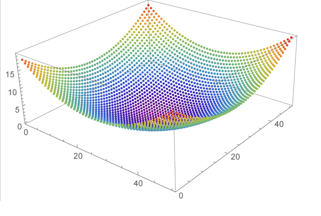

To understand optimization problems, you first need to learn some terminology. 

- **Search space**. This is the space that contains all the feasible solutions to the optimization problem. Each point in this search space is a valid solution to the problem but it's not necessarily the lowest point, which corresponds to the lowest cost solution.
- **Objective function**. This is a mathematical description, which, when evaluated, tells you the cost of that solution.
- **Cost function**. This is the objective function that we specifically wish to minimize. For Contoso Logistics, the cost function is the weight difference between the two ships. In other scenarios, it might be length of travel or a monetary cost.

Together, the search space and the objective function are often referred to as an _optimization landscape_. In the case of a problem that involves two continuous variables, the analogy to a landscape is quite direct.

Let's explore a few landscapes and see which are good candidates for QIO.

## A single, smooth landscape

Consider the following plot of an objective function that looks like a single smooth valley:

This kind of problem is easily solved with techniques such as gradient descent, where you begin from an initial starting point and greedily move to any solution with a lower cost. After a few moves, the solution converges to the *global minimum*. The global minimum is the lowest point is the optimization landscape. QIO offers no advantages over other techniques with these straightforward problems.

## A structured, rugged landscape

QIO works best with problems where the landscape is rugged, with many hills and valleys. Here's an example that considers two continuous variables. In our Contoso Logistics example, we'll be considering a problem with eight variables:

In this scenario, one of the greatest challenges is to avoid getting stuck at any of the sub-optimal *local minima*. A rugged landscape can have multiple valleys. Each of these valleys will have a lowest point, which is the local minimum. One of these points will be the lowest overall, and that point is the global minimum. These rugged landscapes present situations where QIO can outperform other techniques.

## A scattered, random landscape

So far we have discussed smooth and rugged objective functions, but what if there is no structure at all? The following diagram shows such a landscape:

In these cases, where the solutions are completely random, then no algorithm can improve on a brute force search.

## Summary

To summarize, here are the necessary conditions for QIO to perform well:

- Optimization landscapes should be rugged but structured. Such landscapes occur frequently in  real-world problems.
- If the number of variables is too small, then simplistic algorithms are already sufficient. For problems with over 100 variables, QIO has achieved orders of magnitude improvement over [previously used methods](https://news.microsoft.com/innovation-stories/quantum-computing-mri-cancer-treatment/?azure-portal=true).