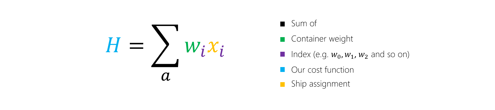
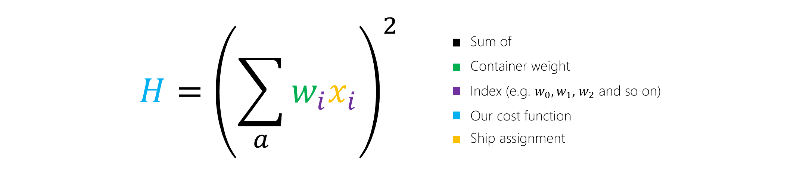

QIO uses two techniques to solve optimization problems. One of them is simulated annealing and the other is quantum annealing.

## Simulated annealing
For optimization problems in search spaces that are too large to solve by exhaustive search and with objective functions that are rugged, one of the most successful and commonly used <i>heuristics</i> is simulated annealing. A heuristic is a technique for finding an approximate solution. It is useful in situations where finding an exact solution can take too long.  You can think of the technique as a random walk through the solution space, where each step a person or particle takes creates a path through the optimization landscape.

### How does simulated annealing work?
Simulated annealing is similar to gradient descent. The algorithm simulates a walker that, ideally, alway moves downhill. But, unlike gradient descent, the walker can also take uphill moves with some non-zero probability. This creates the possibility for the walker to escape from local minima and then descend into deeper neighboring minima.

In the graph, you will notice that this uphill move is described as a <i>thermal jump</i>. That's because simulated annealing is an algorithm from physics that mimics the behaviour of materials as they are slowly cooled. The walker is like an atom in a metal that is driven by temperature to reconfigure itself. These changes are random but moves to lower-energy configurations are more likely than moves to higher-energy configurations. That is why we say the walker follows a biased random walk. 

## Quantum annealing
[Quantum annealing](https://en.wikipedia.org/wiki/Quantum_annealing) is a quantum algorithm that is similar in spirit to simulated annealing but differs in a few ways. For example, in simulated annealing we explored the solution space by making thermal jumps, from one solution to the next. In quantum annealing, we instead make use of a quantum effect called <i>quantum tunnelling</>, which allows us to travel through these energy barriers. 

In the graph, you can see the difference between a thermal jump and quantum tunneling.

### How does quantum annealing work?

In quantum annealing, we frame our problem by giving assignments to qubits, which are our variables. The energy of a given assignment to the qubits is the value of the objective function.

Initially we begin with the quantum state in a broad superposition over many possible assignments to the qubits. Instead of varying the temperature, as we did in simulated annealing, we vary a parameter called the <i>quantum field strength</i>.

This parameter defines is the radius of neighboring states we can move to. As time goes on and we get closer to a solution, this radius becomes smaller and smaller. By the end of the anneal, the system has settled into one particular low-energy configuration that can then be measured, which gives us the solution to the optimization problem. The most mathematically clean formulation of quantum annealing is called <i>adiabatic quantum optimization</>, and this is what quantum-inspired methods attempt to emulate.

**TODO-make this the end of the unit**

**TODO-start a new unit with the Contoso example**

As you recall, Contoso Logistics has to optimize how it distributes containers between two ships. In other words, we have a set of container weights, *w*, which we would like to partition into two sets. Those two sets correspond to whether the container is loaded onto ship *a* or ship *b*. We’ll use QIO to solve the problem. 

**TODO-do we need to repeat the illustration**

## Express the problem
Let's start by coming up with an equation for the weight of a given ship, which is the sum of all the containers on the ship.  
This is expressed in the below equation, where *wi* is the weight of container *i*:

In this equation, *wi* is the weight of container *i*.

Ideally, we'd like a solution where the weight difference between the ships is as small as possible.

The letter *H* is typically used to represent a cost function. It is also referred to as a Hamiltonian in a nod towards the quantum mechanical roots of QIO techniques. If the value of *H* is zero, we know the ships are equally loaded.

## Refine the problem

Next, we'll introduce a variable, *xi*, to represent whether an individual container *i* is assigned to ship *a* or ship *b*. 

Because we can assign the container *i* to either ship, the variable *xi* can take on two different values, which makes it a binary variable. For convenience, we'll say the two values it can take on are *1* and *-1*. The value *1* will represent that the container is placed on ship *a*, and *-1* will represent that the container is placed on ship *b*. Because of our decision to make *i* be either *1* or *-1*, our optimization problem is called an Ising problem. 

By introducing this variable *xi*, we can simplify the equation.

## Refine the problem again
There's one last change we need to make before we can solve our problem. 
If we look at our cost function *H* there's a flaw: the solution with the least cost is to simply assign all containers to ship *b* by setting all of the *xi* variables equal to *-1* and that's not right! To fix this we'll simply square the right hand side of the equation so that it cannot be negative.

This final model gives us a cost function with the right properties.

- If all the containers are on one ship, the function is at its highest value. This is the least optimal solution.
- If the containers are perfectly balanced, the value of the summation inside the square is *0*. This means the function is at its lowest value.

In this case, we don't care about the actual value of *H*. It only has to be as small as possible.

## See the solution
This video uses the Azure Quantum Simulated Annealing solver to assign the containers to the ships. You'll see the algorithm exploring a number of different configurations, as it attempts to minimize the cost function that we defined above.

> [!VIDEO https://www.microsoft.com/...] 

That's it! You've learned the basics of QIO. You're ready to apply it to your own optimization problems.   
