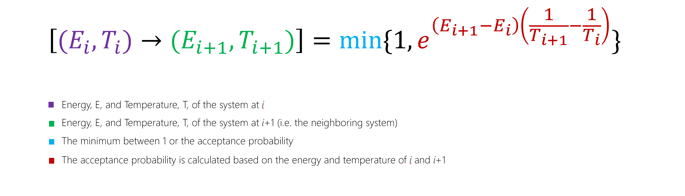

## From Quantum to Quantum Inspired Optimization
One essential feature determining the difficulty of optimization problems is the shape of the barriers that separate local minima from deeper neighboring minima. 
It can be shown in some examples that the runtime of adiabatic quantum optimization algorithms depends sensitively on the width of these barriers but is relatively insensitive to their height. 
Example problems can be constructed containing tall narrow barriers that are solved efficiently by adiabatic quantum optimization but which require exponential time to solve by simulated annealing due to the exponentially small Boltzmann factors.
The capacity to cross tall narrow barriers (a process called quantum tunneling) is the mostly commonly cited argument in favor of quantum annealing.

[Monte Carlo methods](https://en.wikipedia.org/wiki/Monte_Carlo_method) are a broach class of algorithms which use random sampling to estimate a result, and are used in a wide variety of areas, including the simulation of quantum systems. 
Any Monte Carlo method applied to solve a quantum annealing problem can be considered "simulated quantum annealing", and it is these methods that we refer to as quantum-inspired optimization. 
There are a variety of techniques that we have developed, and over time the suite of solvers available through Azure Quantum will grow. 
As with all heuristic algorithms, knowing which solvers perform well is often a combination of intuition about when tunneling-like phenomena can be expected to help with solving optimization problems.
However it is also through experimentation; testing these algorithms on different varieties of optimization instances and observing their performance.

### Diffusion Monte Carlo 

Diffusion Monte Carlo is a type of population method, and on a technical level these are derived by writing an imaginary-time analogue of Schrödinger’s equation, which governs the dynamics of the quantum wavefunction:

and this yields a continuous-time random walk. What does that mean? In terms of our walkers on our solution space, it means that the number of walkers is not preserved. 
For example, the walkers at locations where the objective function is high can die off, and walkers where the objective function is low can reproduce. 
Through a combination of hopping to neighboring sites, death, and reproduction, the walkers explore the search space, preferentially accumulating in the regions where the objective function is lowest. 
As in quantum annealing, the parameters are varied with time so that the hopping is favored at the beginning of the anneal, thereby causing the walkers to explore the search space widely, and birth/death processes are favored at the end of the anneal, thereby strongly driving the walkers into the areas of lowest objective function. 
Depending on the precise details of the algorithm, the population methods are variously called Diffusion Monte Carlo, Green’s Function Monte Carlo, or Population Annealing.

Green’s function Monte Carlo can mimic tunneling effects. 
On the left, an objective function V is shown which depends only on the Hamming weight |x| of the given bit string x. 
On the right the distribution of walkers (with color indicating concentration of walkers) is plotted as a function of Hamming weight (vertical axis) and anneal time (horizonal axis). 
Walkers at Hamming weight above the barrier eventually die off as walkers below the barrier reproduce, thereby mimicking quantum tunneling.

### Path integral Monte Carlo (PIMC)
Path-integral methods work by applying a random walk not to a population of independent walkers but rather to a path through a sequence of possible locations in the search space. 
As in population methods, the precise random walk taken by these paths is derived by adherence to an imaginary-time version of Schrödinger’s equation. 
Intuitively, one can regard such a path as a collection of walkers which each preferentially hop into areas of lower objective function, but which are loosely tied to each other by a chain of elastic bands. 
When a walker stumbles into an area of lower objective function than was previously found, they tug on neighboring walkers can pull more of them into the new basin.
Path Integral Monte Carlo is a method that uses an idea of a "replica", which is simply a copy of the system which is being simulated.

It is in this way that Path Integral Monte Carlo mimics quantum tunnelling. 
Paths spend most of their time in the low "energy" regions, where the objective function is small.
There are occasional hops between wells, which are called *instantons* and can be treated like particles and analysed using the methods of quantum field theory.
Results show that time requiired for Path Integral Monte Carlo to escape from a local minimum to a neighbouring llower minimum scales identically to quantum annealing.
- **Replica**: A copy of the system which is being simulated.
- **Parallel tempering**: A method used to improve the dynamic properties of Monte Carlo simulations

### Substochastic Monte Carlo (SSMC)
Substochastic Monte Carlo is a population method that originally aimed to approximate adiabatic evolution in order to solve optimization problems, however it ended up that (given the same annealing schedule) it can exponentially outperform the quantum algorithm that inspired it.

The paths of walkers in the SSMC method are governed by a time-dependent transition rate matrix H(t) through the diffusion equation:

In plain English, this means that a population of walkers are diffused in the solution space, and the objective function governs the rate at which a walker "dies".
These walkers are then repopulated elsewhere, at the site of a randomly chosen surviving walker.
If you are familiar with the "go with the winners" algorithm, SSMC is considered a more general (and in some cases, exponentially faster) version of GWW.

### Parallel tempering
Parallel tempering is a method that can be used to accelerate both classical and simulated quantum annealing approaches, as well as many other heuristics. 
It does this by simulating several independent copies of the target system at different temperatures.
After a fixed number of Monte Carlo sweeps (where a step is made, and the move is either rejected or accepted), two copies of the system at neighbouring temperatures are selected and exchanged according to a certain probability:

In this way, a walker is able to perform a random walk at high temperatures where moves happen more rapidly, and return to low temperatures where there is less variation. 
With multiple walkers, the system can efficiently explore the complex energy landscape.

A related question may be - how do you select the temperatures, and how many copies of the system should you use?
It has been found that with less than 100 temperatures, speedups of 5-6 orders of magnitude have been observed.
There are a few things to consider when selecting temperatures:
- When the temperatures are too far apart, many moves will be rejected as there will not be enough overlap between the energy distributions at each temperature.
- If the temperatures are too close, then this is wasteful of CPU time as the difference between the two systems is minimal.
- Therefore a good measure for the selection of the temperatures is the acceptance probabilities of the moves. In general, to ensure that they are independent of temperature, the acceptance rate should be between 20-80%.
