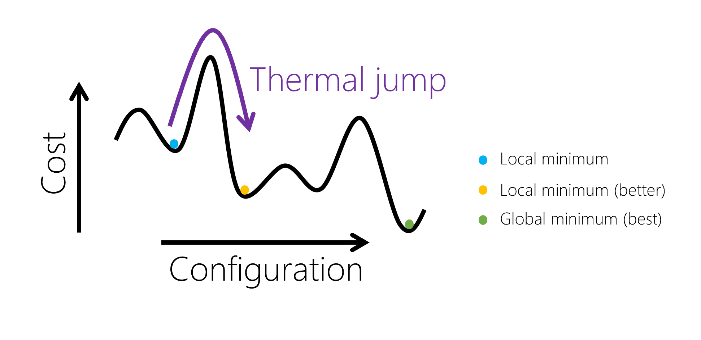

# Solving optimization problems

We will explain the general idea of simulated annealing and quantum annealing, as the solvers in Azure Quantum use variations of these techniques. 

## Simulated annealing
For optimization problems in search spaces that are too large to solve by exhaustive search and objective functions that are rugged but structured, one of the most successful and commonly used heuristics is simulated annealing.

- **Heuristic**: A technique for finding an approximate solution, when finding the exact solution may take too long.
- **Walker**: We can imagine a person or a particle in our solution space, and each step taken creates a path, or walk, through the optimization landscape.

### How does it work?
Simulated annealing is like gradient descent in that the algorithm simulates a walker that preferentially moves downhill. 
But unlike in gradient descent, the walker can take uphill moves with some non-zero probability. 
This creates the possibility for the walker to escape from local minima and then descend into deeper neighboring minima, as illustrated below.

You'll notice this uphill move is described as a "thermal jump" in the illustration. 
That's because simulated annealing is an algorithm from physics that mimics the behaviour of materials as they are slowly cooled.
The walker is like an atom in a metal, for instance, that are driven by thermal motion to reconfigure themselves. 
These changes are random, however moves to lower-energy configurations are more likely than moves to higher-energy configurations.
Hence, we say it follows a biased random walk. 

## Quantum annealing
[Quantum annealing](https://en.wikipedia.org/wiki/Quantum_annealing) is a quantum algorithm which is similar in spirit to simulated annealing but differs in a few details. 
For instance, in simulated annealing we explored the solution space by making thermal jumps, from one solution to the next.
In quantum annealing, we instead make use of a quantum effect called "quantum tunnelling", which allows us to travel through these energy barriers. 

### How does it work?

We frame our problem by giving assigments to qubits, which are our variables, and the energy of a given assignment to the qubits is the value of the objective function.
Initially we begin with the quantum state in a broad [superposition](https://en.wikipedia.org/wiki/Quantum_superposition) over many possible assignments to the qubits.
Instead of varying the temperature, as we did in simulated annealing, we vary a parameter called the "quantum field strength".

What this parameter defines is the radius of neighboring states that we could move to, as time goes on, this radius becomes smaller and smaller, as we hone in on a solution.
By the end of the anneal, the system has settled into one particular configuration of low energy which can then be measured, thus yielding a (not necessarily optimal) solution to the desired optimization problem.
The most mathematically clean formulation of quantum annealing is called adiabatic quantum optimization, and is what quantum inspired methods attempt to emulate.

## Example: Contoso Logistics freight optimization
Let's return to Contoso Logisitic's problem of how to distribute containers between two ships, in order to illustrate how optimization techniques, such as QIO, can be used.

### Understanding the Problem 

In the number partitioning problem, we have a set of container weights, *w*, which we would like to partition into two sets.
Those two sets correspond to whether the container is loaded onto ship *a* or ship *b*.
In this section, our goal will be to develop a representation of the problem that we can provide to a QIO solver.

### Breaking down the Problem
Let's start by coming up with an equation for the weight of a given ship, which is the sum of all the containers on the ship.  
This is expressed in the below equation, where *wi* is the weight of container *i*:

Ideally, we'd like a solution where the weight difference between the ships is as small as possible, which we can express like so:

- **H**: The letter *H* is typically used to represent a cost function and is also referred to as a Hamiltonian in a nod towards the quantum mechanical roots of quantum-inspired optimization techniques.

If the value of *H* is zero, we know the ships are equally loaded.

Next, we'll introduce a variable, *xi*, to represent whether an individual container *i* is assigned to ship *a* or ship *b*. 
Because we can assign the container *i* to either ship, the variable *xi* can be take on two different values - which makes it a binary variable. 
For convenience, we'll say the two values it can take on are *1* and *-1*. 
*1* will represent that the container is placed on ship *a*, and *-1* will represent that the container is placed on ship *b*.

- **Ising problem**: Because of our choice to make *i* be either *1* or *-1* this type of problem is called an Ising problem.

By introducing this variable ${x_i}$ to the previous equation, it can be simplified to:

$$ H = \Large\sum{i} w{i} x_{i} $$

The function ${H}$ will be called our cost function as it describes the cost of a given solution.

The letter ${H}$ is traditionally used to represent a cost function and is also referred to as a Hamiltonian in a nod towards the quantum mechanical roots of Quantum-Inspired Optimization techniques.

### The final model
There's one last change we need to make before we can solve our problem. If we look at our cost function ${H}$ there's a flaw: the solution with the least cost is to simply assign all containers to ship ${b}$ by setting all ${x_i}={-1}$ - that's not right! To fix this we'll take a simple step - we'll square the right hand side of the equation so that it cannot be negative:

$$ H = \Large(\sum{i} w{i} x_{i})^{2} $$

This is somewhat arbitrary, but it yields a cost function with the right properties:

If all the containers are on one ship, the function is at its highest value - reflecting that this is the least optimal solution
If the containers are perfectly balanced, the value of the summation inside the square is ${0}$ - the function is at its lowest value
In this case, we don't care about the actual value of ${H}$, just that it's as small as possible.