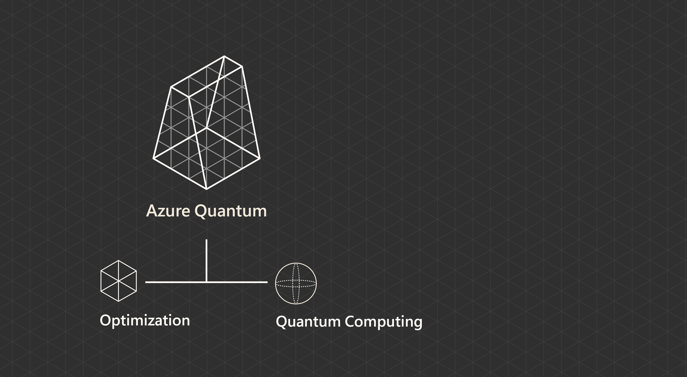

Welcome to Azure Quantum!

Azure Quantum is a cloud service that enables both quantum computing applications and optimization solutions, backed by the reliability and scale of Azure. On Azure Quantum, you can use the [Quantum Development Kit](/learn/modules/qsharp-create-first-quantum-development-kit/?azure-portal=true) to build Q# programs to run on quantum hardware, or to formulate problems for optimization solvers to run on classical hardware.

In the [Quantum Computing Foundations](/learn/paths/quantum-computing-fundamentals/?azure-portal=true) learning path, the quantum space exploration crew teaches you how to use quantum and quantum-inspired algorithms to solve security, logistics, infrastructure, and other types of optimization problems. Besides solving problems on the on-board simulator via the Quantum Development Kit, communication with Earth allows you to access the powerful optimizers and quantum hardware available on Azure Quantum to successfully complete your mission.

In this module, you'll set up your access to Azure Quantum and learn about solutions that are available to you in the cloud. Azure Quantum offers two different types of services: quantum computing solutions and optimization solutions. Different divisions of the quantum space crew will need one of the two different types of solutions that Azure Quantum offers:

* Quantum computing solutions to run quantum algorithms in real or simulated quantum devices. Quantum computing with Q# harnesses quantum mechanics to enable computation through a high-level quantum-focused programming language. You will develop Q# applications for quantum hardware with Azure Quantum. The navigation division will run Grover's algorithm in Q# for routing between space stations.

* Optimization solutions to address optimization problems using classical hardware. You will solve optimization problems on classical hardware faster and better using algorithms inspired by physical processes. The logistics and maintenance divisions will need this for optimal cargo vessel loading and job scheduling prioritization.

You will be carrying out these tasks in the upcoming modules.

## Learning objectives

In this module you'll:

* Discover what the Azure Quantum service has to offer: Quantum computing and Optimization
* Prepare your Azure account to use Azure Quantum.
* Create a Quantum workspace.

## Prerequisites

* None for users in the Optimization path.
* [Create an Azure account](/learn/modules/create-an-azure-account/?azure-portal=true).
* Any Python development environment.
