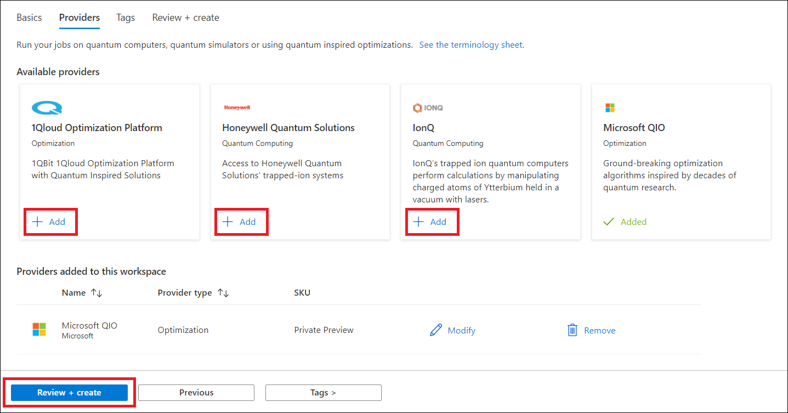

With an active Azure subscription, your crew is ready to create an Azure Quantum workspace.

## Create an Azure Quantum workspace

You can use the Azure Quantum service by adding a **quantum workspace** resource to your Azure subscription in the Azure portal. A quantum workspace resource, or workspace for short, is a collection of assets associated with running quantum or optimization applications.

1. Open the main page of the [Azure portal](https://ms.portal.azure.com/?azure-portal=true).

1. Select **Create a resource**, type **Azure Quantum**, and press <kbd>ENTER</kbd> to see the search results. On the results page, you should see a tile for the **Azure Quantum (preview)** service.

   

1. Select **Azure Quantum (preview)** and then select **Create**. This opens a form to create a workspace.

   

1. Fill out the details of your workspace:
   * **Subscription:** The subscription that you want to associate with this workspace.
   * **Resource group:** The resource group that you want to assign this workspace to.
   * **Name:** The name of your workspace.
   * **Region:** The region for the workspace. For this preview, select  **(US) West US**.
   * **Storage Account**: The Azure storage account to store your jobs and results. If you don't have an existing storage account, select **Create a new storage account** and complete the necessary fields. For this preview, we recommend using the default values.

   

   >[!NOTE]
   > You must be an owner of the selected resource group to create a new storage account. For more information about how resource groups work in Azure, see [Control and organize Azure resources with Azure Resource Manager](/learn/modules/control-and-organize-with-azure-resource-manager/?azure-portal=true).

1. After completing the information, select the **Providers** tab to add providers to your workspace. A provider gives you access to a quantum service, which can be quantum hardware, a quantum simulator, or an optimization service.

   

   >[!NOTE]
   > By default, the Azure Quantum service adds the Microsoft Quantum Solution provider to every workspace.

1. After adding the providers that you want to use, select **Review + create**.

1. Review the settings and approve the *Terms and Conditions of Use* of the selected providers. If everything is correct, select **Create** to create your workspace.

   

   >[!NOTE]
   > Your jobs will be uploaded to the Azure storage account created above and will be subject to storage charges.

Congratulations, you are set up to start using the Azure Quantum service. Let's see some case studies of what you can do with Azure Quantum.
