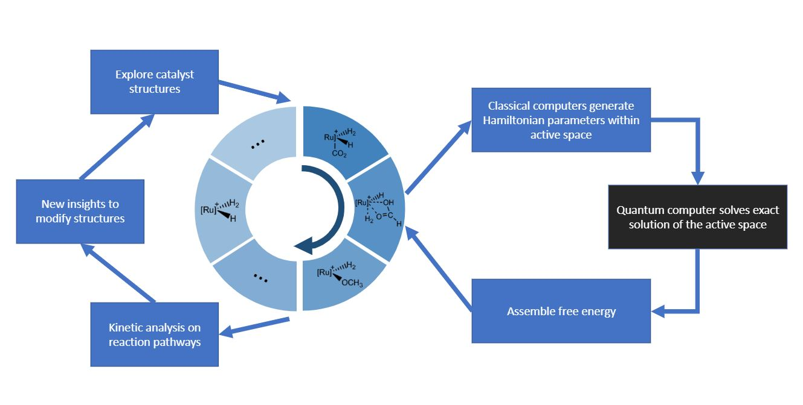

One of the services that Azure Quantum offers is a solution for quantum computing on real or simulated quantum devices.

Quantum mechanics is the underlying "operating system" of our universe. It describes how the fundamental building blocks of nature behave. Nature's behaviors, such as chemical reactions, biological reactions, and material formations often involve many-body quantum interactions. To understand these behaviors, we rely on the ability to simulate them with state-of-the-art computation.

Classical computing, which uses binary states, is increasingly challenged as the size of the system grows. As we've seen throughout the [learning path](../../../paths/quantum-computing-fundamentals/index.yml?azure-portal=true), quantum computing makes use of quantum mechanical phenomena such as *superposition*, *interference*, and *entanglement* to address some of these challenges. For simulating intrinsically quantum mechanical problems, quantum computing is promising because quantum states can be used to represent the natural states in question.

Superposition enables other quantum mechanical effects, such as *interference* and *entanglement*. Those effects, in turn, empower [quantum algorithms](https://wikipedia.org/wiki/Shor%27s_algorithm?azure-portal=true) for faster searching, better optimization, and greater security.

When quantum systems are designed to scale, they'll have capabilities that exceed our most powerful supercomputers. As the global community of quantum researchers, scientists, engineers, and business leaders continues to collaborate to advance the quantum ecosystem, we expect to see quantum impact accelerate across every industry.

The following sections describe case studies in applications of quantum computing.

## Quantum speedups

One of the goals of quantum computing research is to study which problems can be solved by a quantum computer faster than a classical computer and how large the speedup can be. Two well-known examples are [Grover's algorithm](https://wikipedia.org/wiki/Grover%27s_algorithm?azure-portal=true) and [Shor's algorithm](https://wikipedia.org/wiki/Shor's_algorithm), as mentioned in the module [Explore the key concepts of quantum computing by using Q#](/training/modules/qsharp-explore-key-concepts-quantum-computing/?azure-portal=true). These quantum algorithms yield a polynomial and an exponential speedup, respectively, over their classical counterparts.

You might ask why some problems allow exponential speedup, whereas others allow only polynomial speedup. The answer lies in the structure of the input.

In an unstructured problem, such as a list of $n$ random numbers as the input of the algorithm, a quantum computer can achieve polynomial to quadratic speedup. In Grover's algorithm, for example, a quantum computer gives a quadratic speedup.

On the other hand, a structured problem might have a special feature in the input, such as a period-finding problem in Shor's algorithm. A quantum computer can then yield an exponential speedup.

Such impressive speedups are one of the most promising aspects of quantum computers. While we wait to run quantum algorithms on a quantum device, we can study speedups theoretically and prove that these speedups exist mathematically. To do so, researchers use a query model called a *decision tree model*.

A decision tree model consists of a sequence of queries that are done adaptively, so the outcome of the previous tests can influence the next test. The decision tree model is useful in establishing lower and upper bounds for the complexity theory of algorithms.

The real upper bound of query complexity for unstructured problems has been an open problem for more than 20 years. In a 1998 paper, [Beals et al.](https://doi.org/10.1145/502090.502097?azure-portal=true) showed that for any total Boolean function $f$, the maximum possible quantum speedup for an unstructured problem is power 6. This can be expressed as $D(ƒ) = Ο(Q(ƒ)^6)$, where $D(f)$ and $Q(f)$ are classical and quantum query complexity of a function $f$, respectively.

However, at this time, the largest speedup known was only power 2, exhibited by Grover's algorithm. In a paper published in 2020, Microsoft researcher [Robin Kothari et al.](https://www.microsoft.com/research/publication/quantum-implications-of-huangs-sensitivity-theorem/?azure-portal=true) showed that the deterministic query complexity, $D(f)$, is at most quartic in the quantum query complexity: $Q(f): D(f)=O(Q(f)^4)$.

The proof technique used in [Robin Kothari et al.](https://www.microsoft.com/research/publication/quantum-implications-of-huangs-sensitivity-theorem/?azure-portal=true) can be used to resolve an old conjecture about quantum speedups for graph problems. A [graph](https://wikipedia.org/wiki/Graph_theory?azure-portal=true) is a mathematical structure that's used to model pairwise relations between objects. It's defined by a set of vertices and edges, where the edges establish the relations among the vertices.

Graph problems are a common source of algorithmic problems in computer science. We can study different properties of a graph, such as the shortest path between two points, or identify groups of relationships. The funny thing about theoretical proofs and mathematics is that you never know when you'll find a connection with another unsolved problem. 

The query complexity of monotone graph properties remains unsolved to this day. However, their quantum analog has been resolved. If you haven't explored it already, there is a [module on solving graph coloring problems by using Grover's search](/training/modules/solve-graph-coloring-problems-grovers-search/?azure-portal=true).

With an understanding of the status quo of quantum computing and the future that it promises, you'll head back to the spaceship. You'll work with the communications division to run Grover's algorithm in [another Azure Quantum module](/training/modules/run-algorithms-quantum-hardware-azure-quantum/?azure-portal=true) for assigning bandwidth ranges to space stations.

## Using quantum computers to address climate change

We're living a quantum revolution. When we can implement algorithms on a fault-tolerant quantum computer, we can begin to solve some of the world's most challenging problems.

Quantum researchers at Microsoft are studying quantum computer applications and how to accomplish them on a large-scale quantum computer. One of the applications they're focusing on is in chemistry, to help address one of those significant challenges: climate change.

In the context of climate change, a main issue is to find an efficient catalyst for [carbon fixation](https://wikipedia.org/wiki/Carbon_fixation#:~:text=Carbon%20fixation%20or%20%D1%81arbon%20assimilation,as%20structure%20for%20other%20biomolecules?azure-portal=true). Carbon fixation is a natural process by which carbon dioxide is turned into valuable chemicals for storing energy. The most well-known example of carbon fixation is photosynthesis: conversion of carbon dioxide into glucose in plants.

A synthetic carbon fixation process can help reduce carbon dioxide in the atmosphere by converting $CO_2$ into other useful chemical compounds. Simulation of synthetic catalytic processes requires testing thousands of molecular combinations.

Microsoft Quantum researchers have teamed with researchers at ETH Zurich to develop a new quantum algorithm to simulate catalytic processes. They've focused on a well-known catalytic process based on the transition metal ruthenium to convert carbon dioxide into methanol. This process is inefficient, so this case study offers an opportunity to test quantum algorithms and find ways to optimize these simulations on a quantum computer.

Problems that involve calculating molecular energies can require a large number of time steps and a large amount of information. This task can be challenging, even for a quantum computer. We need to reduce the cost of computation before running our quantum algorithms. The natural approach should be to reduce the information to be loaded--that is, reduce the size of the input.

In their paper [Quantum computing enhanced computational catalysis](https://www.microsoft.com/research/publication/quantum-computing-enhanced-computational-catalysis/?azure-portal=true) published in 2020, the authors use a particular representation of the energy of the quantum system: the so-called "double-factorized" Hamiltonian. They propose a quantum algorithm based on compression properties of the double-factorized Hamiltonian to reduce runtime by orders of magnitude for obtaining reliable results, in comparison to unfactorized or single-factorized forms.

The authors' algorithm is 10,000 times faster than the [previous one](https://dx.doi.org/10.1073/pnas.1619152114?azure-portal=true) that they proposed for this task. This is the first time a quantum algorithm has been analyzed on a specific chemical reaction along the entire reaction pathway.

It's important to note that the results obtained from this work are not restricted to chemistry and climate change applications. In fact, knowing more about quantum algorithms and boosting calculations can lead to even more questions about large-scale quantum computers. It can also lead to exploring other ways that algorithms can be more effective.

The following workflow shows the protocol of enhanced computational catalysis in quantum computing. The energies of all species in the catalytic reaction cycle can be evaluated through the quantum computer by using the output parameters of classical computers (upper right).

## Quantum cryptography

Cryptography is the technique of concealing confidential information by using physical or mathematical means, such as using a computational difficulty of solving a particular task. The work of [Peter W. Shor](https://ieeexplore.ieee.org/document/365700?azure-portal=true) uncovered the security threat that quantum computation posed to classical cryptographic schemes that are based on assumptions of the difficulty of factoring large numbers.

One example of a cryptographic scheme is the [Rivest–Shamir–Adleman (RSA) scheme](https://wikipedia.org/wiki/RSA_(cryptosystem)?azure-portal=true), which is widely used in e-commerce for secure data transmission. It's based on the practical difficulty of factoring prime numbers by using classical algorithms.

[Quantum cryptography](https://wikipedia.org/wiki/Quantum_cryptography?azure-portal=true) promises information security by harnessing basic physics rather than complexity assumptions. RSA is safe today because a scalable quantum computer is not yet available. But after quantum computers are built at large scale, polynomial time quantum algorithms might attack the underlying math problems for these cryptosystems. RSA would then become unsafe.

In the module [Explore the key concepts of quantum computing by using Q#](/training/modules/qsharp-explore-key-concepts-quantum-computing/8-introduction-quantum-algorithms/?azure-portal=true), you can find an overview of Shor's algorithm application in cryptography.

With the anticipation of a sufficiently large and fault-tolerant quantum computer, active research is underway to:

- Estimate the security for cryptosystems of a given bit length in a post-quantum environment.
- Estimate how long it will take to migrate current cryptosystems to new ones.

In collaboration with [Microsoft Quantum researchers](https://www.microsoft.com/research/blog/cryptography-quantum-computing-intersect/?azure-portal=true), Microsoft has been developing concrete quantum estimates for breaking current encryption systems. It's also working on ways to make these systems robust against quantum attacks.

Again, let's talk about graphs. The "path-finding problem" is a hard problem for explicit choices of expander graphs. The development of post-quantum cryptosystems (that is, classical protocols that are resistant to quantum attacks) [has been proposed](https://eprint.iacr.org/2006/021.pdf).

The interaction between academia and industry has thrived in recent years and has resulted in the development of commercially viable quantum cryptography products. Quantum cryptography is a reality. We can expect mathematicians and cryptographers to be busy during the next few years trying to determine the best possible choices for post-quantum cryptography standards.
