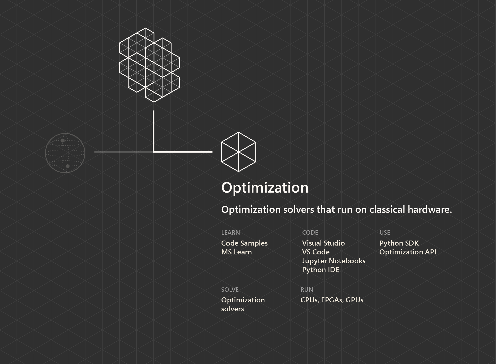
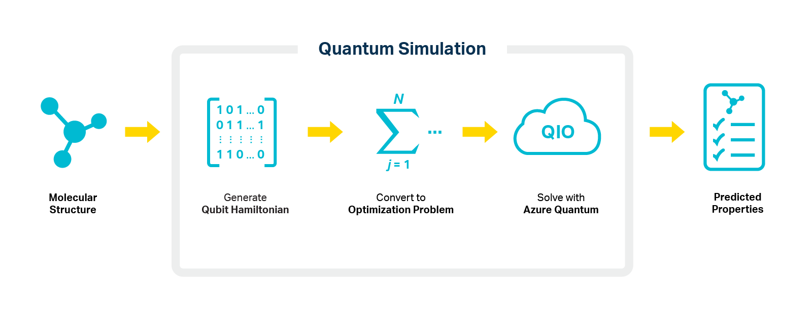

Azure Quantum offers solutions that enable some divisions of the space team to run optimization algorithms by using classical hardware. For example, the logistics and maintenance divisions need this optimization capability for loading cargo vessels. 

There are other optimization problems of interest, such as optimizing travel time between planets, prioritizing job schedules, or finding the equilibrium configuration of certain proteins of a recently discovered form of life.

Complex optimization problems exist across every industry: vehicle routing, supply chain management, portfolio optimization, power grid management, and many others. Optimization algorithms are also at the core of many machine learning methods. 

Solving these real-world problems results in high-value benefits, such as reduced costs, accelerated processes, or reduced risks. Many real-world optimization problems are still unsolvable by classical computing, despite the advancement in both algorithms and computing power over the past decades.

Emulating quantum effects on classical computers has led to the development of new types of quantum solutions called *quantum-inspired* algorithms. These algorithms allow us to use some of the advantages of quantum computing approaches on classical hardware, which provides a speedup over traditional approaches. 

Using quantum solutions on classical hardware also prepares us for the future of quantum optimization on actual quantum hardware.

The following sections describe case studies in applications of optimization.

## Traffic optimization

Traffic congestion results in a significant time and cost burden in many metropolitan areas. Another important use case for vehicle routing is the efficient evacuation of large urban areas.

One example of applying quantum-inspired optimization is to significantly reduce both traffic congestion and travel time. Ford and Microsoft have worked together on a solution that shows a more than 70 percent decrease in traffic congestion and a reduction of average travel time of approximately 8 percent. Preliminary studies used up to 5,000 vehicles and compared the solution to the best routes provided by Bing Maps.

[Traffic optimization](https://arxiv.org/abs/1708.01625?azure-portal=true) of approximately 400 vehicles takes 20 seconds on a quantum annealing machine. In the case study, the quantum-inspired algorithms tackle a comparable problem in only 0.02 seconds on a single CPU core. 

Larger problems might also be accelerated through the use of specialized hardware, such as field-programmable gate arrays (FPGAs) available in Azure, by at least two orders of magnitude. This acceleration enables the speed required to address the scale of real-world routing complexity.

## Material design

Staples of modern life include compact electronics, energy-efficient transportation, and innovative buildings and construction techniques. They're owed to advancements in science that allow researchers to create materials whose chemical structures maximize certain physical properties, such as strength, electrical characteristics, and weight. 

Designing materials to maximize these properties requires simulating the complex quantum physics that dictate how the atoms that make up these materials interact with the world around them. For most molecules, this simulation represents a problem that's intractable through traditional computers or methods.

In this domain, researchers can apply quantum-inspired optimization (QIO) to help achieve near-term advancements in state-of-the-art materials. The following diagram illustrates the role of QIO in quantum simulation for material design. Through the use of Azure Quantum and quantum optimization solutions running on classical hardware, QIO can enable quantum methods for material simulations that yield more accurate results.

One example of QIO comes from OTI Lumionics, which has applied optimization solvers in [Azure Quantum to do material simulations](https://cloudblogs.microsoft.com/quantum/2020/01/21/oti-lumionics-accelerating-materials-design-microsoft-azure-quantum/?azure-portal=true). OTI Lumionics can apply these optimization solvers to its R&D process as it designs the next generation of organic LED (OLED) displays. 

To accomplish this, OTI Lumionics took advantage of the ability of optimization solvers in Azure Quantum to support the native higher-order problem in a Polynomial Unconstrained Binary Optimization (PUBO) problem. The organization reduced the problem definition from 58,265 variables to just 132. By using parameter-free solvers, the organization was also able to save valuable time in optimizing parameters. 

By using the Azure Quantum optimization tools in its pipeline, OTI Lumionics successfully performed a complete simulation of active space configuration interaction. It simulated Tris(8-hydroxyquinolinato)aluminum, an archetype green OLED material that's also called Alq3.

In addition to solving complex optimization problems, quantum computers might be able to aid in chemistry and material development far beyond the capacity of present-day supercomputers. Such simulations might lead to breakthroughs in material science, such as:

- Batteries with greater capacity and longer life spans.
- High-temperature superconductors.
- New catalysts for converting and optimizing alternative fuel sources. 

Simulating the characteristics of complex molecules is difficult. So the development of new materials with specific properties, like next-generation batteries, poses huge computational challenges. With quantum breakthroughs in material science, lower emissions and better efficiencies begin to come into focus.

## Aerodynamics and energy

Simulating aerodynamics is another area that requires heavy computation. On a windmill farm, the placement of windmill locations is critical. Windmills harness power from the wind but can also disrupt airflow and hinder the farm from utilizing the wind's maximum power.

Although airflow and turbulence are seemingly classical and macroscopic phenomena, it's possible to get inspiration from quantum mechanical systems. An example is an electron behaving like a spinning top, and approximating it as a mechanical engine of interacting rotors.

Microsoft Quantum Network member Qubit Engineering is creating rotor models to simulate what turbulence looks like in the air. Azure Quantum has tools to solve these rotor models in order to find minimum and maximum energy configurations. Those tools help Qubit Engineering apply quantum theories to calculate the optimum placement of windmills.

By understanding environmental factors and adding how the windmills might interact with each other, Qubit Engineering has created an abstract modeling scoring system to find the optimal placement for maximum energy production under a variety of circumstances.

## Signal processing

Magnetic resonance imaging (MRI) is a key diagnostic tool in healthcare. It has played a pivotal role in the treatment of the most harming diseases for humanity, such as cancer, heart disease, and Alzheimer's. Although much progress has been made in recent decades, improvements in imaging and scan times have been incremental. Computational challenges have limited improvements.

Microsoft Quantum has teamed up with Case Western Reserve University to use bespoke quantum-inspired optimization solutions running on classical hardware to develop new pulse sequences for [MRI scans](https://news.microsoft.com/innovation-stories/quantum-computing-mri-cancer-treatment/?azure-portal=true). The discoveries have been significant:

* When researchers optimize for speed, the generated pulse sequences are typically shorter. The result is scans that are up to three times faster, and delivery of comparable image quality.

* When researchers optimize for scan precision, these sequences can yield as much as a 30 percent improvement in resolution. That improvement can potentially lead to an earlier diagnosis and treatment.

* Faster imaging, as well as imaging with better precision at a fixed scan time, can lead to new diagnostic tools. These tools can help tackle today's medical challenges while reducing the cost and side effects of the scans.

Read more about applications of quantum-inspired optimizations in the [Quantum Impact case studies](https://azure.microsoft.com/en-us/resources/whitepapers/search/?term=quantum).

By understanding the power of quantum-inspired optimization, you'll work with your crew in the module [Solve Quantum inspired optimization problems](/learn/modules/solve-quantum-inspired-optimization-problems/?azure-portal=true) to help the logistics division efficiently load cargo vessels. In the module [Solve the job shop scheduling problem](/learn/modules/solve-job-shop-optimization-azure-quantum/?azure-portal=true), you'll work with the maintenance division to prioritize different kinds of jobs on the spaceship.
