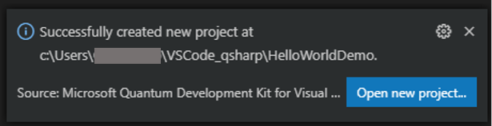

# Install the Microsoft Quantum Development Kit (QDK)

Learn how to install the Microsoft Quantum Development Kit (QDK), so that you can get started with quantum programming.
The QDK consists of:

- the Q# programming language
- a set of libraries that abstract complex functionality in Q#
- APIs for Python and .NET languages (C#, F#, and VB.NET) for running quantum programs written in Q#
- tools to facilitate your development

Q# programs are often paired with a host program written in a .NET language (typically C#) or Python.
This allows us to call quantum operations from inside a classical program.

The QDK is available for multiple development environments, but in this module we will simply utilize the pairing of Q# and C# within Visual Studio Code, as it is available for all operating systems.

## Develop with Q# + C# using Visual Studio Code

Visual Studio Code (VS Code) offers a rich environment for developing Q# programs on Windows, Linux and Mac.
The Q# VS Code extension includes support for Q# syntax highlighting, code completion, and Q# code snippets.

### Prerequisites 

Naturally, if you do not yet have it, your first step should be to [install VS Code](https://code.visualstudio.com/download).

Next, check that you have the latest version of the [.NET Core SDK 3.1](https://dotnet.microsoft.com/download). 
Open a command prompt and run the following:

```bash
dotnet --version
```

Verify the output is `3.1.100` or higher.
If not, install the [latest version](https://dotnet.microsoft.com/download) and check again.
Then, continue on below.

### 1. Install the QDK Extension and Project Templates

Open VS Code, find the "Extensions" tab, and search for "Quantum Development Kit".
Click the install button.


<!--img src="./2-install/2-1.PNG" alt="extension" width="600"-->

Next, we will install the project templates, so that you can immediately get up and running with your first quantum program.

- Go to **View** -> **Command Palette**


<!--img src="./2-install/2-2.PNG" alt="commandpalette" width="300"-->

- Select **Q#: Install project templates**


<!--img src="./2-install/2-3.PNG" alt="projecttemplates" width="300"-->

After a few seconds you should see the following pop-up on the lower right-hand side of your screen.


<!--img src="./2-install/2-4.PNG" alt="installedpopup" width="300"-->

You now have the Quantum Development Kit installed and ready to use in your own applications and libraries.


### 2. Verify the installation by creating a `Hello World` application

To create a new Q# project:

- Go to **View** -> **Command Palette**
- Select **Q#: Create New Project**


<!--img src="./2-install/2-5.PNG" alt="createnewproject" width="300"-->

- Select **Standalone console application**


<!--img src="./2-install/2-6.PNG" alt="standaloneconsoleapp" width="300"-->

- Navigate to the location on the file system where you would like to create the application, and name your project.


<!--img src="./2-install/2-7.PNG" alt="projectlocation" width="600"-->


- Click on the **Open new project...** button, once the project has been created


<!--img src="./2-install/2-8.PNG" alt="opennewproject" width="300"-->

Note that if you don't already have the C# extension for VS Code installed, a pop-up will appear.
Simply go ahead and install the extension. 

You should now see the following files in your project folder:


<!--img src="./2-install/2-9.PNG" alt="projecttemplates" width="300"-->

`Program.qs` is the Q# program file, and `Driver.cs` is the C# host file.
Note that `<project-name>.csproj` is also automatically generated, and simply containing information about which .NET Core and QDK versions are to be used by the compiler.
(I'm not sure if that's accurate, need to double check with devs)

Explore both the Q# and C# files, and think about how they might work.
In particular, note that the C# host file calls the quantum operation defined in the Q# file.


<!--img src="./2-install/2-10.PNG" alt="qsharpfile" width="500"-->
<!--img src="./2-install/2-11.PNG" alt="csharpfile" width="500"-->

In the next unit, you will learn more about this behavior, and Q# files in general.

### 3. Run the application

- Go to **Terminal** -> **New Terminal**


<!--img src="./2-install/2-12.PNG" alt="newterminal" width="240"-->

- Enter `dotnet run`, and you should see your first quantum program saying hello!


<!--img src="./2-install/2-13.PNG" alt="helloworld" width="500"-->


### Continue to the next unit
Insert words here
