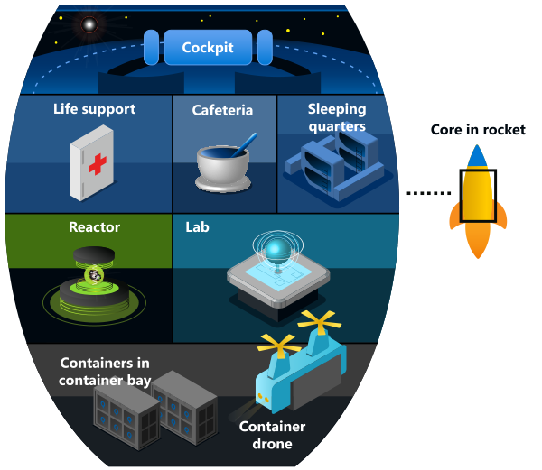

Welcome to the world of quantum computing!

Whether you're a developer or simply someone who wants to get a feel for what quantum programming is all about, this module is a great place to start exploring quantum computing.

You won't be alone in this journey. We'll instruct you step by step through each of the different modules.

Imagine you're the new member of a space crew. The spaceship is equipped with a computer that has access to the Azure Quantum servers on Earth and you can use the power of quantum computing to complete the different tasks. During your training as a new crew member, you'll learn about quantum computing and how to use the Microsoft Azure Quantum service.

Welcome aboard!

In this module, you'll write your first quantum program by using the Quantum Development Kit (QDK). The QDK enables you to write and test your quantum programs locally, with a simulator, on standard hardware. You can, when it's generally available, run the same quantum program on quantum hardware through the Azure Quantum service.

The first thing you'll do before using your quantum computer is to sign in to the system. You want to generate a truly random password so no galactic hacker can jeopardize space fleet security. 

In this module, you'll write a quantum program to generate random numbers. A random number generator is not only easy to write, but it will help you understand the basics of quantum computing.

## Learning objectives

In this module you'll:

- Prepare your development environment for writing quantum programs in Q#.
- Understand how Q# programs are structured.
- Work with qubits and superposition to build a quantum random number generator.
- Learn how Azure Quantum enables you to run your programs on quantum hardware.

## Prerequisites

- The latest version of [.NET Core](https://dotnet.microsoft.com/download?azure-portal=true)
- [Visual Studio Code](https://code.visualstudio.com/download?azure-portal=true)
