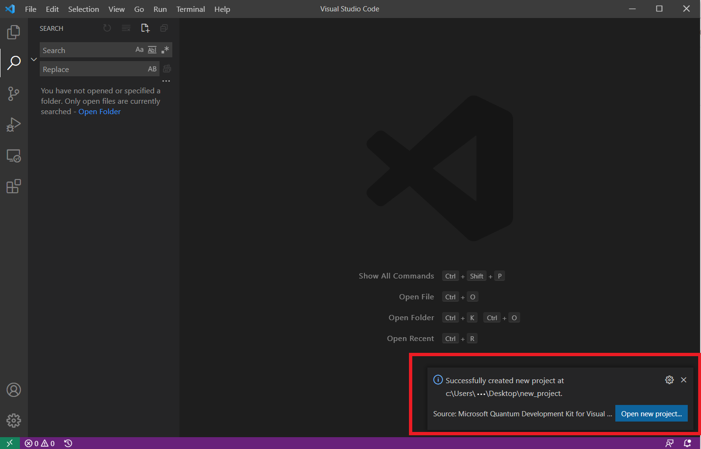

As a new member of the space crew, you first need to learn the tools you'll use.

In this part, you prepare your development environment so you can begin writing quantum programs.

To set up your development environment, you:

> [!div class="checklist"]
> * Install the QDK for Visual Studio Code.
> * Verify the installation by creating a basic Q# application.

But first, let's take a quick look at what you get with the Quantum Development Kit (QDK).

> [!NOTE]
> Before you proceed, make sure you have the [.NET SDK 6.0](https://dotnet.microsoft.com/download?azure-portal=true) and [Visual Studio Code](https://code.visualstudio.com/download?azure-portal=true) installed on your computer.

> [!NOTE]
> For Linux users, you may encounter a missing dependency depending on your particular distribution and installation method (e.g. certain Docker images). Please make sure that the `libgomp` library is installed on your system, as the GNU OpenMP support library is required by the quantum simulator of the QDK. On Ubuntu, you can do so by running `sudo apt install libgomp1`, or `yum install libgomp` on CentOS. For other distributions, please refer to your particular package manager.

## What's the Quantum Development Kit (QDK)?

The QDK gives you everything you need to start writing quantum programs. Included in the QDK is the Q# programming language.

Q# is a *domain-specific programming language* (DSL). A DSL is a computer language that's built for a specific type of application, just like how HTML is built for web pages. Q# enables you to focus on your quantum algorithms without having to worry about many of the underlying details, such as the physical layout of a quantum computer.

The QDK also includes:

* Q# libraries that help you build real-world quantum applications right away.
* Targets, which allow you to run your program locally or on different kinds of hardware through Azure Quantum.

    Targets include resource estimators and simulators for larger quantum programs, and a quantum simulator, which behaves much like a quantum computer would.

    The simulator is useful for trying out new ideas, debugging programs, and learning about quantum computing, but it's only suitable for programs that require relatively few qubits. (Don't worry, we'll explain what a qubit is later in the module.)

    The simulator enables you to run quantum programs locally, on computers you use to write software. You can also target your programs to run on quantum hardware by using Azure Quantum. (See this [module](/training/modules/get-started-azure-quantum?azure-portal=true) to learn more on Azure Quantum.)
* Tools that help you integrate quantum programs with classical programs, including support for C#, F#, and Python. (Classical code enables you to work with the results from quantum computations.)

## Install the QDK for Visual Studio Code

This step installs the QDK and adds extensions to Visual Studio Code that provide support for developing quantum algorithms in Q#.

1. Open Visual Studio Code.
1. Go to [Microsoft Quantum Development Kit for Visual Studio Code](https://marketplace.visualstudio.com/items?itemName=quantum.quantum-devkit-vscode&azure-portal=true), select **Install**, then follow the installation steps.

> [!NOTE]
> If you already have an older version of the QDK, we recommend that you [update to the latest version](/azure/quantum/install-update-qdk?azure-portal=true).
> After installing the QDK extension, restart Visual Studio Code to continue the next steps.

## Verify the installation

To verify your installation, create a basic Q# application as shown in the following steps.

### Install the Quantum project templates

Project templates enable you to quickly create Q# applications, libraries, and unit tests.

1. In Visual Studio Code, on the **View** menu, select **Command Palette**.

1. Enter **Q#: Install command line project templates**. The templates are installed successfully once the pop-up window appears on the bottom right corner:

   

### Create a project

1. On the **View** menu, select **Command Palette**.
1. Enter **Q#: Create new project**.

    > [!NOTE]
    > If you run into a problem with VS Code project templates, receiving an error "'npm' is not recognized as an internal or external command", please install [node.js including npm](https://nodejs.org/en/?azure-portal=true). Alternatively, use our [command line templates](/azure/quantum/install-command-line-qdk?tabs=tabid-vscode#to-configure-for-another-environment?azure-portal=true) to create a Q# project , or use [Visual Studio](/azure/quantum/install-command-line-qdk?tabs=tabid-vscode#to-configure-for-visual-studio?azure-portal=true).

1. Select **Standalone console application**.
1. Select a directory to hold your project, such as your home directory. Enter *QuantumHello* as the project name, then select **Create Project**.
1. From the pop-up window that appears at the bottom right corner, select **Open new project**:

   

1. From the **View** menu, select **Explorer**.

    You see two files: *QuantumHello.csproj* and *Program.qs*.

    The *.csproj* file defines project settings. *Program.qs* contains a basic Q# program that prints a message to the console.

    ```qsharp
    namespace QuantumHello {

        open Microsoft.Quantum.Canon;
        open Microsoft.Quantum.Intrinsic;


        @EntryPoint()
        operation HelloQ() : Unit {
            Message("Hello quantum world!");
        }
    }
    ```

### Run the program

Now let's run the program to verify that everything is set up correctly. You use the `dotnet` utility to run Q# programs.

1. From the **View** menu, select **Terminal** or **Integrated Terminal**.
1. Run `dotnet run`.

    ```bash
    dotnet run
    ```

1. The program prints this message:

    ```output
    Hello quantum world!
    ```

Great work. You just ran your first Q# program!

You likely noticed that this basic program doesn't involve any quantum computations. Next, you'll use quantum computation to create a random number generator.

> [!NOTE]
> If you run into any issues with the installation of the QDK, take a look at the [QDK documentation](/azure/quantum/install-command-line-qdk?tabs=tabid-vscode%3fazure-portal%3dtrue) for additional information, or you can report an issue on [GitHub](https://github.com/MicrosoftDocs/quantum-docs/issues).
