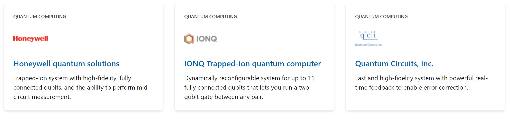

Keep in mind that the programs you ran here use a _simulator_ to mimic quantum behavior. A simulator is a perfect way to experiment with and verify your quantum algorithms before you run your programs on a quantum computer.

When you're ready to run your programs on quantum hardware, there's Azure Quantum, a quantum computing service that runs on Azure.

Azure Quantum is currently in limited preview with select partners and customers. Here's an early look at what to expect.

## What's included on Azure Quantum?

**Quantum computing**: If you're interested in developing quantum software, then Azure Quantum offers a suite of tools that help you express your algorithms using the Quantum Development Kit and Q#.

There are tools for simulating your programs so that you can test the behavior and performance of your code. In addition, there are tools such as the resource estimator, which helps you understand the resources that your code would require. In terms of a quantum program, this can mean the types of quantum gates you use, the number of operations performed, or the number of qubits you need.

Using all these tools together helps you understand the features of a quantum computer that you'd need in order to run your program, such as the number of qubits and their lifetimes. From a software engineering perspective, it also helps you iterate and improve your code, so that you can reduce the number of resources required to run it.

For more details on how this is done in practice, check out Dave Wecker's talk on [Achieving Practical Quantum Computing](https://cloudblogs.microsoft.com/quantum/2018/06/01/achieving-practical-quantum-computing/?azure-portal=true).

**Quantum-inspired solutions**: If you want to solve large, complex optimization problems at scale, then you can explore quantum-inspired solvers from Microsoft and partners such as 1QBit.

Solvers emulate certain processes from quantum physics by using classical hardware that's available today.

**Quantum hardware**: After you have a quantum program that you'd like to run on a quantum computer, you can choose from a range of compute options.

For example, there's trapped ion quantum hardware from IonQ and Honeywell. There's also quantum hardware built from superconducting circuits from QCI.

## What are Azure Quantum Workspaces?

Like other Azure services, you need to deploy an Azure Quantum resource into your Azure subscription in order to use it.

This resource is called a _workspace_, and is a collection of assets that are associated with executing a quantum or quantum-inspired workload. Examples of assets are the problem format, data, and compute target.

Here's a brief overview of some of the terminology that's associated with a quantum workspace.

**Target**: The type of target you use depends on the type of program you want to run.

For quantum programs, your target will either be a quantum computer or a quantum simulator. For quantum-inspired problems, your target will typically be one of the solvers.

**Provider**: After you've decided on the type of target to use, you can enable different providers in your workspace that offer that target.

For example, you could choose to enable IonQ, Honeywell, and QCI in your workspace and run your Q# program on each of their hardware types.

Every workspace comes with the Microsoft provider always enabled, and you can select which third-party providers you'd like to add.

**Jobs**: When you execute a quantum program or solve a quantum-inspired optimization (QIO) problem on Azure Quantum, you're creating and running a job.

A job consists of:

* An ID that's unique within your workspace.
* The provider that will execute your job.
* The target that you'll execute your job on.
* A name that you choose to help you organize your job.
* Any input parameters that your target requires.

Azure Quantum provides information about the state of your job and its execution history.

**Billing**: When you enable a provider in your workspace, you also select the billing plan for that provider. The billing plan defines how you're billed for jobs against that provider.

Each provider may have different billing plans and methods available. While you may only select a single billing plan for a specific provider in a single workspace, you can deploy to multiple workspaces within your Azure subscription.
